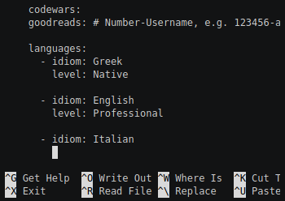
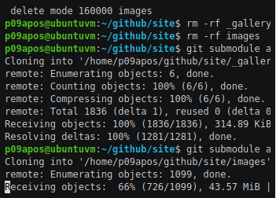
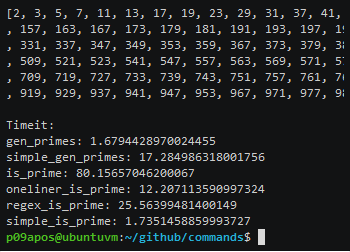

# ΜΑΘΗΜΑ: ΤΕΧΝΟΛΟΓΙΑ ΛΟΓΙΣΜΙΚΟΥ
### Αριθμός Μητρώου: Π2009108
### Ονοματεπώνυμο: Γεωργία Αποστολοπούλου
### [Προφίλ στο github](https://github.com/p09apos 'Προφίλ στο github')

| Εβδομάδα* | Παραδοτέο |
| --- | --- |
| 1 |<a href="#Παραδοτέο 1"> Φορκ του αποθετηρίου και δημιουργία της σελίδας της αναφοράς με τα προσωπικά στοιχεία σας, της σύνοψης με αυτόν τον πίνακα περιεχομένων, και συγγραφή της εισαγωγής με περιγραφή των αναγκών και των στόχων σας για το αντίστοιχο μάθημα.</a> |
| 2 |<a href="#Παραδοτέο 2"> βιογραφικό </a> |
| 3 | <a href="#Παραδοτέο 3"> Αίτημα ενσωμάτωσης στην ιστοσελίδα  </a>|
| 4 | <a href="#Παραδοτέο 4"> Άσκηση γραμμής εντολών  </a>|
| 5 | <a href="#Παραδοτέο 5"> Συμμετοχικό περιεχόμενο  </a>|
| 6 | <a href="#Παραδοτέο 6"> Άσκηση γραμμής εντολών </a>|
| 7 | <a href="#Παραδοτέο 7"> βιογραφικό </a> |
| 8 | <a href="#Παραδοτέο 8"> Αίτημα ενσωμάτωσης στην ιστοσελίδα  </a>|
| 9 | <a href="#Παραδοτέο 9"> Άσκηση γραμμής εντολών  </a>|
| 10 | <a href="#Παραδοτέο 10"> συμμετοχικό περιεχόμενο </a> |
| 11 | <a href="#Παραδοτέο 11"> Άσκηση γραμμής εντολών </a>|
| 12 | <a href="#Παραδοτέο 12"> Τελική αναφορά*  </a>|

## ΕΙΣΑΓΩΓΗ

Σκοπός του μαθήματος τεχνολογία λογισμικού είναι η ενασχόληση με τις βασικές αρχές του μαθήματος μέσω ατομικών αλλά και συνεργατικών ασκήσεων. Μέσω των διαφόρων ειδών ασκήσεων, θα εκπαιδευτούμαι στην χρήση εργαλείων που αφορούν την ανάπτυξη εφαρμογών ακολουθώντας τις τεχνολογικές εξελίξεις.

## Παραδοτέα Μαθήματος
  
### <a name="Παραδοτέο 1">Παραδοτέο 1</a>
### Δημιουργία Αποθετηρίου
Δημιουργία ενός νέου αποθετηρίου μέσω fork του [αποθετηρίου του μαθήματος](https://github.com/courses-ionio/sw). Δημιουργία ενός νέου branch με όνομα τον αριθμό μητρώου μου. Ακολούθως,  μέσα στον φάκελο projects έγινε δημιουργία ενός φακέλου με όνομα τον αριθμό μητρώου μου και του αρχείου της τελικής αναφοράς.
### <a name="Παραδοτέο 2">Παραδοτέο 2</a>
### ΒΙΟΓΡΑΦΙΚΟ
Δημιουργία βιογραφικού σημειώματος Αποστολοπούλου Γεωργία
#### [Σύνδεσμος  αποθετηρίου CV](https://github.com/p09apos/online-cv)
#### [Εκτελέσιμο CV](https://p09apos.github.io/online-cv/)

### <a name="Παραδοτέο 3">Παραδοτέο 3</a>
### Αίτημα ενσωμάτωσης στην ιστοσελίδα  
Προσθήκη περιεχομένου στην ιστοσελίδα του τμήματος. Εγίνε προσθήκη φωτογραφίας και στοιχείων εκπαίδευσης (PhD) ΕΔΙΠ Πανάρετος Αλέξανδρος.

#### [Σύνδεσμος pull request](https://github.com/ioniodi/sitegr/pull/29)
#### [Εκτελέσιμο Netlify](https://quirky-kepler-7abef8.netlify.app/people/alex/)

### <a name="Παραδοτέο 4">Παραδοτέο 4</a>
### Άσκηση γραμμής εντολών: set-up continuous integration
Aλλαγές στο repository του βιογραφικού πού είχα φτίαξει σε προηγούμενη άσκηση μέσω της γραμμής εντολών.

### Εκπλήρωση ζητούμενων πρώτης εργασίας
* [x] Άλλαξα το περιεχόμενο των αρχείων _config.yml και data.yml μέσω του editor nano
* [x] Ενημέρωσα το repository με το νέο περιεχόμενο κάνοντας push.

#### [Σύνδεσμος asciinema Άσκησης γραμμής εντολών 1](https://asciinema.org/a/398845)

### <a name="Παραδοτέο 5">Παραδοτέο 5</a>
### Συμμετοχικό περιεχόμενο

Έκανα fork τα ακόλουθα repositories: site, images και _gallery από το pibook. Στην συνέχεια προσέθεσα από command line τις φωτογραφίες και τα thumb τους στο repository images. Έπειτα δημιουργήθηκε ένα αρχείο .md για κάθε φωτογραφία στο repository _gallery. Μετά έγινε clone το repository site από το terminal και σύνδεση των submodules. Τέλος έγιναν push οι αλλαγές στο από το terminal στο site.

#### [Σύνδεσμος asciinema Συμμετοχικό περιεχόμενο ](https://asciinema.org/a/401062)

#### [Εκτελέσιμο Netlify site ](https://p09apos.netlify.app/)
#### [Αρχείο Apple Lisa _gallery](https://github.com/p09apos/_gallery/blob/master/apple-lisa.md)
#### [Αρχείο Simula _gallery](https://github.com/p09apos/_gallery/blob/master/simula.md)
#### [Αρχείο images apple-lisa-thumb.jpg](https://github.com/p09apos/images/blob/master/apple-lisa-thumb.jpg)
#### [Αρχείο images apple-lisa.jpg](https://github.com/p09apos/images/blob/master/apple-lisa.jpg)
#### [Αρχείο images simula-logo-thumb.jpg](https://github.com/p09apos/images/blob/master/simula-logo-thumb.jpg)
#### [Αρχείο images simula-logo.jpg](https://github.com/p09apos/images/blob/master/simula-logo.jpg)
#### [Εκτελέσιμο Netlify gallery/apple-lisa](https://p09apos.netlify.app//gallery/apple-lisa/)
#### [Εκτελέσιμο Netlify gallery/simula](https://p09apos.netlify.app//gallery/simula/)
#### [Εκτελέσιμο Netlify slides/archetypes](https://p09apos.netlify.app//slides/archetypes/)
#### [Εκτελέσιμο Netlify slides/programming](https://p09apos.netlify.app//slides/programming/)
#### [Εκτελέσιμο Netlify timeline/personal](https://p09apos.netlify.app//timeline/personal/)
#### [Εκτελέσιμο Netlify timeline/programming](https://p09apos.netlify.app//timeline/programming/)

### <a name="Παραδοτέο 6">Παραδοτέο 6</a>
### Άσκηση γραμμής εντολών: send notifications to your desktop-mobile
Λήψη ειδοποίησης όταν ολοκληρωθεί η εκτελεση μίας εργασίας από το terminal. Στη συγκεκριμένη περίπτωση εκτελείται ένα πρόγραμμα σε γλώσσα Python που επιστρέφει τους πρώτους αριθμός από 1 - 1000 και στη συνέχεια εκτελεί κάποιες σχετικές μεθόδους για πρώτους αριθμούς που χρειάζονται λίγο χρόνο για να εκτελεστούν.

Μεθοδολογία:
1. Εγκατάσταση του ntfy
2. Παραμετροποίηση του σχετικού αρχείου /home/p09apos/.config/ntfy/ntfy.yml να γράφει στο systemlog
3. Εκτέλεση "χρονοβόρου" προγραμματος primes.py μέσω της εντολής ntfy done ...
4. Εγγραφή ειδοποίησης στο /var/log/syslog μετά την ολοκλήρωση της εκτέλεσης του "χρονοβόρου" προγράμματος primes.py

#### [Σύνδεσμος asciinema Άσκησης γραμμής εντολών 2](https://asciinema.org/a/403517)

### <a name="Παραδοτέο 7">Παραδοτέο 7</a>
### ΒΙΟΓΡΑΦΙΚΟ
* [x] Εγκατάσταση του weasyprint μέσω pip: pip3 install weasyprint
* [x] Δημιουργία φάκελου pdf για να αποθηκεύεται το παραγόμενο αρχείο pdf
* [x] Αυτοματοποίηση της διαδικασίας με χρήση git hooks. Δημιούργηθηκαν δυο  αρχεία 1) pre-commit και 2) post-commit μέσα στο φάκελο .git/hooks

#### [Σύνδεσμος asciinema  ](https://asciinema.org/a/405530)

#### [Σύνδεσμος  αποθετηρίου CV](https://github.com/p09apos/online-cv)
#### [Εκτελέσιμο CV](https://p09apos.github.io/online-cv/)

### <a name="Παραδοτέο 9">Παραδοτέο 9</a>
###  Άσκηση γραμμής εντολών: Create notifications on your sever
* [x] Δημιουργία λογαριασμού στο [Slack](https://slack.com/intl/en-gr/)
* [x] Εγκατάσταση του mosquitto: apt-get install mosquitto
* [x] Εγκατάσταση του mosquitto client: apt-get install mosquitto-clients
* [x] Εγκατάσταση του mqttwarn: pip3 install mqttwarn
* [x] Τροποποίηση του configuration στο αρχείο mqttwarn.ini
