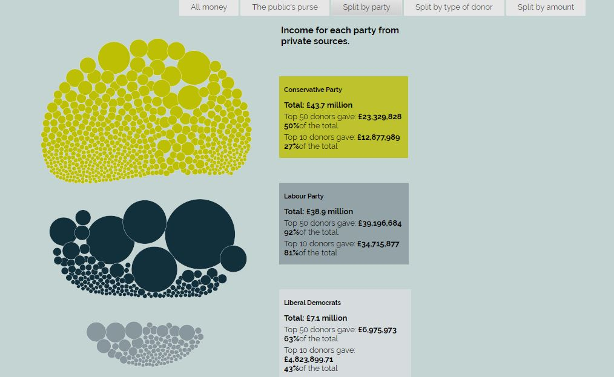
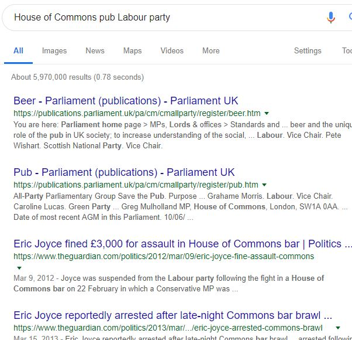
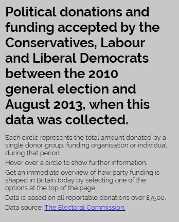
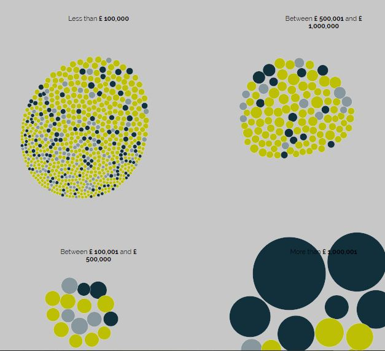
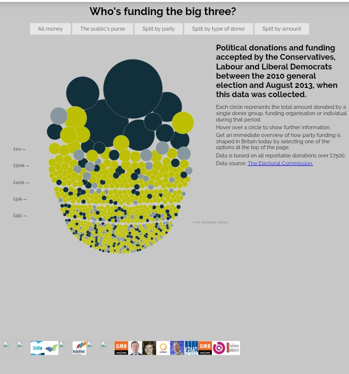

Μαρία Σκαφιδά

Α.Μ.: Π2012060

Εργασία: DATA VISUALIZATION - Οπτικοποίηση δεδομένων χορηγιών (UK)

e-mail: p12skaf@ionio.gr

Link αποθετήριου κώδικα: https://github.com/ioniodi/D3js-uk-political-donations

Link προσωπικού αποθετήριου κώδικα: https://github.com/mskafi28/D3js-uk-political-donations/tree/gh-pages

Link εκτελέσιμου κώδικα: https://mskafi28.github.io/D3js-uk-political-donations/

ΖΗΤΟΥΜΕΝΑ ΠΡΩΤΟΥ ΠΑΡΑΔΟΤΕΟΥ:

Για όλες τις αλλαγές που έχουν γίνει υπάρχουν σχετικά σχόλια στα αρχεία του κώδικα.

1) Ο σύνδεσμος της σελίδας με την εφαρμογή είναι ο παρακάτω: https://mskafi28.github.io/D3js-uk-political-donations/

2) Έκανα μετονομασία του αρχείου full-viz.html σε index.html, για να μη χρειάζεται να καταλήγει το url της εφαρμογής μου σε "full-viz.html".

3) Έγινε αλλαγή των χρωμάτων στις μπάλες με τα δεδομένα σε όλα τα πεδία ομαδοποίησης, με αλλαγή του color scale στο αρχείο chart.js. Επιπλέον, στην κατηγορία Split by party άλλαξα τα χρώματα στα πεδία Conservative Party, Labour Party και Liberal Democrats μέσα από το αρχείο style.css.

4) Ανέβασα στο προσωπικό μου αποθετήριο το αρχείο ήχου "Click.mp3" και στη συνέχεια στο αρχείο index.html πρόσθεσα κάποιες εντολές, ώστε να ακούγεται ήχος κάθε φορά που ο χρήστης κάνει κλικ σε κάποιο από τα πεδία ομαδοποίησης των δεδομένων.

5) Στο αρχείο chart.js προστέθηκε η εντολή ".on("click", SearchGoogle);" στη συνάρτηση start() και ορίστηκε η συνάρτηση "function SearchGoogle(d)" , έτσι ώστε όταν ένας χρήστης κάνει κλικ σε κάποια μπάλα ανοίγει μία καινούρια καρτέλα στο browser με τα αποτελέσματα της αναζήτησης στο google για το δωρητή στον οποίο αντιστοιχεί η μπάλα που πατήθηκε.

6) Στο αρχείο style.css πρόσθεσα zoom στις κεφαλίδες, ώστε κάθε φορά που το ποντίκι μεταφέρεται πάνω σε λέξεις του κειμένου, να μεγεθύνεται το κείμενο κατά 200%. 

7) Στο αρχείο chart.js προστέθηκαν οι εντολές, ώστε κάθε φορά που ο χρήστης περνάει το ποντίκι από τον κύκλο κάποιου δωρητή, ακούγεται το όνομα του δωρητή αυτού, καθώς επίσης και το συνολικό ποσό της δωρεάς του.
 
8) Πρόσθεσα μία ακόμα επιλογή ομαδοποίησης των δεδομένων, την επιλογή "Split by amount", στην οποία τα δεδομένα έχουν χωριστεί ανάλογα με το ποσό της δωρεάς. Συγκεκριμένα τα δεδομένα έχουν χωριστεί σε 4 κατηγοριές: α) αυτούς που έχουν δωρίσει λιγότερα από 100.000 δολλάρια, β) αυτούς που έχουν δωρίσει 100.001 εώς 500.000 δολλάρια, γ) αυτούς που έχουν δωρίσει από 500.001 εώς 1.000.000 δολλάρια και δ) αυτούς που έχουν δωρίσει πάνω από 1.000.001 δολλάρια.

Επιπλέον, στο φάκελο participants δημιούργησα ένα αρχείο .csv, το οποίο περιλαμβάνει τα στοιχεία που ζητήθηκαν και στο φάκελο photos επέλεξα και πρόσθεσα πέντε εικόνες δωρητών με μέγεθος 42x42 pixels και κατάληξη .ico.

ΖΗΤΟΥΜΕΝΑ ΔΕΥΤΕΡΟΥ ΠΑΡΑΔΟΤΕΟΥ:

1) Στο αρχείο "index.html" προστέθηκε εντολή ώστε να δημιουργηθεί χώρος στο κάτω μέρος της σελίδας, όπου εμφανίζεται και επεκτείνεται δυναμικά η σειρά των εικόνων με τους δωρητές πάνω από τους οποίους περνά ο χρήστης με το ποντίκι στο γράφημα.

