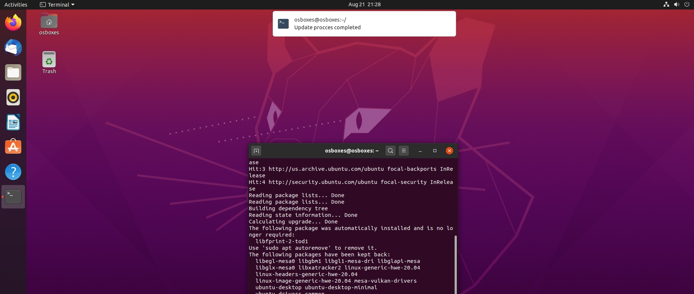

# ΙΟΝΙΟ ΠΑΝΕΠΙΣΤΗΜΙΟ, ΤΜΗΜΑ ΠΛΗΡΟΦΟΡΙΚΗΣ 
## ΜΑΘΗΜΑ
### Τεχνολογία λογισμικού 
Επιβλέπων καθηγητής: Χωριανόπουλος Κωνσταντίνος 

## Στοιχεία φοιτήτριας
### Μαρία Δήμα
### ΑΜ: Π2013029

## Ασκήσεις terminal
#### Άσκηση 1. Set-up continuous integration. Build and deploy your static site and your cv dynamically every time you make a small change in the source files.
##### asciinema: https://asciinema.org/a/MSENReT9thQV3cuTFSHaIlkl3
##### αποθετήριο σελίδας: https://github.com/p13dima/sw-askisi1
##### url σελίδας: https://p13dima-sw-askisi1.netlify.app/
Δγμιούργησα repository το οποίο έκανα clone στο σύστημα μου. Δημιούργησα τη σελίδα με τα απαραίτητα αρχεία index.html και style.css, έκανα commit και push τις αλλαγές. Χρησιμοποίησα το netlify για να κάνω deploy τη σελίδα μου.

###### Πηγές
https://app.netlify.com/

#### Άσκηση 2. Try different terminals and shells. Repeat some of the previous exercises with a different terminal-shell and create a custom configuration that fits your needs.
##### asciinema: https://asciinema.org/a/T1HJUUtOPl26AJS9uwcGiA5E1
Εγκατέστησα το zsh
```
sudo apt install zsh
```
Εγκατέστησα το oh-my-zsh
```
sh -c "$(wget -O- https://raw.githubusercontent.com/ohmyzsh/ohmyzsh/master/tools/install.sh)"
```
Άλλαξα το theme του oh my zsh
```
git clone https://github.com/cviebrock/.oh-my-zsh-custom.git
```
Για να αλλάξω το theme στο .zshrc πρόσθεσα
```
ZSH_THEME="cviebrock"
ZSH_CUSTOM=$HOME/.oh-my-zsh-custom
```
Στη συνέχεια άλλαξα το command prompt του zsh με τον αμ μου, έκανα browse αρχείων και διάβασα το configuration file.

Για να ανοίξω το zsh αφού δεν τον όρισα ως default (ήθελε logout login)
```
zsh
```
###### Πηγές
https://github.com/cviebrock/.oh-my-zsh-custom

https://scriptingosx.com/2019/07/moving-to-zsh-06-customizing-the-zsh-prompt/

https://github.com/ohmyzsh/ohmyzsh

#### Άσκηση 3. Send notifications to your desktop-mobile. Send a notifcation when a big task completes, eg download, compiling, etc
##### asciinema: https://asciinema.org/a/2JhAF0QdO1PyctCYRkcEp0VBB
Εγκατέστησα το ntfy
```
sudo pip3 install ntfy
```
στη συνέχεια δημιούργησα ένα shell script που κάνει update στο σύστημα και στέλνει notification μόλις τελειώσει
```
#!/bin/bash

sudo apt-get update 
sudo apt-get upgrade

ntfy send "Update procces completed"
```

Έτρεξα το script αφού το έκανα executable
```
sudo chmod +x task.sh
./task.sh
```

Το notification


###### Πηγές
https://github.com/dschep/ntfy

https://vitux.com/how-to-write-a-shell-script-in-ubuntu/

