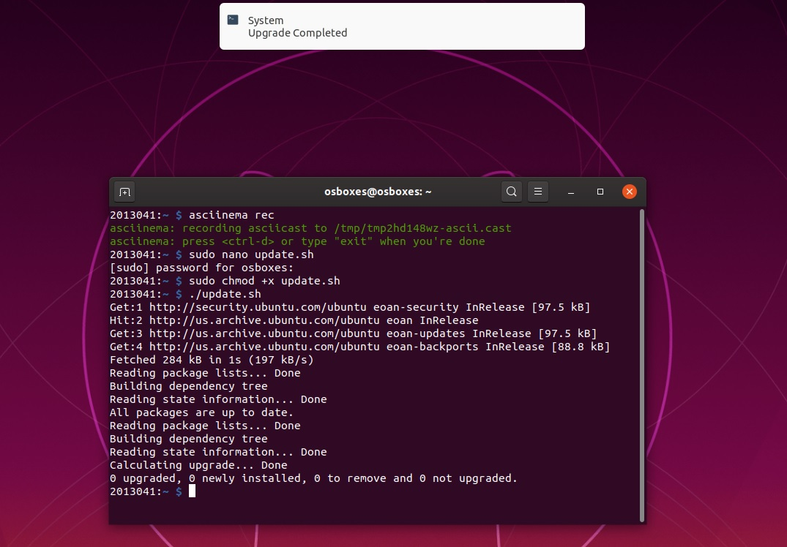
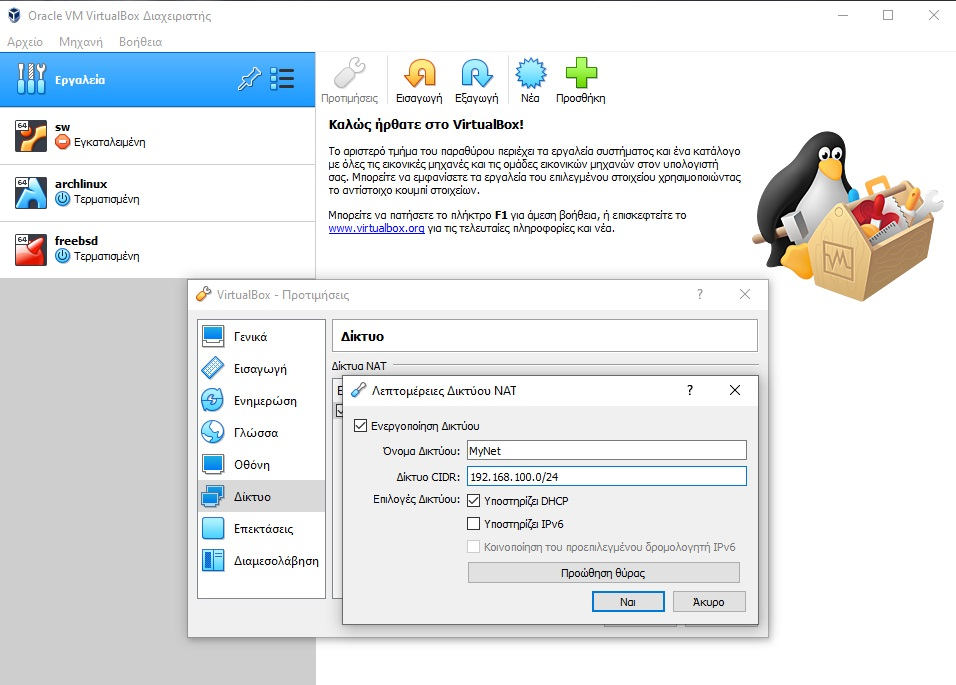
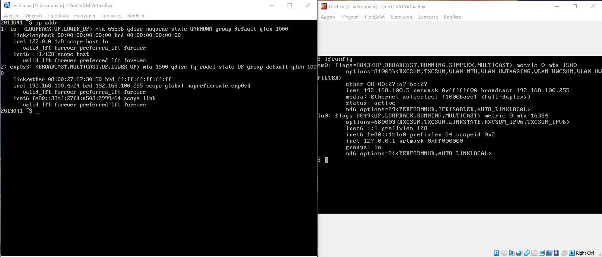
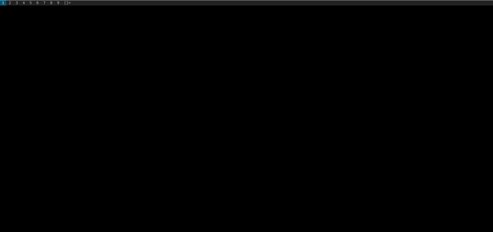

# ΙΟΝΙΟ ΠΑΝΕΠΙΣΤΗΜΙΟ, ΤΜΗΜΑ ΠΛΗΡΟΦΟΡΙΚΗΣ 
## ΜΑΘΗΜΑ
### Τεχνολογία λογισμικού 
Επιβλέπων καθηγητής: Χωριανόπουλος Κωνσταντίνος 

## Στοιχεία φοιτητή  
### Φοίβος Αργυρίδης
### ΑΜ: Π2013041

## Εισαγωγή
Γίνανε συνολικά 7 ασκήσεις linux terminal (6 + 1 extra) και 3 συμμετοχικού εκπαιδευτικού υλικού (2 + 1 extra). Σε όλες τις ασκήσεις linux terminal υπάρχουν τα url με την καταγραφή του asciinema ενω όπου δεν ήταν δυνατή η καταγραφή υπάρχουν ενδεικτικά screenshots που τεκμηριώνουν την υλοποίηση των ασκήσεων. Σε κάθε άσκηση στο τέλος υπάρχουν url με πηγές απο όπου βρέθηκαν πληροφορίες και οδηγίες για τα εργαλέια που χρησιμοποιήθηκαν.

## Συμμετοχικό περιεχόμενο
### url αποθετηρίου: https://github.com/fivosf/gr
### url σελιδας: https://fivos-gr.netlify.app/
### Παραδοτέο 1.Α
#### Eικόνα 1: Raspberry pi https://fivos-gr.netlify.com/gallery/f-raspberry-pi/
#### Εικόνα 2: Playstation https://fivos-gr.netlify.com/gallery/playstation/

### Παραδοτέο 1.Γ.1
#### David Canfield Smith https://fivos-gr.netlify.app/biography/smith/
#### Πηγές
https://en.wikipedia.org/wiki/David_Canfield_Smith

### extra παραδοτέο
#### Νέα μελέτη περίπτωσης apple https://fivos-gr.netlify.app/case-study/apple/
#### Πηγές
https://el.wikipedia.org/wiki/Apple


### Άσκηση 1. Try different terminals and shells. Ρepeat some of the previous exercises with a different terminal-shell and create a custom configuration that fits your needs
#### asciinema: https://asciinema.org/a/e4dounmZh2PBkr2GbrtOIzn5u
Χρησιμοποίησα το zsh

```
sudo apt install zsh
```

To zsh terminal by default είναι το ίδιο με το bash. Όλες οι παραμετροποιήσεις γίνοντε απο το αρχείο .zshrc, Δημιουργησα το αρχείο και άλλαξα την μεταλητή PS1 με τον ΑΜ μου (Άσκηση 1 HCI), ενεργοποίησα τα χρώματα και το auto complete στις εντολες. Επίσης πατωντας 2 φορες το tab μπορω να δω όλα τα αρχεια (και dotfiles) με οποιαδήποτε εντολή. Τέλος έδειξα το configuration file μου .bashrc

```
nano .zshrc
```

#### Πηγές
https://www.youtube.com/watch?v=eLEo4OQ-cuQ

### Άσκηση 2. Set-up a system for python development. Install and configure in a user folder a python project that is not available through the package manager.
#### asciinema: https://asciinema.org/a/QolaktK9DbVgTEk2B9oZ38KGH
Για την άσκηση αυτή χρησιμοποίησα ένα δικό μου project το οποίο κάνει print τίτλους ειδήσεων απο www.euro2day.gr μέσω rss. Το μοναδικό dependency στο project είναι το feedparser.

```
pip install feedparser
```

Για να στήσω το virtual enviroment ακολούθησα τον οδηγό https://docs.python-guide.org/dev/virtualenvs/. Ο κώδικας του project είναι στο github. https://github.com/fivosf/mynews.

### Άσκηση 3. Send notifications to your desktop-mobile. Send a notifcation when a big task completes, eg download, compiling, etc
#### asciinema: https://asciinema.org/a/PorL9zTrycaOBRuGGDQ8JVXQt
Χρησιμοποίησα το ntfy

```
sudo pip install ntfy
```
Εφτιαξα ενα bash script (update.sh) το οποίο τρέχει update kai upgrade και στο τέλος στέλνει το notification στον χρήστη.

```
#!/bin/bash

sudo apt update
sudo apt upgrade -y

ntfy -t 'System' send "Upgrade Completed"
```

Παρακάτω φαίνεται το notification


#### Πηγές
https://www.youtube.com/watch?v=bbdQXfReuG0

### Άσκηση 4. Try different operating systems in the emulator. Load at least two operating systems without a GUI (only CLI) and create a virtual local network.
#### asciinema: https://asciinema.org/a/7oCqxmiZQ21ATjk9DZzQ1WN8K
χρησιμοποίησα το ArchLinux και το FreeBsd με το virtual box σαν emulator. Για να δημιουργήσω το virtual local network απο τις ρυθμίσεις του virtual box δημιουργησα καινούργιο δίκτυο όπως φαίνεται στην παρακάτω εικόνα



Στη συνέχεια απο τις ρυθμίσεις του κάθε συστήματος τα ένταξα στο καινούργιο δίκτυο που δημιουργησα


Στην παρακάτω εικόνα φαίνονται οι ip adresses των δύο συστημάτων



Για να δω την ip στο ArchLinux και στο FreeBsd χρησιμοποίησα τις εντολές αντίστοιχα

```
ip addr
ifconfig
```

Το asciinema εγκαταστάθηκε στο ArchLinux και το recording εγινε απο εκει.

```
sudo pip install asciinema
```

Για να τεκμηριώσω ότι υπάρχει επικοινωνία μεταξύ των δύο συστημάτων εκανα ping to freeBsd απο το ArchLinux

```
ping 192.168.100.5
```

#### Πηγές
https://www.youtube.com/watch?v=vReAkOq-59I

### Άσκηση 5. Configure a custom window manager. Try different wm and configure one to fit your needs.
#### asciinema: https://asciinema.org/a/lef0LuS69LYPOe9VtJFitF7Nm
Έκανα εγκατάσταση το dwm

```
sudo apt-get install dwm suckless-tools xdm dmenu xorg
echo dwm > .xsession
```
Εκανα reboot to συστημά μου και οταν εκανα login ημουν πια στο dwm.



Απο εδω αρχίζει να γράφει το acsiinema. Στόχος μου ηταν να ενσωματώσω ένα status bar που θα τρέχει αυτόματα κάθε φορά που θα κάνω login στο σύστημα. Μετά απο αναζήτηση βρήκα το status monitor το οποίο υπάρχει στο github και το εκανα clone και install, όπως περιγράφουν οι οδηγίες (url στις πηγές) χρειάστηκε να εγκαταστήσω το libx11-dev για να ολοκληρωθεί η εγκατάσταση καθώς μου εβγαζε error. 

```
sudo apt install libx11-dev
```

Μετά την εγκατάσταση το αποτέλεσμα ηταν όπως στην παρακάτω εικόνα.


#### Πηγές

dwm installation https://medium.com/hacker-toolbelt/dwm-windows-manager-in-ubuntu-14958224a782

status bar https://dwm.suckless.org/status_monitor/

### Άσκηση 6. Set-up continuous integration. Build and deploy your static site and your cv dynamically every time you make a small change in the source files
#### asciinema: https://asciinema.org/a/7RKbseRiPaKSdK6UVTuciA3ws
#### url αποθετηρίου https://github.com/fivosf/sw_site
#### url σελίδας https://sw-assignment-6.netlify.app/

Η άσκηση αυτή έγινε τοπικά στον υπολογιστή μου και εγιναν push τα source files στο github repo. Το asciinema καταγράφει μία αλλαγή στο css και γινεται git commit και git push.

### Εxtra άσκηση 7. Use the terminal as an IDE. Edit your files (e.g., cv, website, code, etc) in vim or emacs and compile it in a different panel or use a plug-in.
#### asciinema: https://asciinema.org/a/XUI7EP2xyqm6MHCDaF27GyyrR
Για την άσκηση αυτή επεξεργάτηκα τη σελίδα που δγμιούργησα για την προηγουμενη άσκηση χρησιμοποιόντας το spacevim όπως φαινεται στο recorded session του asciinema.

#### Πηγές
https://spacevim.org/quick-start-guide/#install


