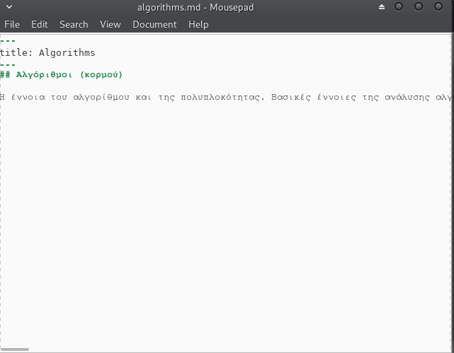
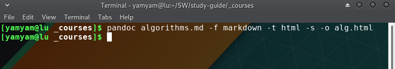
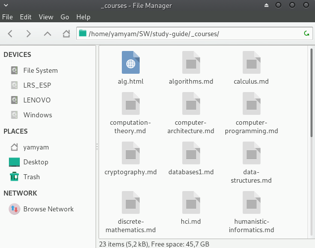
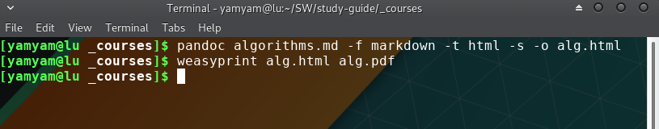
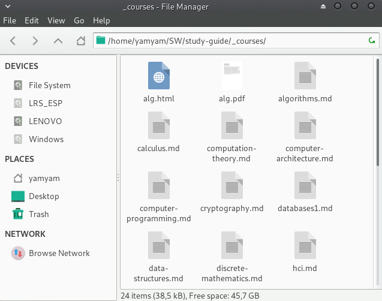
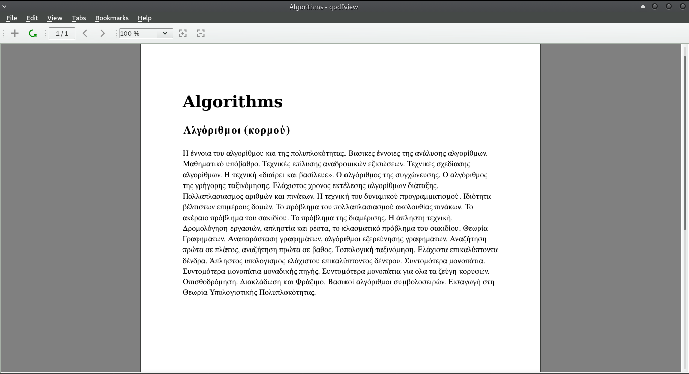

### Δήλωση και δέσμευση θέματος εργασίας στο μάθημα Τεχνολογία Λογισμικού(14 Μαρτίου)

*  Ονοματεπώνυμο: **Γιαμουρίδης Νικόλαος**
*  Αριθμός Μητρώου: **Π2013051**
*  Θέμα εργασίας **"Συνεργατική κατασκευή οδηγού σπουδών"**
*  Προσωπικό αποθετήριο του κώδικα: [Link Αποθετηρίου του κώδικα](https://github.com/DIYamYam/study-guide)

### Παραδοτέο 1.1

*  Δημιουργήθηκαν και έγιναν απόδεκτα(merged) τα παρακάτω αρχεία:  
( algorithms.md, calculus.md, computation-theory.md, computer-architecture.md, computer-programming.md, cryptography.md, databases1.md, data-structures.md, discrete-mathematics.md, hci.md, humanistic-informatics.md, information-theory.md, introduction-computer-science.md, itp.md, linear-algebra.md, mis.md, networks1.md, object-oriented-programming.md, readme.md, security.md, statistics.md, theory-of-probability.md)
* Μετά απο την εγκατάσταση του λειτουργικού Manjaro linux, εγκαταστάθηκαν τα εργαλεία pandoc και weasyprint. Επόμενο βήμα ήταν να γίνει clone το αποθετήριο του Study guide τοπικά . Στην συνέχεια έγινα οι πρώτες δοκιμαστικές μετατροπές αρχείων:
* Αρχικά από markdown το αρχείο algorithms.md αφού προσθέσαμε ένα πρόχειρο περιεχόμενο από τον legacy οδηγό σπουδών μετατράπηκε σε html με την βοήθεια του pandoc και δημιουργήθηκε ένα νέο αρχείο alg.html:
 
 
 
 
* Και έπειτα από html με την βοήθεια του weasyprint μετατράπηκε σε αρχείο pdf και δημιουργήθηκε το νέο αρχείο alg.pdf:
 
 
 

# ΠΑΡΑΔΟΤΕΟ 2 - ΤΕΛΙΚΗ ΑΝΑΦΟΡΑ

[GitHub Page]( https://diyamyam.github.io/SWFinal/ )
