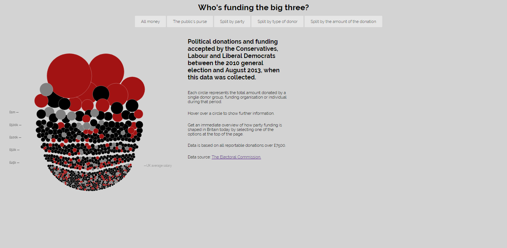
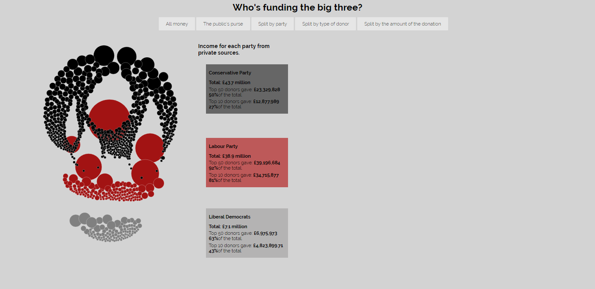
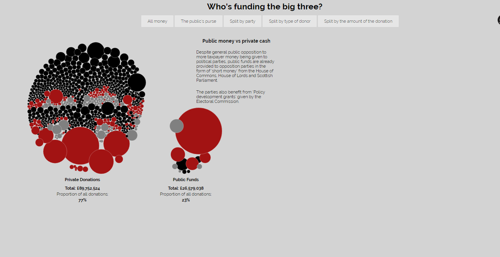
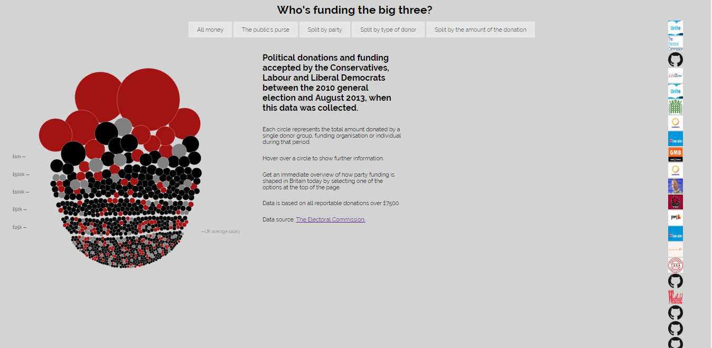
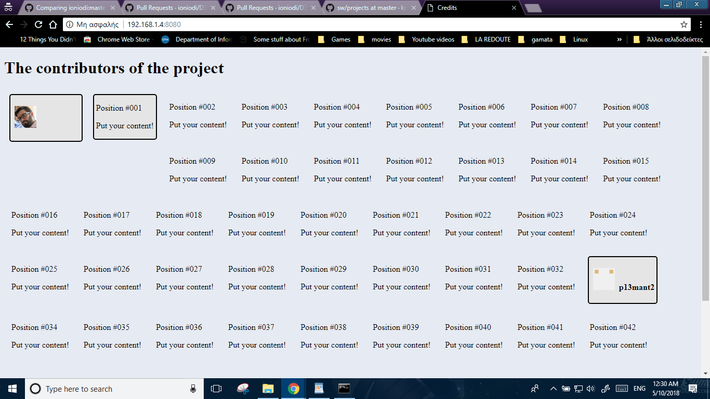

## Τριαντάφυλλος Μάντσιος

## Α.Μ.: Π2013079

## Εργασία: DATA VISUALIZATION - Οπτικοποίηση δεδομένων χορηγιών (UK)

e-mail: p13mant@ionio.gr

Link αποθετήριου κώδικα https://github.com/p13mant2/D3js-uk-political-donations

## ΖΗΤΟΥΜΕΝΑ ΠΡΩΤΟΥ ΠΑΡΑΔΟΤΕΟΥ:

1.Ο σύνδεσμος της σελίδας με την εφαρμογή είναι ο παρακάτω https://p13mant2.github.io/D3js-uk-political-donations

2.Έκανα μετονομασία του αρχείου full-viz.html σε index.html, για να μη χρειάζεται να καταλήγει το url της εφαρμογής μου σε "full-viz.html".

3.Έγινε αλλαγή των χρωμάτων στις μπάλες με τα δεδομένα σε όλα τα πεδία ομαδοποίησης, με αλλαγή του color scale στο αρχείο chart.js. Επιπλέον, στην κατηγορία Split by party άλλαξα τα χρώματα στα πεδία Conservative Party, Labour Party και Liberal Democrats μέσα από το αρχείο style.css.

4.Στο αρχείο index.html πρόσθεσα την εντολή onmousedown="bs.play()", ώστε να ακούγεται ήχος κάθε φορά που ο χρήστης κάνει κλικ σε κάποιο από τα πεδία ομαδοποίησης των δεδομένων.

5.Στη συνάρτηση start() του αρχείου chart.js προστέθηκε η εντολή .on("click", function(d) { window.open("http://www.google.com/search?q=" + d.donor);});, έτσι ώστε όταν ένας χρήστης κάνει κλικ σε κάποια μπάλα ανοίγει μία καινούρια καρτέλα στο browser με τα αποτελέσματα της αναζήτησης στο google για το δωρητή στον οποίο αντιστοιχεί η μπάλα που πατήθηκε.

6.Στο αρχείο index.html πρόσθεσα σε όλες τις κεφαλίδες των κειμένων το class=zoom, ώστε κάθε φορά που το ποντίκι μεταφέρεται πάνω σε λέξεις του κειμένου, να λειτουργεί και ως μεγεθυντικός φακός.

## ΖΗΤΟΥΜΕΝΑ ΔΕΥΤΕΡΟΥ ΠΑΡΑΔΟΤΕΟΥ:

Για το δεύτερο παραδοτέο:

Αρχικά ζητήθηκε να εμφανίζεται  η σειρά των εικόνων με τους δωρητές πάνω από τους οποίους πέρασε ο δείκτης του ποντικιού στο γράφημα.Ουσιαστικά πρόκειται για ένα ιστορικό σχετικά με το από ποιους δωρητές έκανε mouseover ο χρήστης.

## Παραδοτέο 2 - Η σελίδα στην οποία φαίνονται τα contributions από τους χρήστες του κεντρικού απεθετηρίου.

## Τελική Αναφορά
Link για την τελική αναφορά της εργασίας:https://github.com/p13mant2/FinalReportSW
