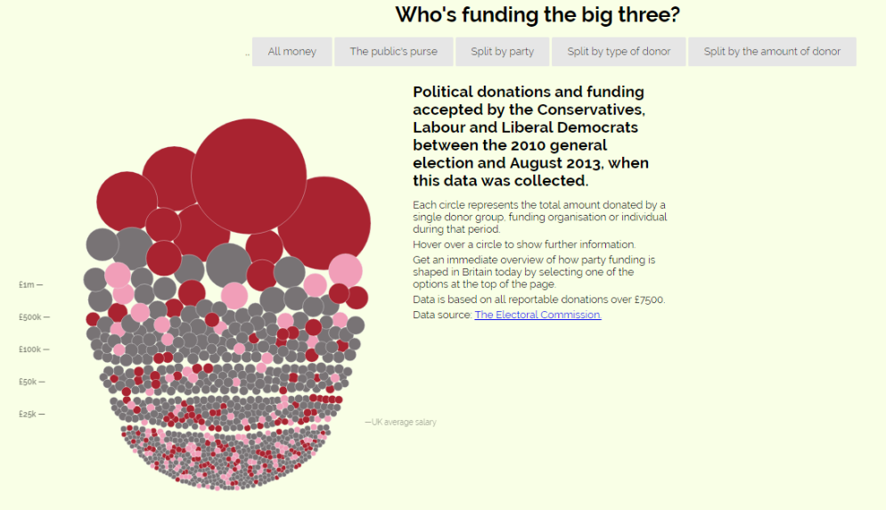
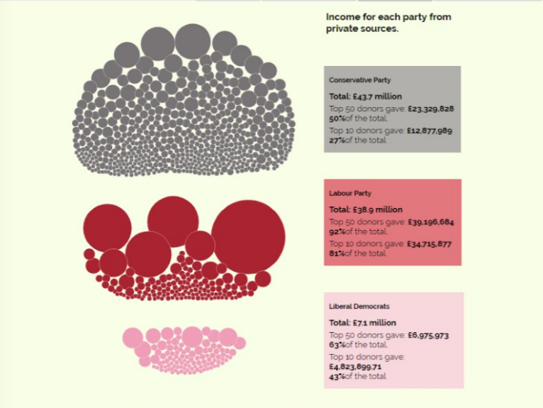
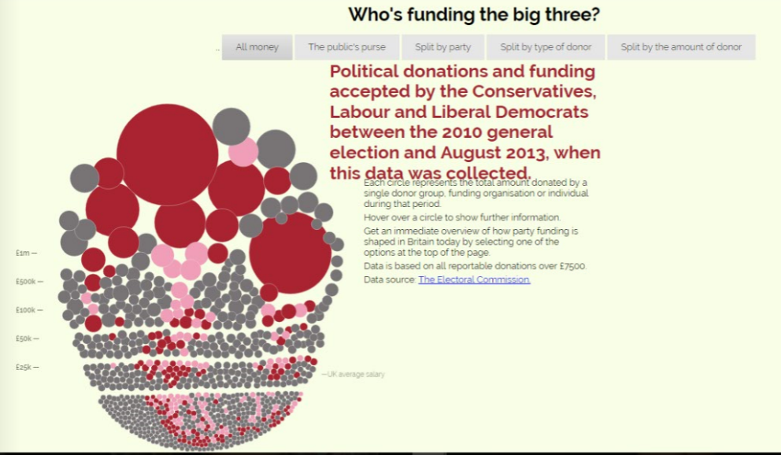
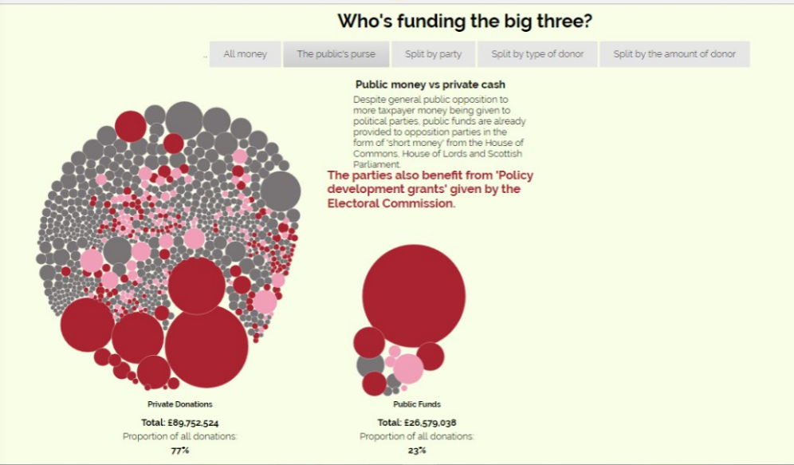

Οπτικοποίηση δεδομένων

Ειρήνη Φωκά - Π2013083
Link στο προσωπικό αποθετήριο του κώδικα:
Link στο εκτελέσιμο του κώδικα: https://riniw.github.io/D3js-uk-political-donations/

Ζητούμενα πρώτου παραδοτέου:

1) Αρχικά έσβησα την κατάληξη του συνδέσμου της σελίδας μου full-viz.html (https://riniw.github.io/D3js-uk-political-donations/)

2) Έγινε αλλαγή στα χρώματα από τις μπάλες στο αρχείο chart.js και αλλαγή χρωμάτων στα αντίστοιχα 3 πεδία της ομαδοποίησης Split by party, στο αρχείο style.css

3) Ανέβασα στο αποθετήριό μου ένα .mp3 αρχείο και σημειώθηκε η αντίστοιχη μεταβλητή στο index.html αρχείο.

4) Δημιούργησα τη συνάρτηση "anazitisi" στο αρχείο chart.js και μέσα στη συνάρτηση start() πόσθεσα την εντολή ".on("click",anazitisi);".
Το συγκεκριμένο κομμάτι δε λειτούργησε και προκαλούσε προβλήματα και για αυτό τα παραπάνω βρίσκονται σε σχόλια.

5) Δημιουργήθηκαν δύο κλάσεις zoom, και zoom2 οι οποίες αλλάζουν το μέγεθος της γραμματοσειράς που απεικονίζεται και τη μετακινούν, καθώς και αλλάζει χρώμα κατά το zoom και κάνει bold τα γράμματα για ευκολότερη ανάγνωση. Η δεύτερη κλάση εμφανίζει τη γραμματοσειρά με διαφορετικό μέγεθος από την πρώτη,ώστε να μην υπάρχουν συγκρούσεις των γραμμάτων.

6) Στο αρχείο chart.js τροποποίησα τον κώδικα της εφαρμογής ώστε όταν το ποντίκι βρίσκεται μέσα στον κύκλο κάποιου δωρητή, να ακούγεται η ονομασία του δωρητή και το ποσό της δωρεάς.

7)
