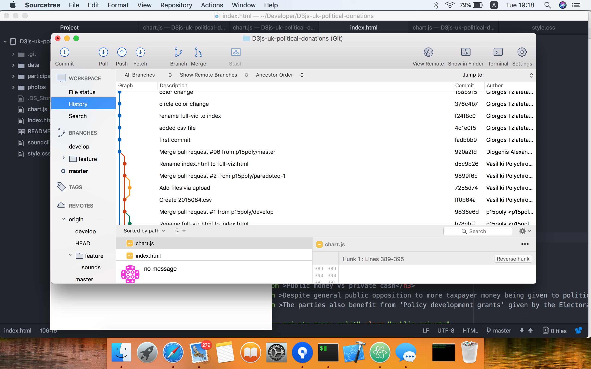
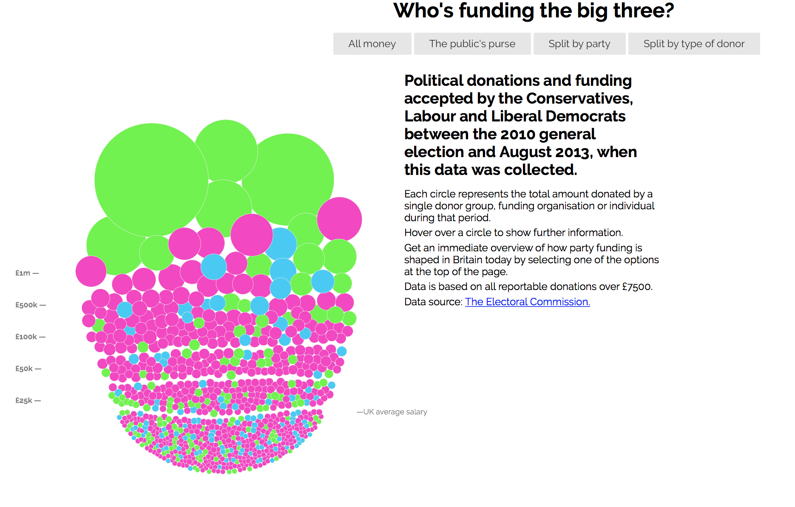

# Μάθημα: Τεχνολογίες Λογισμικού

Ονοματεπώνυμο: **Τζιαφέτας Γιώργος**

Αριθμός Μητρώου: **Π2013112**

## Εργασία: Οπτικοποίηση δεδομένων χορηγιών (UK)

**Προσωπικό αποθετήριο: https://github.com/giorgostzaf/D3js-uk-political-donations**

**_Παραδοτέο 1_**

- **Link εκτελέσιμου:** https://giorgostzaf.github.io/D3js-uk-political-donations/
- Αλλαξή του url απο full-viz.html
- Αλλαγή χρώματος στις μπάλες με τα δεδομένα καθώς και στα
    αντίστοιχα 3 πεδία της ομαδοποίησης _Split by party_
- Ακούγεται ήχος κάθε φορά που ο χρήστης της εφαρμογής κάνει
    κλικ σε μία από τις επιλογές ομαδοποίησης των δεδομένων
- Κάθε φορά που ο χρήστης κάνει κλίκ πάνω σε μια μπάλα ανοίγει
    ένα νέο παράθυρο με τα αποτελέσματα της αναζήτησης στο
    google για τον αντίστοιχο δωρητή
- Κάθε φορά που ο χρήστης κάνει hover με το ποντίκι πάνω απο
    γράμματα λειτουργεί σαν μεγενθυτικός
    φακος μεγενθύνοντας την γραμματοσειρά
- Όταν το ποντίκι βρίσκεται μέσα στον κύκλο κάποιου δωρητή
    ακούγεται η ονομασία του δωρητή και το ποσό της δωρεάς
- Δημιουργήθηκε μια νέα επιλογή ομαδοποίησης δεδομένων (Split
    by the amount) όπου ομαδοποιεί τα δεδομένα με βάση το ποσό της
    δωρεάς
- Προσθήκη αρχείου csv με τα στοιχεία μου στο κοινό αποθετήριο
- πρόσθεσα 5 φωτογραφίες απο τους δωρητές που επέλεξα, στο
    κοινό αποθετήριο
    
    Το τοπικό μου περιβάλλον εργασίας αποτελείτε απο το Atom και το
Sourcetree. Μετά το fork του repo το έκανα clone μέσω ssh για να
δουλέψω τοπικά. Η επεξεργασία του κώδικα γινόταν απο το Atom και η
αλληλεπιδραση με το Git γινόταν μέσω του Sourcetree.Κάθε αλλαγή που
απαιτούνταν γινόταν με feature branch και στη συνέχεια όταν η αλλαγή
ολοκληρωνόταν γινόταν merge στο develop. Οταν ολοκληρώθηκαν όλες
οι αλλαγές περάστηκαν απο το develop στο master.

## Ενδεικτικές φωτογραφίες ##

