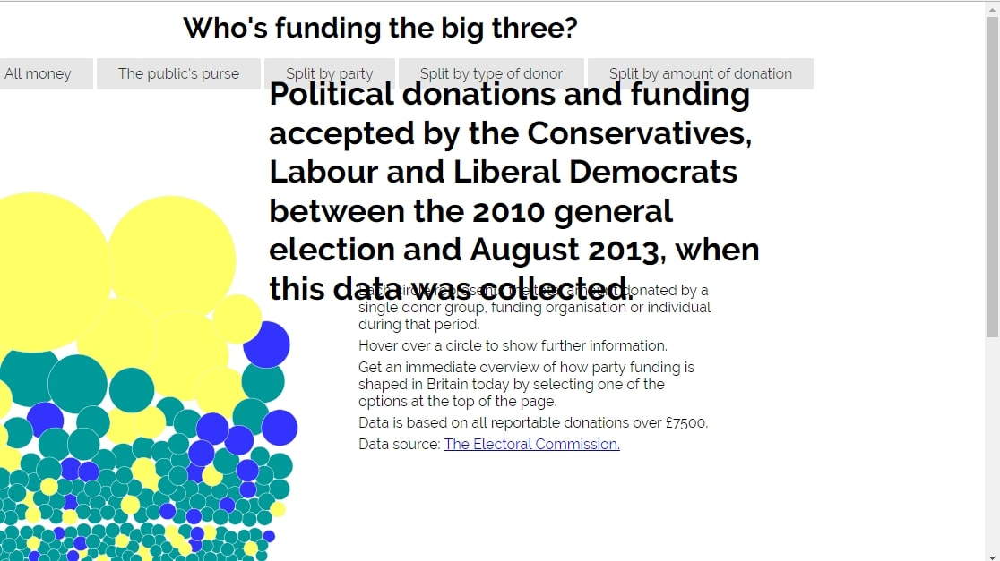
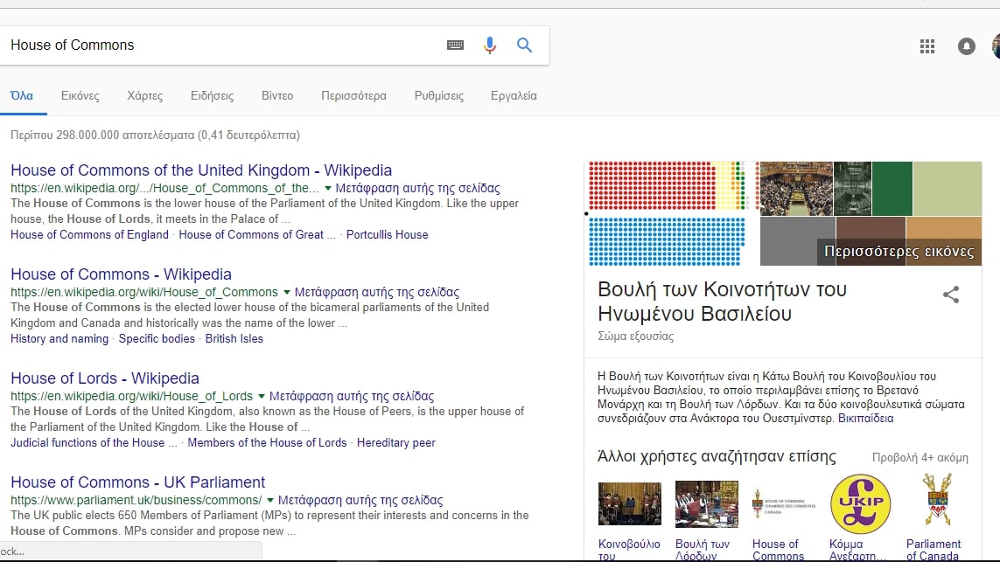

Μάθημα: Τεχνολογία Λογισμικού

Τίτλος Εργασίας: Οπτικοποίηση δεδομένων χορηγιών (UK)

Όνομα: Νίκη Καπετανοπούλου

ΑΜ: Π2013120

Link προσωπικού αποθετήριου κώδικα: https://github.com/Nikikpt/D3js-uk-political-donations

Link εκτελέσιμου:
https://nikikpt.github.io/D3js-uk-political-donations/

Παραδοτέο 1:

•	Αρχικά μετέτρεψα τον σύνδεσμο της σελίδας μου μετονομάζοντας το αρχείο full_viz.html σε index.html.

•	Στην συνέχεια για να αλλάξω το χρώμα στις μπάλες τροποποίησα στο chart.js την συγκεκριμένη γραμμή: var fill = d3.scale.ordinal().range(["#f02233", "#087fbd", "#fdbb30"]); καθώς και στα 3 πεδία ομαδοποίησης Split by party.

•	Προκειμένου να ακούγεται ήχος κάθε φορά που πατιέται κάποιο κουμπί αρχικά ανέβασα ένα αρχείο “Sound.mp3” και το χρησιμοποίησα στην παρακάτω συνάρτηση:
var button_sound = new Audio("Sound.mp3");
και επίσης: onmousedown="button_sound.play()

•	Στη συνέχεια για να ανοίγει νέο παράθυρο με τα αποτελέσματα της αναζήτησης στο google χρησιμοποίησα την παρακάτω συνάρτηση:
.on("click", function(d) { window.open("http://www.google.com/search?q=" + d.donor);});

•	Στο επόμενο ερώτημα ζητήθηκε να τοποθετήσουμε μεγεθυντικό φακό που αφορά άτομα με περιορισμένη όραση. Προκειμένου να επιτευχθεί το συγκεκριμένο ερώτημα τροποποίησα το: $("p").addClass("zoom");
το οποίο παίρνει την κάθε κεφαλίδα όπως φαίνετε και στον index.html και μέσω του zoom την μεγεθύνει. 

•	Τέλος προστέθηκε ακόμα μια επιλογή ομαδοποίησης των δεδομένων (Split by amount of donation) με τις κατάλληλες αλλαγές στα index.html, chart.js και style.css.

Στιγμιότυπα:

Παραδοτέο 2 και Τελική Αναφορά:

Όνομα: Νίκη Καπετανοπούλου

ΑΜ: Π2013120

Link προσωπικού αποθετήριου κώδικα: https://github.com/Nikikpt/D3js-uk-political-donations

Link εκτελέσιμου:
https://nikikpt.github.io/D3js-uk-political-donations/

Εισαγωγή:

Η παρούσα εργασία αποτελεί μέρος του μαθήματος "Τεχνολογία Λογισμικού" του ΣΤ' εξαμήνου και έχει ως κύριος στόχο την γνωριμία και την εκμάθηση των γλωσσών javascript, html και css. Η οπτικοποίηση γίνεται με τη χρήση της βιβλιοθήκης D3 της JavaScript που αντλεί τα δεδομένα των χορηγιών από ένα αποθετήριο που τα περιέχει στην ιστοσελίδα του Github. Στη συνέχεια θα αναλυθούν οι αλλαγές που έγιναν σε κάθε παραδοτέο προκειμένου να προκύψει το τελικό αποτέλεσμα.

Σύνοψη:

Ουσιαστικά έγινε μια γνωριμία με τις Github-pages προκειμένου να επιτευχθούν αλλαγές στον κώδικα ο οποίος έγινε αρχικά fork από το κεντρικό αποθετήριο. Η εργασία αφορά δωρεές που έχουν γίνει σε πολιτικά κόμματα της Μεγάλης Βρετανίας. Επιπλέον έγινε μια επιπλέον εκμάθηση των γλωσσών html και css και φυσικά javascript. 

Εργαλεία και ανάλυση σχετικών έργων:

Κύριο και βασικό εργαλείο αποτελεί το Github.
Στη συνέχεια ωστόσο έγιναν αρκετές αλλαγές στον κώδικα προκειμένου να αλλάξει και η ιστοσελίδα. Τα βήματα τα οποία πραγματοποιήθηκαν είναι τα παρακάτω:

Αρχικά μετέτρεψα τον σύνδεσμο της σελίδας μου μετονομάζοντας το αρχείο full_viz.html σε index.html.
Στην συνέχεια για να αλλάξω το χρώμα στις μπάλες τροποποίησα στο chart.js την συγκεκριμένη γραμμή: var fill = d3.scale.ordinal().range(["#f02233", "#087fbd", "#fdbb30"]); καθώς και στα 3 πεδία ομαδοποίησης Split by party.	Προκειμένου να ακούγεται ήχος κάθε φορά που πατιέται κάποιο κουμπί αρχικά ανέβασα ένα αρχείο “Sound.mp3” και το χρησιμοποίησα στην παρακάτω συνάρτηση:
var button_sound = new Audio("Sound.mp3");
και επίσης: onmousedown="button_sound.play()
Στη συνέχεια για να ανοίγει νέο παράθυρο με τα αποτελέσματα της αναζήτησης στο google χρησιμοποίησα την παρακάτω συνάρτηση:
.on("click", function(d) { window.open("http://www.google.com/search?q=" + d.donor);});
Στο επόμενο ερώτημα ζητήθηκε να τοποθετήσουμε μεγεθυντικό φακό που αφορά άτομα με περιορισμένη όραση. Προκειμένου να επιτευχθεί το συγκεκριμένο ερώτημα τροποποίησα το: $("p").addClass("zoom");
το οποίο παίρνει την κάθε κεφαλίδα όπως φαίνετε και στον index.html και μέσω του zoom την μεγεθύνει. 
Τέλος προστέθηκε ακόμα μια επιλογή ομαδοποίησης των δεδομένων (Split by amount of donation) με τις κατάλληλες αλλαγές στα index.html, chart.js και style.css.

Αλλαγές στο κοινό αποθετήριο:

Επιλέχτηκαν οι εξής δωρητές:

Keith G Bradshaw 
Anna C hobhouse 
David Hempleman-Adams 
Costas Kaplanis 
Tim Oliver 

Όπου προστέθηκαν και οι κατάλληλες φωτογραφίες.
Τέλος δημιουργήθηκε το 2013120.csv

Παραδοτέο 2:

Αν και πραγματοποιήθηκαν οι αλλαγές στον κώδικα των style.css, chart.js και index.html οι οποίες απαιτούνταν ώστε να εμφανίζονται δυναμικά οι εικόνες των δωρητών με τους οποίους πέρασε ο δείκτης του ποντικιού στο γράφημα, προέκυψε πρόβλημα κατά την εμφάνιση τους ωστόσο υπήρξε πολύ προσπάθεια για την σωστή εμφάνση τους.

Όσο αφορά τη δημιουργία του ίδιου D3 γραφήματος οπτικοποίησης με νέα ανοικτά δεδομένα δημιουργήθηκαν 3 καινούργια αρχεία:

chart2.js, index2.html και style2.css στα οποία έγιναν κάποιες μικροαλλαγές όπως σε ονομάτα και σε τιμές τα οποία προέκυψαν από τον εξής σύνδεσμο:
data-and-maps/data/waterbase-rivers-10/waterbase-rivers-quality/waterbase-rivers-csv-files

και έγιναν τροποιήσεις με βάση τα δεδομένα που αντλήθηκαν από κει.

Τέλος, δεσμέυτηκε η περιοχή "position#58" και έγιναν κάποιες αλλαγές στον κώδικα.

Συμπεράσματα:

Στα πλαίσια εκπόνησης της συγκεκριμένης εργασίας ήρθαμε σε επαφή με διάφορες γλώσσες προγραμματισμού όπως html, css and javascript. 
Τα παραπάνω αποτελούν ένα σημαντικό κομμάτι της πληροφορικής και γενικά των τεχνολογιών.
Τέλος, υπήρξε σημαντική ενασχόληση και εκμάθηση ιστοσελιδών με τη βοήθεια των github-pages.

