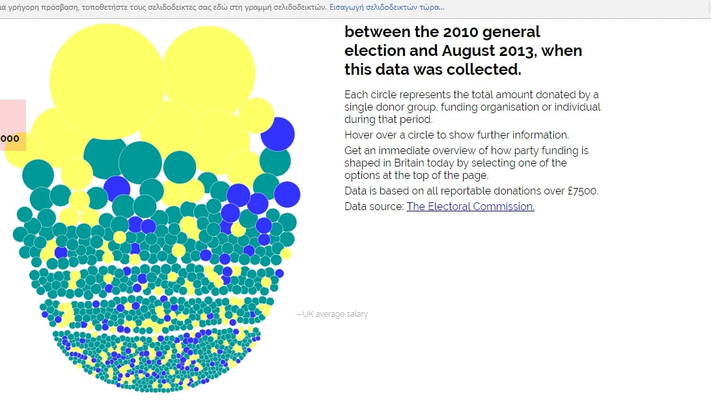

Μάθημα: Τεχνολογία Λογισμικού

Τίτλος Εργασίας: Οπτικοποίηση δεδομένων χορηγιών (UK)

Όνομα: Νίκη Καπετανοπούλου

ΑΜ: Π2013120

Link προσωπικού αποθετήριου κώδικα: https://github.com/Nikikpt/D3js-uk-political-donations

Link εκτελέσιμου:
https://nikikpt.github.io/D3js-uk-political-donations/

Παραδοτέο 1:

•	Αρχικά μετέτρεψα τον σύνδεσμο της σελίδας μου μετονομάζοντας το αρχείο full_viz.html σε index.html.

•	Στην συνέχεια για να αλλάξω το χρώμα στις μπάλες τροποποίησα στο chart.js την συγκεκριμένη γραμμή: var fill = d3.scale.ordinal().range(["#f02233", "#087fbd", "#fdbb30"]); καθώς και στα 3 πεδία ομαδοποίησης Split by party.

•	Προκειμένου να ακούγεται ήχος κάθε φορά που πατιέται κάποιο κουμπί αρχικά ανέβασα ένα αρχείο “Sound.mp3” και το χρησιμοποίησα στην παρακάτω συνάρτηση:
var button_sound = new Audio("Sound.mp3");
και επίσης: onmousedown="button_sound.play()

•	Στη συνέχεια για να ανοίγει νέο παράθυρο με τα αποτελέσματα της αναζήτησης στο google χρησιμοποίησα την παρακάτω συνάρτηση:
.on("click", function(d) { window.open("http://www.google.com/search?q=" + d.donor);});

•	Στο επόμενο ερώτημα ζητήθηκε να τοποθετήσουμε μεγεθυντικό φακό που αφορά άτομα με περιορισμένη όραση. Προκειμένου να επιτευχθεί το συγκεκριμένο ερώτημα τροποποίησα το: $("p").addClass("zoom");
το οποίο παίρνει την κάθε κεφαλίδα όπως φαίνετε και στον index.html και μέσω του zoom την μεγεθύνει. 

•	Τέλος προστέθηκε ακόμα μια επιλογή ομαδοποίησης των δεδομένων (Split by amount of donation) με τις κατάλληλες αλλαγές στα index.html, chart.js και style.css.

Στιγμιότυπα:

