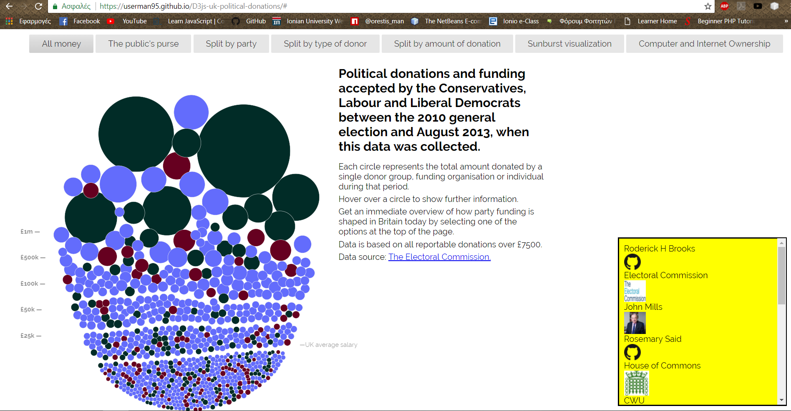
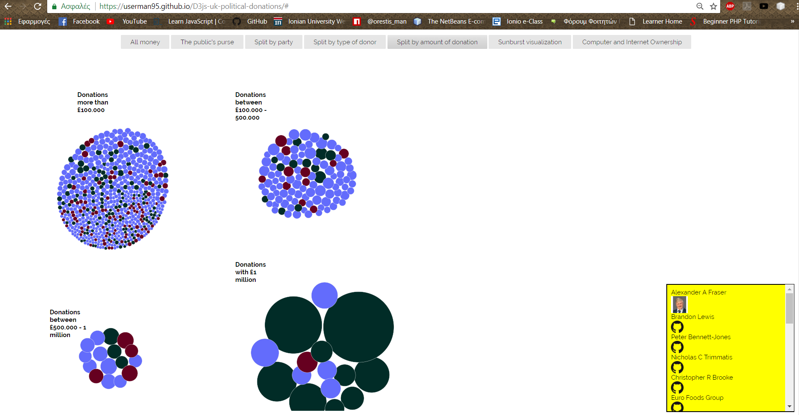
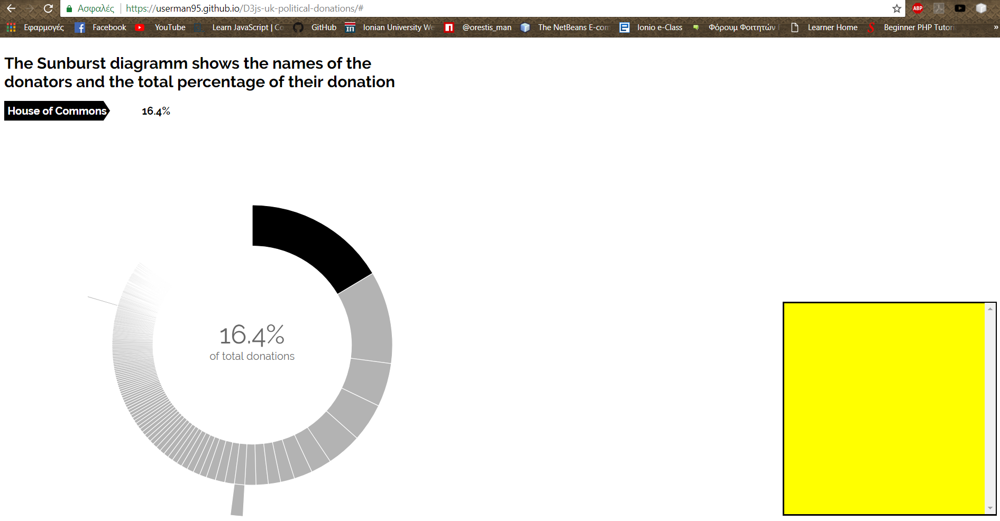

# ΙΟΝΙΟ ΠΑΝΕΠΙΣΤΗΜΙΟ

# ΤΜΗΜΑ ΠΛΗΡΟΦΟΡΙΚΗΣ

# ΜΑΘΗΜΑ 

### Τεχνολογία Λογισμικού
## Επιβλέπων καθηγητής: Χωριανόπουλος Κωσταντίνος
# Επιλογή Εργασίας 
**Data Visualization**
**Καπλάνης Ορέστης ΑΜ:2013139**
## Παραδοτέο 1ο
**Ζητούμενα:**
### 1o&2o:   Ζητούμενο Link:https://userman95.github.io/D3js-uk-political-donations/
          
### 3ο:   **Αλλαγή χρωμάτων: (πράσινο,μπλέ,βυσσινί)**
var fill = d3.scale.ordinal().range(["#012c27", "#636cfc", "#660020"]);

### 4ο:   **Έγινε upload του ήχου και προσθήκη id sto html και ο παρακάτων κώδικας για το chart.js**
var x = document.getElementById("myAudio"); 

function playAudio() { 
    x.play(); 
} 
### 5ο:   **Προσθήκη click event**
function click(d){
	var q = d.donor;
	    window.open('http://google.com/search?q='+q);
}
### 6o:   **Έγινε απλά αλλαγή στο font size όταν ο χρήστης έχει το ποντίκι από πάνω από οποιοδίποτε text**
### 7o:   **Έγινε προσθήκη της source:     και του εξής κώδικα**
	responsiveVoice.speak("The name of the donor is" + donor + "             and the ammount of the donation is " + amount);
### 8o: **Έγινε δημιουργία νέου tab (Split by the amount of donation) και προστέθηκε κώδικας έτσι ώστε οι μπάλες με τους donators να βρίσκονται στην κατάλληλη περιοχή**
## Παραδοτέο 2ο
**Ζητούμενα**
### 1o:   **Προσθήκη html αρχείου μέσα στο chart.js που παίρνει το icon από τον εκάστοτε δωρητή και το τοποθετεί δυναμικά**
    var newIcon = $("#IconContainer").html();
    var addIt = donor+"
"+
		"
"
    	$("#IconContainer").html(addIt + newIcon);

	}
### 2o:   **Έγινε δημιουργία ενός νέου γραφήματος(SunBurst) που ανάλογα με το ποσό της δωρεάς τοποθετεί τον δωρητή σε ένα κομμάτι του κύκλου**
### 3o:   **Αυτό το ζητούμενο δεν ολοκληρώθηκε επιτυχώς λόγω έλλειψης χρόνου,ωστόσο έγινε μία προσπάθεια**

**Link [αποθετηρίου](https://github.com/userman95/D3js-uk-political-donations/tree/gh-pages)**

**Link [εκτελέσιμου](https://userman95.github.io/D3js-uk-political-donations/)**
