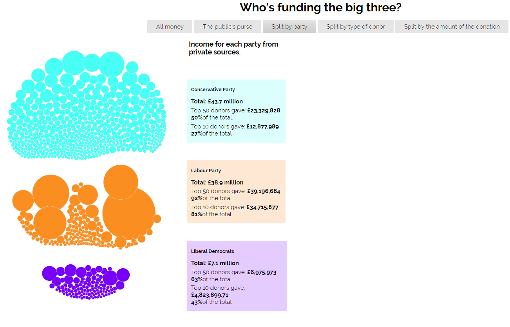
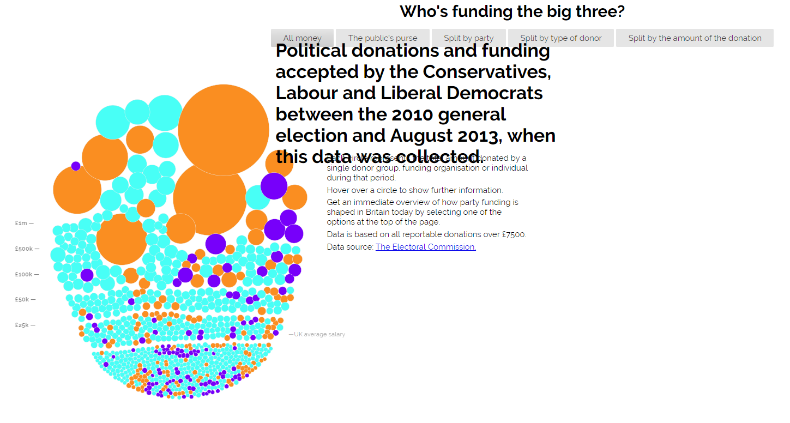
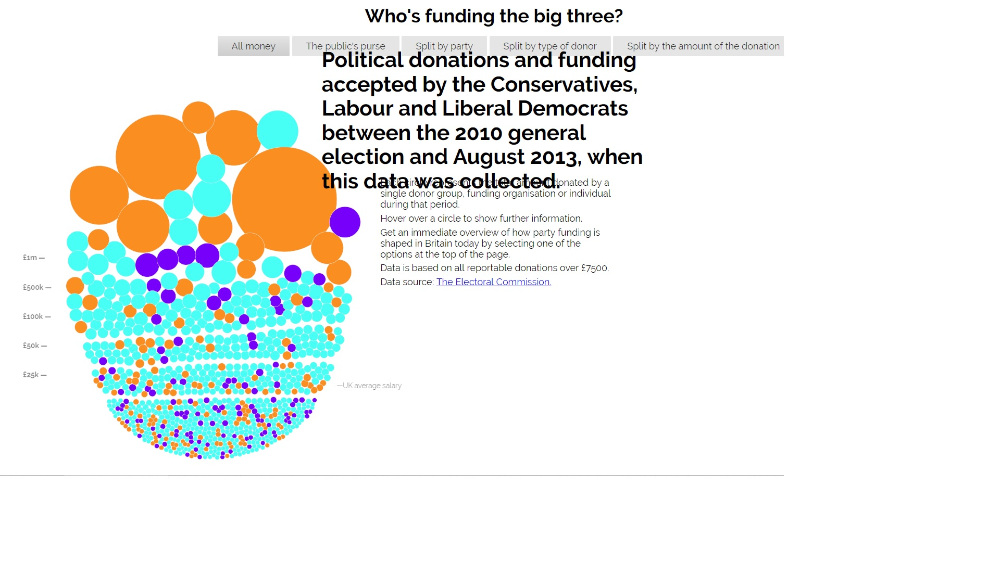
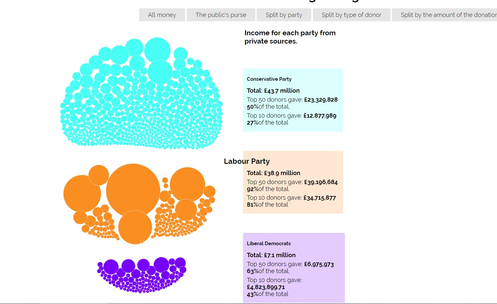

# Μάθημα: Τεχνολογίες Λογισμικού
## Τίτλος Εργασίας: Οπτικοποίηση δεδομένων χορηγιών (UK)
**Όνομα: Αλέξανδρος Βόβολης**  
**ΑΜ: Π2014008**  
**Εξάμηνο φοίτησης: ΣΤ**

**email: p14vovo@ionio.gr**  
**Github username: alexvov13**

**Link προσωπικόυ αποθετήριου κώδικα: https://github.com/alexvov13/D3js-uk-political-donations**


**Link εκτελέσιμου κώδικα: https://alexvov13.github.io/D3js-uk-political-donations/**

## Παραδοτέο 1: Αρχικό έργο και ενδιάμεση αναφορά προόδου - 14 Μαρτίου (25%)

**Σύνδεσμος σελίδας: https://alexvov13.github.io/D3js-uk-political-donations/**
## Ζητούμενα στα οποία απαιτούνται αλλαγές στο προσωπικό μου αποθετήριο

* Για να αλλάξει το url της  μετονόμασα το αρχείο full_viz.html σε index.html ώστε να μη χρειάζεται να καταλήγει σε "full-viz.html"

* Στην συνέχεια για να αλλάξω το χρώμα στις μπάλες τροποποίησα στο chart.js την συγκεκριμένη γραμμή: 

```
var fill = d3.scale.ordinal().range(["#ff9000", "#00fff6", "#7b00ff"]);
```
Στιγμιότυπο:


Επιπλέον για την αλλαγή των χρωμάτων στα αντίστοιχα 3 πεδία της ομαδοποίησης split by party αρκεί να αλλάξουμε στο style.css το παρακάτω κώδικα:
```
#conservative {
    background: rgba(0, 255, 246, 0.2);
    top: 110px;
}
#labour {
    background: rgba(255, 144, 0, 0.2);
    top: 330px;
}
#libdem {
    background: rgba(123, 0, 255, 0.2);
    top: 550px;
}
```
Στιγμιότυπο: 


* Για να ακούγεται ήχος κάθε φορά που ο χρήστης της εφαρμογής κάνει κλικ σε μία από τις επιλογές/κουμπιά ανέβασα ένα αρχείο .wav στο προσωπικό μου αποθετήριο και χρησιμοποίησα την συνάρτηση playSound:

```
 <audio id="sound" src="Button.wav"></audio>
    <a onclick = "playSound();"></a>
    <script>
        function playSound() {
          var sound = document.getElementById("sound");
          sound.play();}
   </script>
 ``` 
Και με την "oneclick" κάθε φορά που πατάω κάποια από τις επιλογές ομαδοποίησης παίζει το αρχείο ήχου μου.

    π.χ.
    ```
    <li><a href="#" role="button" class="pure-button switch" id="all-donations" onclick = "playSound()">All money</a>
            </li>
    ```
* Στην συνέχεια για να να ανοίγει ένα νέο παράθυρο με τα αποτελέσματα της αναζήτησης στο google για τον αντίστοιχο δωρητή πρόσθεσα στο αρχείο chart.js μέσα στην συνάρτηση start() τον κώδικα:
```
 .on("click", function(d)
 { window.open("http://www.google.com/search?q=" + d.donor);});	
```
* Για να λειτουργεί το ποντίκι και σαν μεγενθυτικός φακός χρησιμοποίησα το παρακάτω κομμάτι κώδικα το οποίο βρίσκεται στο index.html του αποθετηρίου μου και πρόσθεσα το class=zoom μπροστά απο κάθε κείμενο.
```
.zoom {
    
    transition: transform .2s;    
}
.zoom:hover {
    transform: scale(1.5);
}
```
π.χ.

```
<h2 class=zoom>Political donations and funding accepted by the Conservatives, Labour and Liberal Democrats between the 2010 general election and August 2013, when this data was collected.</h2>

```
Στιγμιότυπο:


    


## Ζητούμενα στα οποία απαιτούνται αλλαγές (pull request) στο κοινό αποθετήριο του κώδικα
* Δημιούργησα ένα αρχείο .csv στον φάκελο participants του αποθετηρίου του κώδικα με τα στοιχεία μου και τίτλο τον Α.Μ. μου. 

* Στον φάκελο photos αποθετηρίου, πρόσθεσα 5 εικόνες δωρητών με τα ζητούμενα χαρακτηριστικά αφού πρώτα τους επέλεξα έτσι να μην τους έχει και κάποιος άλλος.

## Στιγμιότυπα:
 
 
