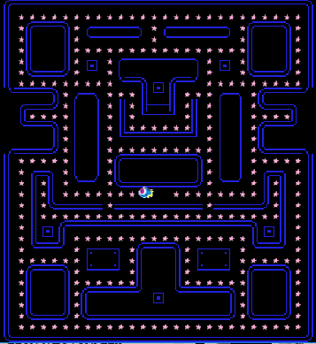

**Παραδοτέο 3**

**Ονοματεπώνυμο:** Ασημίνα Μπιγιλάκη

**Αριθμός Μητρώου:** Π2014024

**Προσωπικό αποθετήριο:** https://github.com/BigiSemi/pacman

**Link για το εκτελέσιμο:** https://bigisemi.github.io/pacman/pacman.html

Σε αυτό το παραδοτέο πραγματοποιήθηκαν τα εξής βήματα: 

-Πρόσθεσα έναν νέο χαρακτήρα σαν Bonus, τον **Nemo**, όπου θα ακούγετε ένας ήχος νεραϊδόσκονης, 
όταν τον βρίσκει ο χαρακτήρας μας **Dory**.

-Επίπλέον προστέθηκε στο κάτω μέρος της πίστας μου ένας μετρητής για Score (όπου θα αυξάνετε ανα 5 για κάθε Αστερία)

ένας ακόμα μετρητής  για το Bonus (όπου θα αυξάνετε ανα 10 για κάθε Nemo),

τέλος προστέθηκαν τρείς ζωές.

-Όσον αφορά τον ήχο για κάθε Αστερία επέλεξα τον ήχο μιας φούσκας που σκάει.

-Επέλεξα ως κύριο ήχο το Soundtrack της ταινίας "Finding Dory".

-Κλείνοντας, πρόσθεσα ένα Background, με θέμα το "Finding Dory" ώστε η αίσθηση του παιχνιδιού να είναι πιο ευχάριστη.

**Παραδοτέο 2: Αρχικός σχεδιασμός εφαρμογής**

**Ονοματεπώνυμο:** Ασημίνα Μπιγιλάκη

**Αριθμός Μητρώου:** Π2014024

**Θέμα εργασίας:** Pacman

**Προσωπικό αποθετήριο:** https://github.com/BigiSemi/pacman

**Link για το εκτελέσιμο:** https://bigisemi.github.io/pacman/pacman.html

Στόχοι παραδοτέου:

-Αλλαγή πρωταγωνιστή

-Αλλαγή αντικειμένου που μαζεύει ο πρωταγωνιστής

-Δημιουργία νέας πίστας μέσω Tiled

Για νέο πρωταγωνιστή επέλεξα την **Dory** από την ταινία "Finding Dory".

Αστερίες αντικατέστησαν τα dots.

Τέλος χρησιμοποίησα το **Tiled** για τη δημιουργία μιας νέας πίστας.

