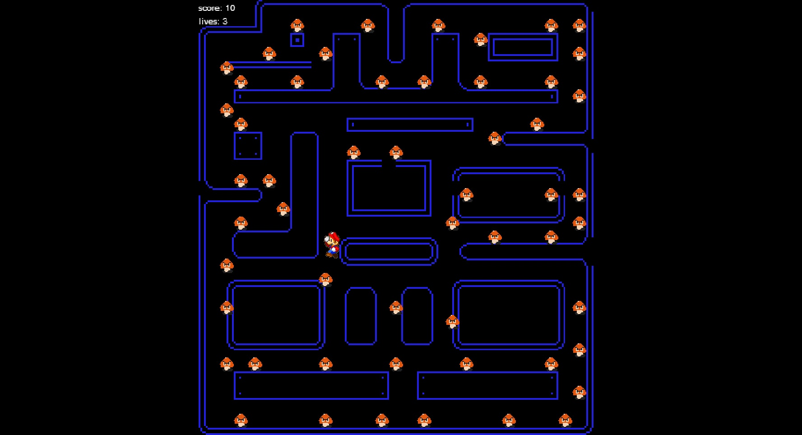
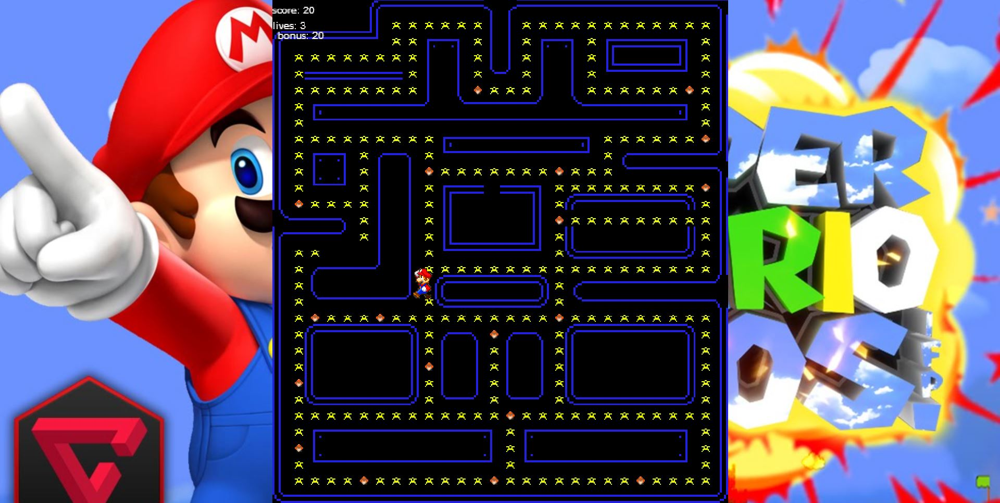

ΒΑΣΙΛΕΙΟΣ ΜΠΕΧΤΣΟΥΔΗΣ
Π2014049
ΕΠΙΛΟΓΗ ΕΡΓΑΣΙΑΣ PACMAN

2o ΠΑΡΑΔΟΤΕΟ
Τo χαρακτήρα που διάλεξα για πρωταγωνιστή του παιχνιδιού αντί για τον pacman είναι ο γνωστός χαρακτήρας mario.
Στη θέση των dots εβαλα να συλλέγει φλόγες, ενω η αλλαγή της πίστας έγινε με το πρόγραμμα tiled.
Οι αλλαγές που έγιναν στη πίστα είναι κυρίως η δημιουργία περισσότερων διαδρόμων
το λίνκ για το παιχνίδι είναι το παρακάτω:
https://vasilismp.github.io/pacman/pacman.html

ενώ για τα assets και το κώδικα είναι το παρακάτω:
https://github.com/vasilismp/pacman

3ο ΠΑΡΑΔΟΤΕΟ
ΕΠΙΛΟΓΗ ΕΡΓΑΛΕΙΩΝ
Τα εργαλεία τα οποία χρησιμοποίησα είναι το πρόγραμμα tiled κάθως έγινε αλλαγή στη πίστα αλλα και το pxlreditor 
προκειμένου να απομονώσω απο την εικόνα το ανικείμενο που με ενδιέφερε.

ΔΙΑΔΙΚΑΣΙΑ ΑΝΑΠΤΥΞΗΣ
Αρχικά έγινε αλλαγή στα αντικέιμενα που συλλέγει ο χαρακτήρας super mario όπου πρόσθεσα το μανιτάρι
που υπάρχει στο αντίστοιχο παιχνίδι. Στη συνέχεια αλλαξα τη πίστα προκείμένου να αντιμετωπίσω το πρόβλημα
της χωρητικότητας για το score και τις ζωές. Έπειτα έγιναν αλλαγές στο κώδικα του pacman.html όπου πρόσθεσα
 στην αριστερή πλευρα της οθόνης το score όπου με κάθεμανιτάρι που συλλέγει ο χαρακτήρας προστίθενται 10 πόντοι 
αλλά και τις ζωές οι οποίες είναι 3. Τέλος στο φάκελο assets πρόσθεσα δύο αρχεία mp3 οπου το ένα χρησιμοποιείται 
για εφέ κάθε φορά που ο χαρακτήρας συλλέγει ένα μανιτάρι ενώ το άλλο είναι η γνωστη μουσική απο το παιχνίδι
 super mario η οποία χρησιμοποιείται για background.
 ΕΝΔΕΙΚΤΙΚΕΣ ΟΘΟΝΕΣ
 
 
 

το λίνκ για το παιχνίδι είναι το παρακάτω:
https://vasilismp.github.io/pacman/pacman.html

ενώ για τα assets και το κώδικα είναι το παρακάτω:
https://github.com/vasilismp/pacman

4ο παραδοτέο
ΤΙΤΛΟΣ ΕΡΓΑΣΙΑΣ: ΔΗΜΙΟΥΡΓΙΑ PACMAN
ΣΥΝΟΨΗ:  Η παρούσα εργασία πραγματοποιήθηκε στα πλαίσια του μαθήματος  τεχνολογία λογισμικού του ΣΤ’ εξαμήνου. Σκοπός της εργασίας ήταν να επεκτείνουμε το δημοφιλές παιχνίδι pacman με τη βοήθεια της βιβλιοθήκης phaser η οποία χρησιμεύει στην ανάπτυξη παιχνιδιών μέσω html5. Η εργασία αποτελούνταν από τέσσερα παραδοτέα. Στο πρώτο παραδοτέο χρειαζόταν να δηλώσουμε το θέμα της εργασίας μέσα απο το github αλλά και να  δημιουργήσουμε ενα αντίγραφο του αποθετηρίου του παιχνιδίου προκείμενου να κατεβάσουμε το κώδικα και τα assets του παιχνιδιού. Στο δεύτερο παραδοτέο χρειαζόταν να κάνουμε σχετικά μικρές αλλαγές στο παιχνίδι όπως να αλλάξουμε το πρωταγωνιστή, να προσθέσουμε επιπλέον αντικέιμενα  και να δημιουργήσουμε μία καινούργια πίστα, ενώ στο τρίτο παραδοτέο χρειαζόταν να κάνουμε περισσσότερες αλλαγές στο κώδικα καθώς απαιτούνταν να προσθέσουμε score, bonus, ζωές και ήχους. Τέλος το τέταρτο παραδοτέο είχε ένα μεγαλύτερο βαθμό δυσκολίας καθώς έπρεπε να προσθέσουμε εχθρούς και χρόνο.

ΕΙΣΑΓΩΓΗ: Στόχος του συγκεκριμένου παιχνιδιού είναι ο πρωταγωνιστής να συλλέξει όλα τα dots  προκειμένου να να συγκεντρώνει πόντους αλλά και εκείνα τα αντικείμενα τα οπόια του δίνουν bonus.
ΕΠΙΛΟΓΗ ΕΡΓΑΛΕΙΩΝ: Tα εργαλεία τα οποία χρησιμοποίησα για τη πραγματοποίηση της εργασίας είναι τα εξής.
1.	TILED: το οποίο το χρησιμοποίησα για την αλλαγή της πίστας.
2.	NOTEPAD++: το οποίο χρησιμεύει για τη μεταφορά του κώδικα της πίστας στον επεξεργαστή κειμένου του github.
3.	PISKEL: για τη δημιουργία των dots.
4.	Pixlr Editor: για την απομόνωση των κινήσεων του χαρακτήρα του Mario απο μια εικόνα.

ΔΙΑΔΙΚΑΣΙΑ ΑΝΑΠΤΥΞΗΣ:
Αρχικά για το δεύτερο παραδοτέο όπου έπρεπε να αλλάξω το πρωταγωνιστή διάλεξα το γνωστό χαρακτήρα Mario όπου απομόνωσα τις κινήσεις του απο μια εικόνα με το εργαλείο pxlr editor και αντικατέστησα την εικόνα με τις κινήσεις του Pacman με το Mario. Στη συνέχεια έκανα δοκιμές  με το εργαλείο Tiled προκειμένου να κάνω αλλαγές στη πίστα αλλά και να αντιμετωπίσω το πρόβλημα του χώρου για να φαίνεται το score, το bonus και οι ζωές. Για αντικείμενα τα οποία πρέπει να συλλέγει ο χαρακτήρας δίαλεξα να συλλέγει τα αστέρια οπου θα παίρνει 10 πόντους και τα μανιτάρια για bonus οπου θα παίρνει 20. Τα αντικέιμενα αυτά υπάρχουν και στο παιχνίδι Mario. ‘Επειτα έκανα κάποιες αλλαγές στο κώδικα όπου πρόσθεσα στην αριστερή πλευρα της οθόνης το score και το bonus του πρωταγωνιστή απο τα αντικείμενα που συγκεντρώνει . Επίσης στο φάκελο assets πρόσθεσα δύο αρχεία mp3 οπου το ένα χρησιμοποιείται για εφέ κάθε φορά που ο χαρακτήρας συλλέγει ένα μανιτάρι ενώ το άλλο είναι η γνωστη μουσική απο το παιχνίδι super mario η οποία παίζει επαναλαμβανόμενα. Επιπρόσθετα για background χρησιμοποίησα μια εικόνα απο το παιχνίδι Mario. Σε σχέση με τα προηγούμενα παραδοτέα οι αλλαγές που έκανα είναι κυρίως στα dots καθώς στο τρίτο παραδοτέο το μόνο που συλλέγει ο χαρακτήρας είναι τα μανιτάρια. Τέλος για τις ανάγκεςτου  4ου παραδοτέου δε κατάφερα να προσθέσω εχθρούς ή χρόνο.

ΕΝΔΕΙΚΤΙΚΕΣ ΟΘΟΝΕΣ

ΣΥΜΠΕΡΑΣΜΑΤΑ: Το μεγαλύτερο μέρος της εργασίας έχει πραγματοποιηθεί αλλά ωστόσο για τη περαιτέρω βελτιωσή του παιχνιδιού χρείαζεται να προστεθούν οι εχθροί και η τηλεμεταφορά

το λίνκ για το παιχνίδι είναι το παρακάτω: https://vasilismp.github.io/pacman/pacman.html

ενώ για τα assets και το κώδικα είναι το παρακάτω: https://github.com/vasilismp/pacman

