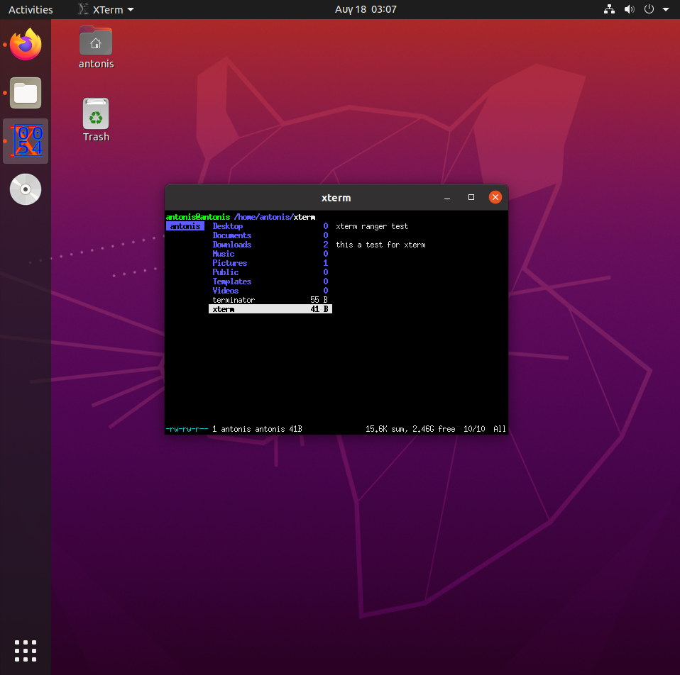
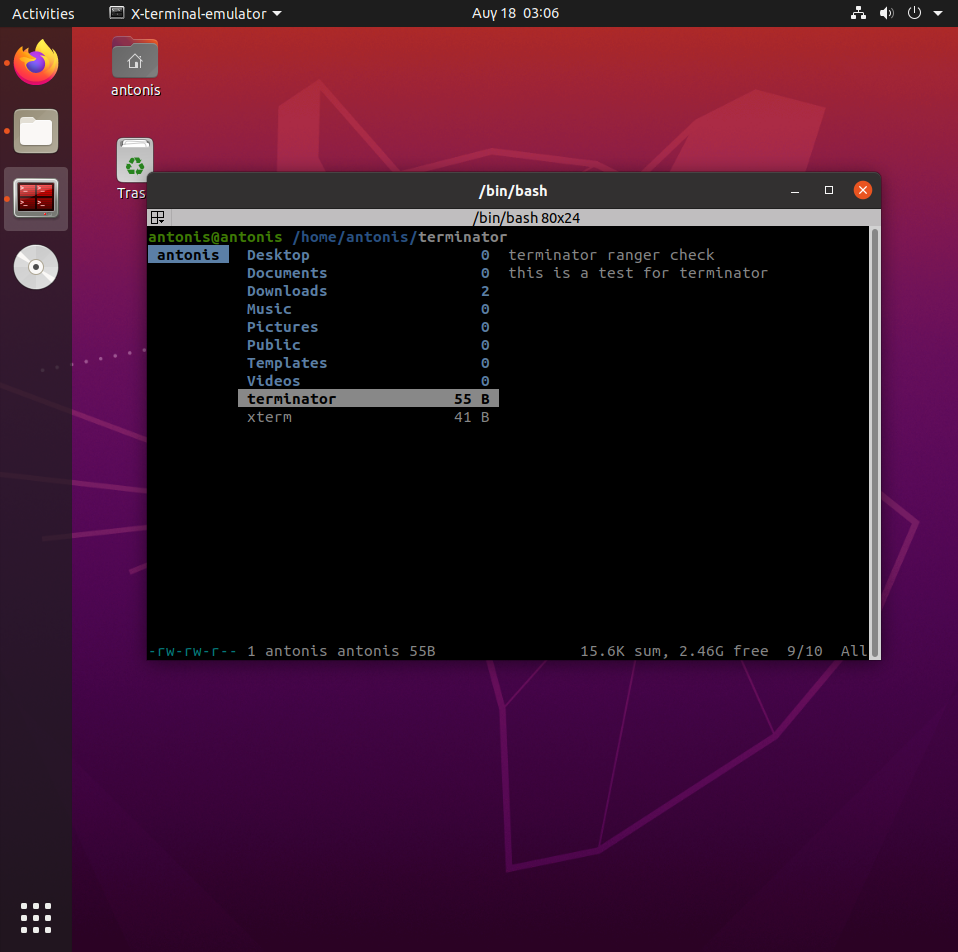

# ΙΟΝΙΟ ΠΑΝΕΠΙΣΤΗΜΙΟ, ΤΜΗΜΑ ΠΛΗΡΟΦΟΡΙΚΗΣ 
## ΜΑΘΗΜΑ Τεχνολογία Λογισμικού

## Στοιχεία φοιτητή  
### Παπακωστούλης Αντώνιος
### ΑΜ: Π2014055


### Άσκηση 1. Set-up continuous integration.build and deploy your static site and your cv dynamically every time you make a small change in the source files.

Για την παραπάνω άσκηση η σελίδα υλοποιήθηκε με το Github pages και χωρίς terminal επομένως δεν υπάρχει κάποιο asciinema url.


[CV](https://p14papa1.github.io/CV/)

[αποθετήριο κώδικα](https://github.com/p14papa1/CV)


### Άσκηση 2. Try different terminals and shells. Repeat some of the previous exercises with a different terminal-shell and create a custom configuration that fits your needs	

[asciinema url](https://asciinema.org/a/vdcpu4sMnC4F7ai02QP084MKB)

Για την παραπάνω άσκηση χρησιμοποίησα δύο καινούργια terminal το terminator και το xterm καθώς και το ranger για να επεξεργαστώ αρχεία κειμένου όπως ζητούσε μια άσκηση του μαθήματος Επικοινωνία Ανθρώπου υπολογιστή. Αρχικά για την εγκατάσταση

```bash
sudo apt-get install terminator
sudo apt-get install xterm
sudo apt-get install ranger
```

Ενώ για να ανοίξω το καθένα terminal έγραψα απλά τις εντολές


```bash 
xterm
terminal
ranger
```






### Άσκηση 3. Use the terminal as an IDE. Edit your files (e.g., cv, website, code, etc) in vim or emacs and compile it in a different panel or use a plug-in.

[asciinema url](https://asciinema.org/a/WQquskz7nLa40TdOSI95bPl44)

Για αυτή την άσκηση αποφάσισα να γράψω ένα απλό πρόγραμμα Hello World σε c με τον vi. Στην συνέχεια έγινε compile. Όλα έγιναν σε terminal. 


### Άσκηση 4. Send notifications to your desktop-mobile. Send a notifcation when a big task completes, eg download, compiling, etc	

[asciinema url](https://asciinema.org/a/IhO7bbcD78Dz6pKL6w83KFk7p)

Αρχικά για την άσκηση χρειάστηκε να εγκαταστήσω το ntfy.

```bash
sudo pip3 install ntfy
```

Στην συνέχεια έκανα ένα απλό update/upgrade και στην συνέχεια του είπα να μου στείλει notification όταν τελειώσει το upgrade. Τέλος το έκανα εκτελέσιμο και το έτρεξα.

```bash
sudo apt update
sudo apt upgrade
ntfy -t 'System' send "Upgrade Completed"
sudo chmod +x notification
./notification
```


### Άσκηση 5. Performance monitoring. Monitor the performance of your python scripts and visualize them with colors and/or spark lines.

[asciinema url](https://asciinema.org/a/wgyLiYNrogx8hUEFDCrS7blzU)

Για αυτό το παράδειγμα χρησιμοποιήθηκε το hyperfine. Αρχικά το έκανα εγκατάσταση με αυτές τις εντολές 

```
wget https://github.com/sharkdp/hyperfine/releases/download/v1.10.0/hyperfine_1.10.0_amd64.deb
sudo dpkg -i hyperfine_1.10.0_amd64.deb
```

Ενώ στην συνέχεια σύγκρινα δύο παραδείγματα python τα οποία είχα κατεβάσει με την παρακάτω εντολή. 

```
hyperfine -i 'pythonex1.py' 'pythonex2.py'
```

[Πληροφορίες hyperfine](https://github.com/sharkdp/hyperfine)


# Συμμετοχικό Εκπαιδευτικό υλικό

[Προσωπικό Αποθετήριο](https://github.com/p14papa1/pibook)

[url Σελίδας Βιβλίου](https://p14papa1.netlify.app/)


## Παραδοτέο 1.Β

Νέο διαδραστικό παράδειγμα

[Knowledge Quiz](https://p14papa1.netlify.app/remix/quiz/)

## Παραδοτέο 1.Γ.2
Νέα Βιογραφία

[Dennis Ritchie](https://p14papa1.netlify.app/biography/dennis-ritchie/)

Πηγή: [wikipedia](https://en.wikipedia.org/wiki/Dennis_Ritchie)


## Παραδοτέο 1.Β

Νέο διαδραστικό παράδειγμα

[Distance Converter](https://p14papa1.netlify.app/remix/distance/)


##  ΈΞΤΡΑ Παραδοτέο 1.Γ.2
Νέα Βιογραφία 

[Elon Musk](https://p14papa1.netlify.app/biography/elon-musk/)

// Έγινε πρώτα η βιογραφία του Elon Musk αλλά αποφάσισα πως δεν είναι τόσο σχετική με το μάθημα και επομένως έκανα μετά την βιογραφία του Dennis Ritchie και αφού την έκανα είπα να μην την διαγράψω αλλά να την αφήσω σαν έξτρα.

Πηγή: [wikipedia](https://en.wikipedia.org/wiki/Elon_Musk)


