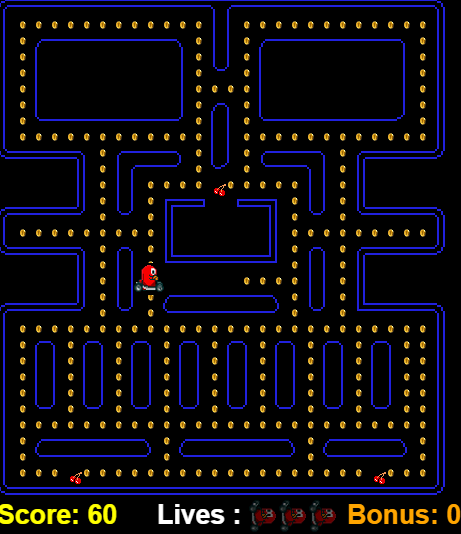

####ΕΡΓΑΣΙΑ ΤΕΧΝΟΛΟΓΙΑΣ ΛΟΓΙΣΜΙΚΟΥ 2017                                           

*  Ονοματεπώνυμο: **ΚΩΝΣΤΑΝΤΙΝΟΣ ΜΑΥΡΩΝΑΣ**
*  Αριθμός Μητρώου: ** Π2014064**
*  Θέμα εργασίας : ** Pacman**
*  Ακαδ.Έτος : 2016-2017
*  Προσωπικό αποθετήριο του κώδικα: [Link αποθετηρίου του κώδικα](https://github.com/p14mavr/pacman)
*  Link για το εκτελέσιμο: [Link Εκτελέσιμου](https://p14mavr.github.io/pacman/pacman.html)

####ΕΙΣΑΓΩΓΗ

Η εργασία που ασχοληθήκαμε για το τρέχον εξάμηνο στο μάθημα Τεχνολογία Λογισμικού ήταν η δημιουργία ενός παιχνιδιού το pacman σε HTML5.Αξίζει να αναφέρουμε οτι το παιχνίδι δεν δημιουργείται απο την αρχή αλλα κάνουμε αλλαγές σε υπάρχον κώδικα.Η εργασία συμφωνα με τις διευκρινήσεις που δόθηκαν απο τον καθηγητη κ.Χωριανόπουλο ειναι να παραδώσουμε 4 παραδοτέα.Το πρώτο έχει να κάνει αρχικά με την δήλωση και δέσμευση του θέματος, την εγκατάσταση των εργαλείων που πρόκειται να χρησιμοποιηθούν αλλά και την μελέτη παρόμοιων project μέσα απο την σελίδα του phaser.Στο δεύτερο σχεδιάστηκε μια νέα πίστα, αλλάχθηκε ο βασικός χαρακτήρας του PacMan αλλά και οι χαρακτήρες των dots. Στην συνέχεια προστέθηκαν στο παιχνίδι bonus,ζωές και score αλλά και ήχοι καθώς και κάποια νέα αντικείμενα τα οποία εμφανίζονται και εξαφανίζονται κατά την διάρκεια του παιχνιδιού.Στο τελευταίο χρειάζεται να προσθέσθουμε εχθρούς και χρόνο.

####ΚΥΡΙΟ ΜΕΡΟΣ

 Σύμφωνα με το παραδοτέο 2 
 

*  Άλλαξα τον πρωταγωνιστή του pacman με το παρακάτω χαρακτήρα 
 

 
 

 
* Χρησιμοποίησα αντί για Dots κέρματα 

          
 

* Με την βοήθεια του  Tiled δημιούργησα μια νέα πίστα για το pacman.
 

 
Στο παραδοτέο 3 ζητάει να προσθέσουμε score ,bonus, ζωές ,ήχους και όσα ανέφερε και ο κύριος Χωριανόπουλος στο μάθημα.Πρόσθεσα σύμφωνα με τις οδηγίες το score ,το bonus και τους ήχους.Τοποθέτησα σε ολο το παιχνίδι να ακούγεται ένας ήχος στην συνέχεια έβαλα ήχο την ώρα που τρώει ο ήρωας τα κέρματα και πρόσθεσα ένα καινούργιο αντικείμενο ( κερασάκι) για το bonus .Κατα την δοκιμή όμως ο ήρωας ενω τρώει το κεράσι κολλάει και δεν προσθέτει το bonus και ούτε ακούγεται ο ήχος που το έχω τοποθετήσει.Για αυτό το άφησα το κομμάτι κώδικα σε σχόλια.

* Ο ήχος που ακούγεται συνέχεια ειναι το εξης αρχειο:
''90s_disco.mp3''

* Ο ήχος που έχει τοποθετηθεί για το φάγωμα του κέρματος είναι το εξής αρχείο:
'sound.mp3'

* Ο ήχος που έχει τοποθετηθεί κατα το φάγωμα του κερασιού(bonus) είναι το εξής αρχείο:
'eatfruit.wav'

* Τέλος το score, το bonus και οι ζωές φαίνονται στην εξής εικόνα :

Στο τελευταίο παραδοτέο ζητάει να τοποθετηθούν εχθροί και ο χρόνος.

* Οι εχθροί θα πρέπει να κινούνται τυχαία στην πίστα ενώ μετά από κάποιο χρονικό διάστημα για να δυσκολέψεις το παιχνίδι θα μπορούσες να   αυξάνεις την ταχύτητά τους.

*  Ο πρωταγωνιστής επίσης θα μπορούσε να αντιμετωπίσει τους εχθρούς συλλέγοντας το κατάλληλο αντικείμενο. Είτε θα μπορούσε να έχει τη      δυνατότητα να τους τρώει για κάποιο χρονικό διάστημα, είτε θα μπορούσε να του πετάει κάτι από απόσταση και να τους εξολοθρεύει.

* Δυνατότητα teleport για τον πρωταγωνιστή σε συγκεκριμένα σημεία της πίστας.

Η εργασία έχει ολοκληρωθεί ως το τρίτο παραδοτέο.Δεν έχω ασχοληθεί με το τελευταίο παραδοτέο.

####ΕΡΓΑΛΕΙΑ
Τα μόνα εργαλεία που χρησιμοποιήθηκαν για την υλοποιήση της εργασίας είναι ο online editor του Github καθώς και ένα notepad++.

####ΣΥΜΠΕΡΑΣΜΑΤΑ

Εν κατακλείδι έχει δημιουργηθεί ένα καλό λειτουργικά παιχνίδι σε HTML5 με την χρήση της βιβλιοθήκης PHASER το οποίο περιέχει τις περισσότερες αλλαγές απο αυτές που ζητήθηκαν.Είναι αρκετά διαφορετικό παιχνίδι σε σχέση με το κλασικό Pacman που γνωρίζουμε.Έχει έναν άλλο χαρακτήρα(ένα πουλάκι σε αυτοκίνητο 'birdcar') το οποίο μαζεύει κέρματα αλλά και κερασάκια που του δίνουν έξτρα σκορ και έχει ωραίους ήχους.

