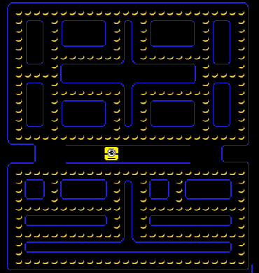

**Παραδοτέο 3:

**Ονοματεπώνυμο:** Ευστάθιος Αλεξανδρίδης

**Αριθμός Μητρώου:** Π2014092

**Θέμα εργασίας:** Pacman

**Προσωπικό αποθετήριο:** https://github.com/stathisalex/pacman

**Link για το εκτελέσιμο:** https://stathisalex.github.io/pacman/pacman.html

Σε αυτό το παραδοτέο πρόσθεσα στο παιχνίδι

-Καρύδες, τις οποίες τρώει ο χαρακτήρας ως μπόνους εκτός από τις μπανάνες.

-Μετρητή Score (+5 για κάθε μπανάνα +10 για κάθε καρύδα)

-Μετρητή Bonus (+10 για κάθε καρύδα)

-Ζωές, οι οποίες δεν έχουν κάποια λειτουργικότητα προς το παρόν

-Νέο background

-Μουσική κατά την διάρκεια του παιχνιδιού

-2 νέους ήχους για όταν ο χαρακτήρας τρώει τις μπανάνες και τις καρύδες

**Παραδοτέο 2: Αρχικός σχεδιασμός εφαρμογής**

**Ονοματεπώνυμο:** Ευστάθιος Αλεξανδρίδης

**Αριθμός Μητρώου:** Π2014092

**Θέμα εργασίας:** Pacman

**Προσωπικό αποθετήριο:** https://github.com/stathisalex/pacman

**Link για το εκτελέσιμο:** https://stathisalex.github.io/pacman/pacman.html

Σκοπός του δεύτερου παραδοτέου ήταν:

-Αλλαγή πρωταγωνιστή στην εφαρμογή

-Αλλαγή αντικειμένου που μαζεύει ο πρωταγωνιστής

-Δημιουργία νέας πίστας χρησιμοποιώντας το Tiled

Για νέο πρωταγωνιστή στην εφαρμογή επέλεξα να βάλω ένα **minion** απο την ομώνυμη ταινία το οποίο ανοιγοκλείνει το στόμα του όπως και ο pacman.

Στην θέση των dots επέλεξα να βάλω μπανάνες.

Τέλος δημιούργησα μία νέσα με πίστα χρησιμοποιώντας το **Tiled** με διαφορετική διαδρομή.

