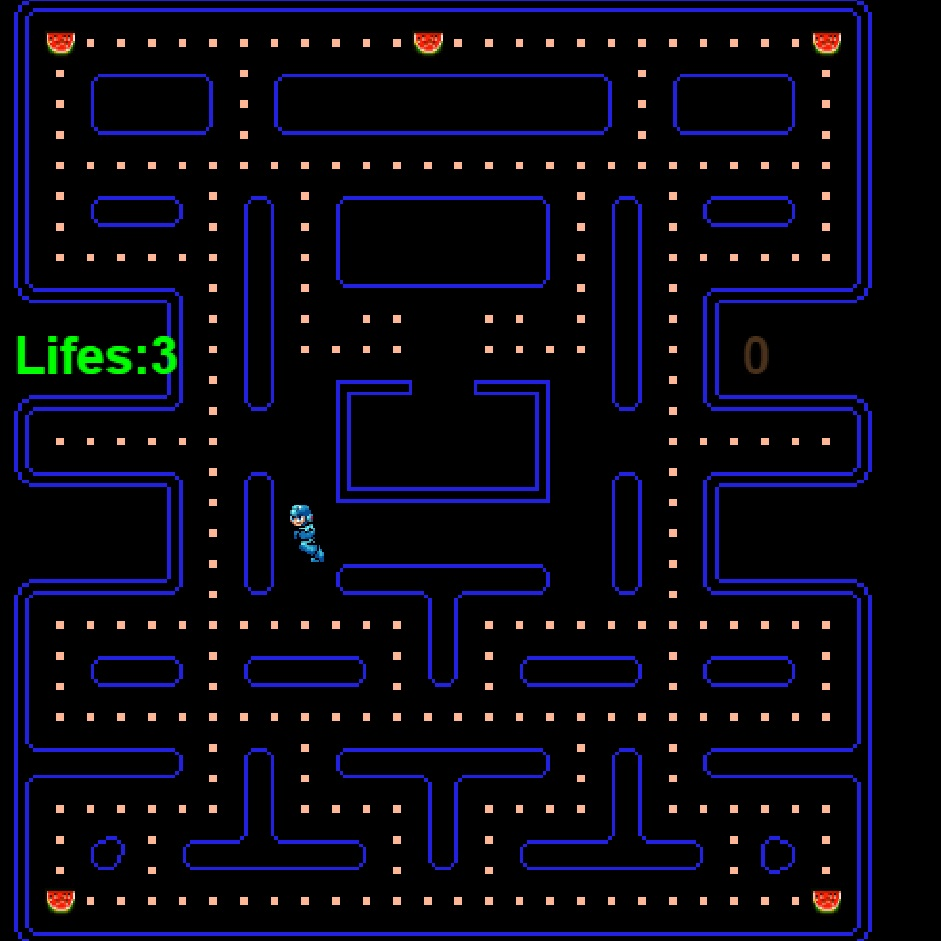

# Tεχνολογία Λογισμικού

Ονοματεπώνυμο: Διονύσης Κάλφας

Αριθμός Μητρώου: Π2014112

## Παραδοτέο 1 - Δήλωση και δέσμευση θέματος, 20 Φεβρουαρίου

Θέμα εργασίας: Pacman

## Παραδοτέο 2 Άλλαξε πρωταγωνιστή, πρόσθεσε επιπλέον αντικείμενα και δημιουργία νέας πίστας

1.Άλαξα τον pacman σε Megaman

2.Ο πρωταγωνιστής αντί να μαζεύει μόνο dots μαζεύει και καρπούζια

3.Έκανα αλαγές στην δομή τις πίστας με το Tiled

## Παραδοτέο 3  Πρόσθεσε score, bonus, ζωές και ήχους
1.Έβαλα ήχους σε όταν : Τρώει ένα dot,Τρώει ένα καρπούζι,Πέρνει μια ζώη,Backround music
2.Έβαλα καρπούζια για bonus που σε δίνουν extra ζώη όταν τρώς 3
3.Έβαλα τις ζώες και το Score να φαίνοντε στην οθόνη

Το παιχνίδι μπορείτε να το βρείτε εδώ
https://dionisis1234.github.io/pacman/pacman.html

  
 ---------------------------------------------------------------------------------------------------------------------------------------
 _______________________________________________________________________________________________________________________________________----------------------------------------------------------------------------------------------------------------------------------------
  
  # Τελική αναφορά
  'Οτι βρίσκετε ανάμεσα σε * * δεν έχει υλοποιηθή ακόμα

Mega-pac-man

# Εισαγωγη

Το Project αυτό υλοποιήθηκε με βάση πρότυπα της εργασίας "Pac-man" του μαθήματος "Τεχνολογία Λογισμικού" 
του τμήματος Πληροφορικής του Ιονίου Πανεπιστημίου.Ο στόχος του project ήταν η επέκταση και παραλλαγή του 
γνωστού ηλεκτρονικού παιχνιδιού Pac-man (Namco).Συγκεκριμένα να αλάξουμε τον πρώταγωνιστη,τους εχθρούς,την μουσική
,τα sound effect και να προσθέσουμε νέα powerups.Όλες οι αλαγές ,τροποποιήσεις όπως και οι αναφορές γίνανε μέσω
της πλατφόρμας GitHub.

# Σύνοψη

Το 'Theme' της εργασίας μου ήταν "Megaman" (Capcom) ,δηλαδή για πρώταγωνιστη έβαλα τον χαρακτήρα Megaman,
*για εχθρούς 4 διαφορετικού χρώματος 'Met'(μικρα robot)*,για μουσική από το megaman 8 "tengu man"
και για sound effect πήρα από διάφορα megaman παιχνίδια.
Ο σκοπός του παιχνιδιού είναι ,ο megaman να μαζέψει όλες τα 'Dots' χώρις να τον 'χτυπήσουν' τα robot Met.
Ο παίχτης έχει 3 ζωές αρχικά αλλά μπορεί να τις αυξήση μαζεύοντας καρπούζια.

# Επιλογή εργαλείων
 https://ezgif.com/split  - για το 'σπάσιμο gif αρχείων σε png
 
 https://draeton.github.io/stitches/ (stitches) - για την ένωση των sprites
 
 http://imagesplitter.net/ - για πιο γρήγορο κοψίμο png αρχείων για να κρατήσω τα sprites που θέλω
 
 http://www.mapeditor.org/ (tiled) - για τη δημιουργία της πίστας και των layers
 
 https://www.gimp.org/ (gimp 2) - Για την επεξεργασία των εικόνων που χρησιμοποιήθηκαν
 
 https://notepad-plus-plus.org/ (Notepad++) - για την επεξεργασία του κώδικα
 
 http://www.audacityteam.org/ (Audacity) - για την επεξεργασία των ηχητικών εφέ που χρησιμοποιήθηκαν.
 
 https://www.apachefriends.org/index.html (XAMPP) - για τοπική εκτέλεση
 

 
 
 # Διαδικασία ανάπτυξης
 
 Αρχικά στο πρώτο παραδοτέο έκανα δήλοση του project μου μέσω της πλατφόρμας Github .
 
 Έπειτα στο δεύτερο παραδοτέο άλλαξα τον πρωταγονιστή από τον pac-man σε Megaman από την συνόνιμη σειρά παιχνιδιών.
 Τα sprites του χαρακτήρα πάρθηκαν απο [εδώ](http://orig07.deviantart.net/2a95/f/2014/258/f/6/ssb4_megaman_run_animation_test_by_gregarlink10-d7z8mt5.gif) όπου υπέστη επεξεργασία με τα εργαλία που προαναφέρθηκαν.
 Στη συνέχεια πρόσθεσα καρπούζια για powerup τα οποία δίνουν έχτρα ζωές στον παίχτη έαν καταφέρη να πάρη 3.
 Τo sprite το πήρα από εδώ [εδώ](http://cuddlesnam.deviantart.com/art/Kirby-Food-Sprites-on-RPG-Maker-XP-665410499) και όπως και με τον megaman έγινε επεξεργασία με τα εργαλεία που αναφέρθηκαν.
 Τέλος πειράζοντας στα assets τα tiles(για την πρόσθεση του καρπουζιού) και με την χρήση του προγράματος Tiled έφτιαξα νέα πίστα και έγινε αλαγή του κώδικα όπου χρείαζοταν για να εφαρμοστούν οι νέες αλαγές.
 
 Το επόμενο βήμα (Τρίτο παραδοτέο) ήταν η προσθήκη Backround music ,το οποίο πάρθηκε από [εδώ](https://www.youtube.com/watch?v=HFnXxTG_9-c) όπου υπέστη μικρή επεξεργασία για να μικρύνη το μέγεθος του αρχείου.
 Επίσης έβαλα διαφορετικά sound effect για όταν τρώει τα dot η τα καρπούζια από[εδώ](https://www.sounds-resource.com/nes/megaman2/sound/3616/) και όταν ο παίχτης κερδίζει μια ζωή από [εδώ](https://www.youtube.com/watch?v=69AyYUJUBTg).
 Τα αρχεία αύτα επεξεργάστηκαν με την χρήση του audacity για να ταιριάζουν καλύτερα με το theme του παιχνιδιού.
 
Αυτό που είχε μείνει να κανώ είναι να βάλω ζωές και score ,τα οποία βρίσκονται στο αριστερό και δεξί μέρος τις οθόνης αντίστοιχα.

*Στο Τέταρτο παραδοτέο προσθέθηκαν εχθροι*

 # Συμπεράσματα
 
 1 Δεν χρειάζονται πολλές προαπετούμενες γνώσεις για την υλοποίηση ένος τετιου είδους παιχνιδιού
 2 
 
 
 # screenshot
 
 
---------------------------------------------------------------------------------------------------------------------------------------  
  # "Βιβλιογραφία"
##Programs used
  https://draeton.github.io/stitches/ (stitches)
  http://www.mapeditor.org/   (tiled)
  https://ezgif.com/split
  https://www.gimp.org/ (gimp 2)
  http://youtubetop.download
  http://imagesplitter.net/
  
## Resources
  http://www.deviantart.com/art/SSB4-Megaman-run-animation-test-482452601
  http://orig07.deviantart.net/2a95/f/2014/258/f/6/ssb4_megaman_run_animation_test_by_gregarlink10-d7z8mt5.gif
  https://www.youtube.com/watch?v=HFnXxTG_9-c
  http://cuddlesnam.deviantart.com/art/Kirby-Food-Sprites-on-RPG-Maker-XP-665410499
  http://orig07.deviantart.net/6944/f/2017/054/0/5/kirby_food_sprites_on_rpg_maker_xp_by_cuddlesnam-db0620z.png
