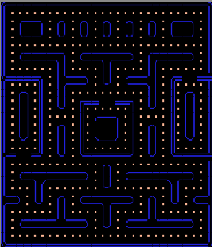
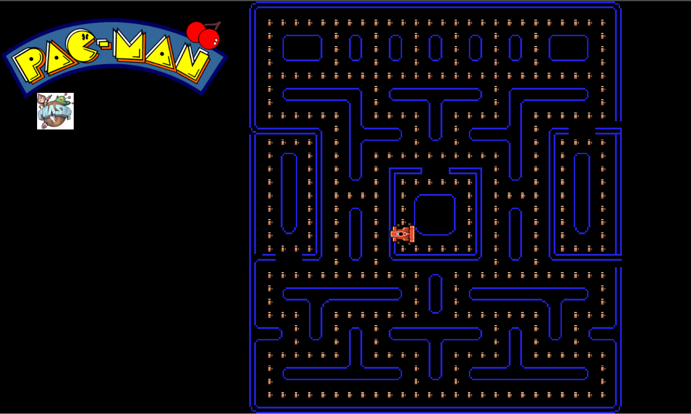

### Δήλωση και δέσμευση θέματος εργασίας στο μάθημα Τεχνολογία Λογισμικού(20 Φλεβάρη)

*  Ονοματεπώνυμο: **Νικόλαος Δάσκαλος**
*  Αριθμός Μητρώου: **Π2014219**
*  Θέμα εργασίας **"Δημιουργία Pacman"**
*  Προσωπικό αποθετήριο του κώδικα **"https://github.com/nikosdaskalos/pacman"**
*  Link για το εκτελέσιμο **"https://nikosdaskalos.github.io/pacman/pacman.html"**

### Αρχικός σχεδιασμός εφαρμογής(20%)-13 Μαρτίου
#### Εισαγωγή:

Το δεύτερο παραδοτέο, αφορά τον αρχικό σχεδιασμό της εφαρμογής. Οι αλλαγές που έχουν γίνει ακολουθούν τις οδηγίες που έχουν δοθεί γραπτώς στο GitHub στην εργασία PacMan αλλά και διευκρινήσεις που έχουν δοθεί εντός του μαθήματος από τον κύριο Χωριανόπουλο. Πιο συγκεκριμένα, στο δεύτερο παραδοτέο γίνονται τα:

*  Αντί για τον PacΜan χρησιμοποίησε έναν άλλο χαρακτήρα για πρωταγωνιστή του παιχνιδιού.

*  Αντί ο πρωταγωνιστής να μαζεύει μόνο dots, θα μπορούσε να μαζεύει και άλλα αντικείμενα(λουλούδια ,κέρματα, φρούτα).

*  Δημιούργησε μια νέα πίστα χρησιμοποιώντας το Tiled.

Έπειτα από διευκρίνηση σχετικά με το συγκεκριμένο παραδοτέο του διδάσκοντα στις διαλέξεις, στο πρώτο σκέλος του παραδοτέου ζητήθηκε απλώς να αλλαχθεί ο PacMan με έναν νέο χαρακτήρα, στο δεύτερο σκέλος να αλλαχθούν τα dots με κάτι άλλο που θα τρώει ο νέος χαρακτήρας και τέλος στο τρίτο σκέλος να χρησιμοποιηθεί η πίστα που υπάρχει ήδη και να γίνουν αλλαγές πάνω σε αυτήν.

#### Κύριο Μέρος:

Παρακάτω αναφέρονται οι αλλαγές που έχουν γίνει ακολουθώντας τα παραπάνω δεδομένα:

*  O χαρακτήρας του PacMan έχει αλλαχθεί με έναν νέο χαρακτήρα αυτοκινήτου ο οποίος πάρθηκε από το phaser coding tips(έχει γίνει fork στο προσωπικό μου repository).Παρακάτω φαίνεται ο νέος χαρακτήρας.

*  Ο πρωταγωνιστής(αυτοκίνητο),αντί να μαζεύει dots, μαζεύει πλέον  «βενζίνη». Αξίζει να αναφερθεί ότι έγιναν πολλές προσπάθειες με διαφορετικά αντικείμενα τα οποία θα μπορούσε να μαζεύει το αυτοκίνητο αλλά οι περισσότερες από αυτές ήταν αποτυχημένες διότι η ανάλυση πρέπει να είναι αρκετά μικρή και δεν φαίνετε ξεκάθαρα τι μαζεύει ο χαρακτήρας. Το παραπάνω πρόβλημα θα μπορούσε να αντιμετωπιστεί με πιο αραιή κατανομή των dots μέσα στην πίστα έτσι ώστε να μπορεί να μεγαλώσει η ανάλυση της εικόνας. Τα «dots» που χρησιμοποιήθηκαν πάρθηκαν από απλές αναζητήσεις στο Google. Παρακάτω  φαίνονται τα νέα «dots».

*  Τέλος, δημιουργήθηκε μια νέα πίστα με το Tiled, η οποία βασίζεται στην αρχική ,αλλά με πολλές πλέον αλλαγές(αδιέξοδα, νέα εμπόδια, αλλαγή σχεδιασμού). Παρακάτω υπάρχει η νέα πίστα.

Επίσης εκτός από αυτές τις αλλαγές προστέθηκε  ένα logo του PacMan πάνω αριστερά, εκτός αυτού προστέθηκε και ήχος κατά την διάρκεια του παιχνιδιού καθώς και ήχος όποτε το αυτοκίνητο «τρώει» βενζίνη. Στο δεύτερο κομμάτι του ήχου, εμφανίζεται ένα πρόβλημα, τα dots είναι πολύ κοντά το ένα στο άλλο και ο ήχος τείνει να είναι συνεχόμενος όταν τα τρώει το αυτοκίνητο.  Το πρόβλημα αυτό μπορεί να αντιμετωπιστεί με πιο αραιή χρήση των dots στην πίστα ή με την χρήση «πιο κοφτού ήχου» ή με κάποια συνάρτηση.

#### Συμπεράσματα:

Τέλος δίνεται ένα τελικό screenshot του παιχνιδιού, με τις αλλαγές που έχουν γίνει μέχρι στιγμής, στην φάση του δεύτερου παραδοτέου.Στο προσωπικό αποθετήριο στον φάκελο assets υπάρχουν διάφορα αρχεία που θα χρησιμοποιηθούν μελλοντικά καθώς και κάποια νέα κομμάτια κώδικα σε σχόλια.

### Τελικό προσχέδιο έργου για σχολιασμό και βελτιώσεις(20%)-8 Μαίου
#### Εισαγωγή:

Το τρίτο παραδοτέο αφορά την δημιουργία του τελικού προσχέδιου του έργου, με σκοπο να γίνουν σχολιασμός και βελτιώσεις αυτού. Οι αλλαγές που έχουν γίνει ακολουθούν ακριβώς τις οδηγίες που έχουν δοθεί στο παραδοτέο 3 της εργασίας PacMan αλλά και τις διευκρινήσεις που έχουν δοθεί απο τον κύριο Χωριανόπουλο κατά την διάρκεια των διαλέξεων/συναντήσεων. Πιο συγκεκριμένα στο τρίτο παραδοτέο:

*  Κάποια από τα αντικείμενα μπορούν να εμφανίζονται ξαφνικά σε κάποιο τυχαίο σημείο της πίστας και μετά από κάποιο χρονικό διάστημα να εξαφανίζονται.

*  Επέκτεινε το παιχνίδι ώστε να προσθέσεις score, bonus και ζωές.

*  Πρόσθεσε ήχους.

#### Κύριο Μέρος:

Παρακάτω αναφέρονται οι αλλαγές που έχουν γίνει ακολουθώντας τα παραπάνω δεδομένα:

* Αρχικά έχει προστεθεί **ήχος** στην διάρκεια του παιχνιδιού αλλά και όταν το αυτοκίνητο τρώει κάποιο dot. Επίσης έχει προστέθει και ήχος όταν τρώγονται και τα νέα αντικείμενα(κέρματα, φράουλες). Ο ήχος που παίζει κατά την διάρκεια όλου του παιχνιδιού είναι το αρχείο "pacman_ringtone.mp3" αντίστοιχα για τα dots και για τα νέα αντικείμενα οι ήχοι "pacman_chomp.wav" και "pacman_eatfruit.wav". Αξίζει να αναφερθεί ότι επειδή είναι πολύ κοντά τα αντικείμενα το ένα με το άλλο σε πολλές περιπτώσεις ο ήχος γίνεται συνεχόμενος.Παρακάτω φαίνονται τα νέα αντικείμενα που προστέθηκαν.

* Επίσης προστέθηκαν score,bonus και ζωές. Στο **score** για κάθε dot προστίθενται και 10 πόντοι ενώ για τα κέρματα 10. Στα **bonus** προστίθενται για κάθε φράουλα 100 πόντοι. Στις **ζωές** έχουν προστεθεί τρείς ζωές οι οποίες δεν έχουν ακόμα κάποια λειτουργικότητα καθώς δεν υπάρχουν φαντάσματα για να χαθεί κάποια ζωή.

