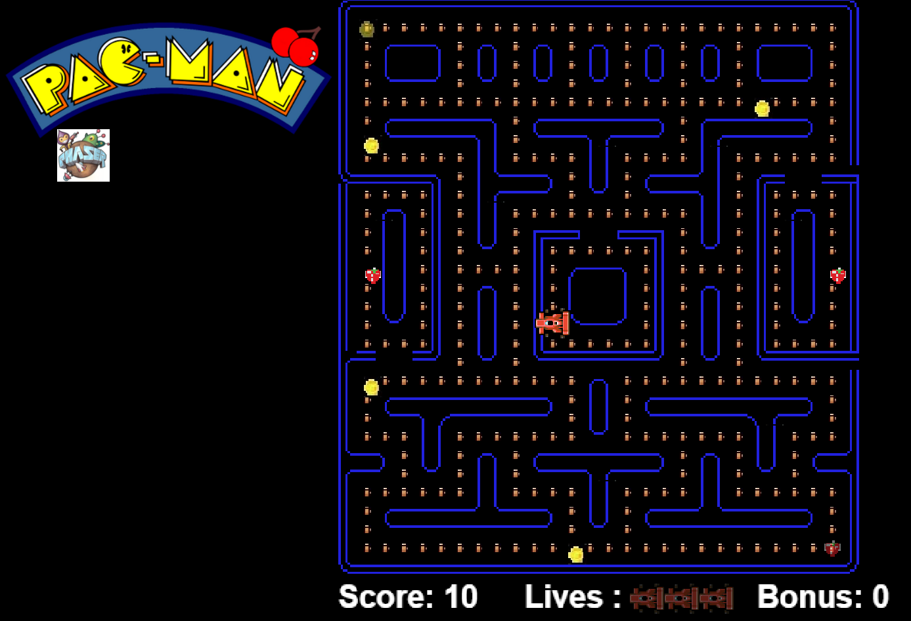

# Tίτλος Εργασίας-Δημιουργία PacMan
## Σύνοψη
Το παρόν έγγραφο αποτελεί την τελική αναφορά του Νικόλαου Δάσκαλου με αριθμό μητρώου Π2014219 στο μάθημα Τεχνολογία Λογισμικού για το εαρινό εξάμηνο του έτους 2016-2017.

Η συγκεκριμένη εργασία ασχολείται με την δημιουργία ενός παιχνιδιού PacMan σε HTML5 με την βοήθεια της βιβλιοθήκης Phaser. Αξίζει να αναφερθεί ότι το παιχνίδι δεν δημιουργείται απο την αρχή αλλά γίνεται fork απο το κεντρικό αποθετήριο και στην συνέχεια γίνονται αλλαγές πάνω στον υπάρχων κώδικα. Η διαδικασία που ακολουθήθηκε έχει να κάνει αρχικά με την δήλωση και δέσμευση του θέματος, την εγκατάσταση των εργαλείων που πρόκειται να χρησιμοποιηθούν αλλά και την μελέτη παρόμοιων project μέσα απο την σελίδα του phaser. Έπειτα σχεδιάστηκε μια νέα πίστα, αλλάχθηκε ο βασικός χαρακτήρας του PacMan αλλά και οι χαρακτήρες των dots. Στην συνέχεια προστέθηκαν στο παιχνίδι bonus,ζωές και score αλλά και ήχοι καθώς και κάποια νέα αντικείμενα τα οποία εμφανίζονται και εξαφανίζονται κατά την διάρκεια του παιχνιδιού. Επιπρόσθετα έχει μπει και στο παιχνίδι ένα logo του PacMan και της βιβλιοθήκης που χρησιμοποιήθηκε. Για το τελευταίο παραδοτέο δεν έχει γίνει κάποια απο τις ενδεικτικές προσθήκες. Η τελική αναφορά έχει γραφτεί και σε Github Pages(bonus 1 μονάδα). Στην συνέχεια αναλύονται όλα τα παραπάνω ανά παραδοτέο αλλά παρατίθενται και οι πηγές που χρησιμοποιήθηκαν ώστε να γίνει η εργασία. Στον κώδικα υπάρχουν σχόλια στα σημαντικά σημεία που έχουν γίνει αλλαγές.
### Δήλωση και δέσμευση θέματος εργασίας στο μάθημα Τεχνολογία Λογισμικού(20 Φλεβάρη)

*  Ονοματεπώνυμο: **Νικόλαος Δάσκαλος**
*  Αριθμός Μητρώου: **Π2014219**
*  Θέμα εργασίας **"Δημιουργία Pacman"**
*  Προσωπικό αποθετήριο του κώδικα: [Link Αποθετηρίου του κώδικα](https://github.com/nikosdaskalos/pacman)
*  Link για το εκτελέσιμο: [Link Εκτελέσιμου](https://nikosdaskalos.github.io/pacman/pacman.html)
*  Link για το πρώτο bonus(1 μονάδα): [Link Bonus GitHub Pages](https://nikosdaskalos.github.io/sw/projects/2014219/)

### Αρχικός σχεδιασμός εφαρμογής(20%)-13 Μαρτίου
#### Εισαγωγή:

Το δεύτερο παραδοτέο, αφορά τον αρχικό σχεδιασμό της εφαρμογής. Οι αλλαγές που έχουν γίνει ακολουθούν τις οδηγίες που έχουν δοθεί γραπτώς στο GitHub στην εργασία PacMan αλλά και διευκρινήσεις που έχουν δοθεί εντός του μαθήματος από τον κύριο Χωριανόπουλο. Πιο συγκεκριμένα, στο δεύτερο παραδοτέο γίνονται τα:

*  Αντί για τον PacΜan χρησιμοποίησε έναν άλλο χαρακτήρα για πρωταγωνιστή του παιχνιδιού.

*  Αντί ο πρωταγωνιστής να μαζεύει μόνο dots, θα μπορούσε να μαζεύει και άλλα αντικείμενα(λουλούδια ,κέρματα, φρούτα).

*  Δημιούργησε μια νέα πίστα χρησιμοποιώντας το Tiled.

Έπειτα από διευκρίνηση σχετικά με το συγκεκριμένο παραδοτέο του διδάσκοντα στις διαλέξεις, στο πρώτο σκέλος του παραδοτέου ζητήθηκε απλώς να αλλαχθεί ο PacMan με έναν νέο χαρακτήρα, στο δεύτερο σκέλος να αλλαχθούν τα dots με κάτι άλλο που θα τρώει ο νέος χαρακτήρας και τέλος στο τρίτο σκέλος να χρησιμοποιηθεί η πίστα που υπάρχει ήδη και να γίνουν αλλαγές πάνω σε αυτήν.

#### Κύριο Μέρος:

Παρακάτω αναφέρονται οι αλλαγές που έχουν γίνει ακολουθώντας τα παραπάνω δεδομένα:

*  O χαρακτήρας του PacMan έχει αλλαχθεί με έναν νέο χαρακτήρα αυτοκινήτου ο οποίος πάρθηκε από το phaser coding tips(έχει γίνει fork στο προσωπικό μου repository).Παρακάτω φαίνεται ο νέος χαρακτήρας.[Πηγή χαρακτήρα](https://github.com/nikosdaskalos/phaser-coding-tips/tree/master/issue-005).

*  Ο πρωταγωνιστής(αυτοκίνητο),αντί να μαζεύει dots, μαζεύει πλέον  «βενζίνη». Αξίζει να αναφερθεί ότι έγιναν πολλές προσπάθειες με διαφορετικά αντικείμενα τα οποία θα μπορούσε να μαζεύει το αυτοκίνητο αλλά οι περισσότερες από αυτές ήταν αποτυχημένες διότι η ανάλυση πρέπει να είναι αρκετά μικρή και δεν φαίνετε ξεκάθαρα τι μαζεύει ο χαρακτήρας. Το παραπάνω πρόβλημα θα μπορούσε να αντιμετωπιστεί με πιο αραιή κατανομή των dots μέσα στην πίστα έτσι ώστε να μπορεί να μεγαλώσει η ανάλυση της εικόνας. Τα «dots» που χρησιμοποιήθηκαν πάρθηκαν από απλές αναζητήσεις στο Google. Παρακάτω  φαίνονται τα νέα «dots». [Πηγή dot.](https://www.google.gr/search?q=petrol+cartoon&tbm=isch&tbo=u&source=univ&sa=X&ved=0ahUKEwjYgbut9oXUAhWH8RQKHdsBAEAQsAQIJA&biw=1920&bih=974#imgrc=0F2npRsbUC49zM:)

*  Τέλος, δημιουργήθηκε μια νέα πίστα με το Tiled, η οποία βασίζεται στην αρχική ,αλλά με πολλές πλέον αλλαγές(αδιέξοδα, νέα εμπόδια, αλλαγή σχεδιασμού). Παρακάτω υπάρχει η νέα πίστα.Χρησιμοποιήθηκε ο [Tiled Map Editor](http://www.mapeditor.org/).

Επίσης εκτός από αυτές τις αλλαγές προστέθηκε  ένα logo του PacMan πάνω αριστερά, εκτός αυτού προστέθηκε και ήχος κατά την διάρκεια του παιχνιδιού καθώς και ήχος όποτε το αυτοκίνητο «τρώει» βενζίνη. Στο δεύτερο κομμάτι του ήχου, εμφανίζεται ένα πρόβλημα, τα dots είναι πολύ κοντά το ένα στο άλλο και ο ήχος τείνει να είναι συνεχόμενος όταν τα τρώει το αυτοκίνητο.  Το πρόβλημα αυτό μπορεί να αντιμετωπιστεί με πιο αραιή χρήση των dots στην πίστα ή με την χρήση «πιο κοφτού ήχου» ή με κάποια συνάρτηση. Τα logo πάρθηκαν απο απλές αναζητήσεις στο Google. [Πηγή PacMan Logo.](https://www.google.gr/search?q=petrol+cartoon&tbm=isch&tbo=u&source=univ&sa=X&ved=0ahUKEwjYgbut9oXUAhWH8RQKHdsBAEAQsAQIJA&biw=1920&bih=974#tbm=isch&q=pacman+logo&imgrc=YA_IYhOHPi2ExM:) [Πηγή Phaser Logo.](https://www.google.gr/search?q=phaser+logo&tbm=isch&tbo=u&source=univ&sa=X&ved=0ahUKEwilt5T89oXUAhWHSBQKHY3bD3sQsAQILA&biw=1920&bih=974#imgrc=40FJuXYcYF69uM:)

#### Συμπεράσματα:

Τέλος δίνεται ένα τελικό screenshot του παιχνιδιού, με τις αλλαγές που έχουν γίνει μέχρι στιγμής, στην φάση του δεύτερου παραδοτέου.Στο προσωπικό αποθετήριο στον φάκελο assets υπάρχουν διάφορα αρχεία που θα χρησιμοποιηθούν μελλοντικά καθώς και κάποια νέα κομμάτια κώδικα σε σχόλια.

### Τελικό προσχέδιο έργου για σχολιασμό και βελτιώσεις(20%)-8 Μαίου
#### Εισαγωγή:

Το τρίτο παραδοτέο αφορά την δημιουργία του τελικού προσχέδιου του έργου, με σκοπο να γίνουν σχολιασμός και βελτιώσεις αυτού. Οι αλλαγές που έχουν γίνει ακολουθούν ακριβώς τις οδηγίες που έχουν δοθεί στο παραδοτέο 3 της εργασίας PacMan αλλά και τις διευκρινήσεις που έχουν δοθεί απο τον κύριο Χωριανόπουλο κατά την διάρκεια των διαλέξεων/συναντήσεων. Πιο συγκεκριμένα στο τρίτο παραδοτέο:

*  Κάποια από τα αντικείμενα μπορούν να εμφανίζονται ξαφνικά σε κάποιο τυχαίο σημείο της πίστας και μετά από κάποιο χρονικό διάστημα να εξαφανίζονται.

*  Επέκτεινε το παιχνίδι ώστε να προσθέσεις score, bonus και ζωές.

*  Πρόσθεσε ήχους.

#### Κύριο Μέρος:

Παρακάτω αναφέρονται οι αλλαγές που έχουν γίνει ακολουθώντας τα παραπάνω δεδομένα:

* Αρχικά έχει προστεθεί **ήχος** στην διάρκεια του παιχνιδιού αλλά και όταν το αυτοκίνητο τρώει κάποιο dot. Επίσης έχει προστέθει ήχος όταν τρώγονται και τα νέα αντικείμενα(κέρματα, φράουλες). Ο ήχος που παίζει κατά την διάρκεια όλου του παιχνιδιού είναι το αρχείο "pacman_ringtone.mp3" αντίστοιχα για τα dots και για τα νέα αντικείμενα οι ήχοι "pacman_chomp.wav" και "pacman_eatfruit.wav". Αξίζει να αναφερθεί ότι επειδή είναι πολύ κοντά τα αντικείμενα το ένα με το άλλο, σε πολλές περιπτώσεις ο ήχος γίνεται συνεχόμενος και σε κάποια σημεία ο ένας ήχος επικαλύπτει τον άλλο.Παρακάτω φαίνονται τα νέα αντικείμενα που προστέθηκαν.Οι εικόνες πάρθηκαν απο απλές αναζητήσεις στο Google. [Πηγή ήχων](http://www.classicgaming.cc/classics/pac-man/sounds).

          

* Επίσης προστέθηκαν score,bonus και ζωές. Στο **score** για κάθε dot προστίθενται  10 πόντοι ενώ για τα κέρματα και τις φράουλες 20. Στα **bonus** προστίθενται για κάθε αντικείμενο που εμφανίζεται και εξαφανίζεται 100 πόντοι(έχει γραφτεί ο κώδικας για το bonus αλλά δεν λειτουργεί). Στις **ζωές** έχουν προστεθεί τρείς ζωές οι οποίες δεν έχουν ακόμα κάποια λειτουργικότητα καθώς δεν υπάρχουν φαντάσματα για να χαθεί κάποια ζωή. Στην συνέχεια φαίνονται τα αντίστοιχα screenshots.[Πηγή Score-Bonus.](https://phaser.io/tutorials/making-your-first-phaser-game/part8) [Πηγή Ζωών.](https://phaser.io/examples/v2/games/invaders)

  

  

* Τέλος κάποια αντικείμενα(κέρματα και φράουλες) εμφανίζονται ξαφνικά(διαγώνια πάνω αριστερά και κάτω δεξιά) σε ένα σημείο της πίστας και στην συνέχεια εξαφανίζονται,αυτά τα αντικείμενα μετράνε σαν bonus και δίνουν απο 100 πόντους το καθένα(δεν έχει υλοποιηθεί το "φάγωμα" των αντικειμένων για την προσθήκη bonus,απλά εμφανίζονται και εξαφανίζονται χωρίς να τρώγονται). Μελλοντικά θα μπορούσαν να δίνουν ζωές εφόσον προστεθούν φαντάσματα που θα τρώνε το αυτοκίνητο.[Πηγή κώδικα](https://phaser.io/examples/v2/time/basic-timed-event).

#### Συμπέρασμα:

Στο παιχνίδι έχουν προστεθεί όλα όσα αναφέρονται στην εκφώνηση του παραδοτέου και πλέον βρίσκεται σε στάδιο τελικού προσχέδιου,μένει η προσθήκη των εχθρών καθώς και όποια άλλη λειτουργία έχει να κάνει με αυτούς. To παιχνίδι προτείνεται να παιχτεί στον browser Google Chrome καθώς διαπιστώθηκε απο τον κύριο Χωριανόπουλο ότι σε Mozila δεν φαίνεται όπως στο screenshot στο συμπέρασμα παρακάτω , αλλά το logo πέφτει πάνω στο παιχνίδι.Βέβαια με zoom out λύνεται το πρόβλημα σε άλλους browser.

Επίσης σε αυτό το παραδοτέο έχει δημιουργηθεί και μια σελίδα στο github pages η οποία περιέχει όλα τα παραδοτέα αλλά και θα περιέχει στο τέλος και την τελική αναφορά της εργασίας.Το θέμα που επιλέχθηκε για την σελίδα είναι το "Architect", η σελίδα βρίσκεται σε ένα νέο κλαδί gh-pages το οποίο ενημερώνεται απο το κλαδί 2014219 ,όποτε χρειάζεται με pull request. Συνεπώς η παρούσα εργασία διεκδικεί και το πρώτο **bonus(1 μονάδα)**. Στο συγκεκριμένο στάδιο η σελίδα στο GitHub Pages είναι ενημερωμένη μέχρι και το τρίτο παραδοτέο. Η τελική αναφορά θα προστεθεί στο επόμενο παραδοτέο. [Πηγή Bonus](https://pages.github.com/).

### Τελική αναφορά και έργο(20%)-6 Ιουνίου

#### Εισαγωγή:

Το τελευταίο παραδοτέο ασχολείται με την τελική αναφορά και το έργο, δηλαδή την προσθήκη εχθρών αλλά και χρόνου, πιο συγκεκριμένα:

*  Οι εχθροί θα πρέπει να κινούνται τυχαία στην πίστα ενώ μετά από κάποιο χρονικό διάστημα για να δυσκολέψεις το παιχνίδι θα μπορούσες να αυξάνεις την ταχύτητά τους.

*  Ο πρωταγωνιστής επίσης θα μπορούσε να αντιμετωπίσει τους εχθρούς συλλέγοντας το κατάλληλο αντικείμενο. Είτε θα μπορούσε να έχει τη δυνατότητα να τους τρώει για κάποιο χρονικό διάστημα, είτε θα μπορούσε να του πετάει κάτι από απόσταση και να τους εξολοθρεύει.

*  Δυνατότητα teleport για τον πρωταγωνιστή σε συγκεκριμένα σημεία της πίστας.

*  Τελική αναφορά της εργασίας όπου θα πρέπει να υπάρχει link με τον κώδικα του παιχνιδιού.

#### Κύριο Μέρος:

Για το συγκεκριμένο παραδοτέο δεν έχει γίνει κάποια απο τις προτεινόμενες αλλαγές μέχρι στιγμής. Το μόνο που έχειο γίνει απο τα παραπάνω είναι η συγγραφή της Τελικής Αναφοράς σύμφωνα με τις οδηγίες του παραδοτέου.

#### Συμπεράσματα:

Δεν υπάρχουν συμπεράσματα γιατί όπως προαναφέρθηκε δεν έχει γίνει κάποια αλλαγή ακόμα στο παιχνίδι.

## Συμπεράσματα

Τελικά έχει δημιουργηθεί ένα αρκετά λειτουργικό παιχνίδι το οποίο περιέχει ένα αρκετά μεγάλο πλήθως αλλαγών απο τις προτεινόμενες. Αποτελέι ένα παιχνίδι PacMan με ένα αυτοκινητάκι που τρώει βενζίνη, φρούτα και κέρματα που εμφανίζονται και εξαφανίζονται σε μια νέα πίστα, με score, ζωές και bonus αλλά και με ήχους κατά το φάγωμα των αντικειμένων αλλά και στο υπόβαθρο. Αξίζει να αναφερθεί ότι το bug με τα "μπαντιλίκια"(πατόντας δύο βελάκια ταυτόχρονα) έχει μείνει εσκεμένα στο παιχνίδι.

## Αναφορές

Αναφορές σχετικά με τις  πηγές των αντικειμένων, των ήχων, του κώδικα και ότι άλλου χρειάστηκε για την υλοποίηση του παιχνιδιού υπάρχουν αναλυτικά μέσα στα αναλυτικά παραδοτέα παραπάνω με απευθείας link στην πηγή. Σε αυτό το κεφάλαιο δίνονται τα link απο τα αρχεία που έχουν αλλαχθεί στο προσωπικό αποθετήριο του κώδικα. Έχουν αλλαχθεί και προστεθεί τα:

*  [Βασικό HTML](https://github.com/nikosdaskalos/pacman/blob/master/pacman.html) για αλλαγές στον κώδικα.
*  [Βασικό pacman-map.json](https://github.com/nikosdaskalos/pacman/blob/master/assets/pacman-map.json) για την επεξεργασία της πίστας.
*  [Βασικό png εικόνων](https://github.com/nikosdaskalos/pacman/blob/master/assets/pacman-tiles.png) για εισαγωγή νέων αντικειμένων στην πίστα.
*  [Νέο pacman](https://github.com/nikosdaskalos/pacman/blob/master/assets/pacman.png) αντικαθιστά το παλιό.
*  [Νέο dot](https://github.com/nikosdaskalos/pacman/blob/master/assets/dot.jpg) αντικαθιστά τα αρχικά dots.
*  [Εισαγωγή Φράουλας](https://github.com/nikosdaskalos/pacman/blob/master/assets/str.png) ως νέο αντικείμενο.
*  [Εισαγωγή Κέρματος](https://github.com/nikosdaskalos/pacman/blob/master/assets/coin.jpg) ως νέο αντικείμενο.
*  [Logo Pacman](https://github.com/nikosdaskalos/pacman/blob/master/assets/Pac-man-50b7b12e49245.png) πάνω αριστερά.
*  [Logo Phaser](https://github.com/nikosdaskalos/pacman/blob/master/assets/2af2c4f1310cde76dc1008d8fa60350e.jpg) πάνω αριστερά.
*  [Ήχος στο υπόβαθρο](https://github.com/nikosdaskalos/pacman/blob/master/assets/pacman_beginning.wav) κατά το παίξιμο.
*  [Ήχος κατά το φάγωμα](https://github.com/nikosdaskalos/pacman/blob/master/assets/pacman_chomp.wav) των dots.
*  [Ήχος κατά το φάγωμα](https://github.com/nikosdaskalos/pacman/blob/master/assets/pacman_eatfruit.wav) των νέων αντικειμένων.
