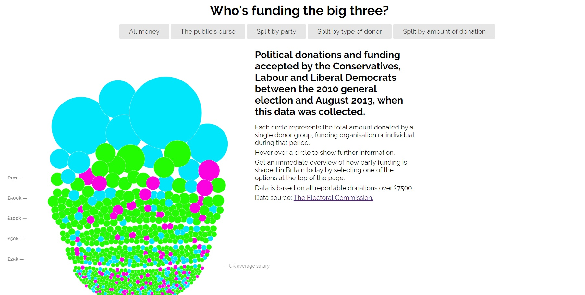
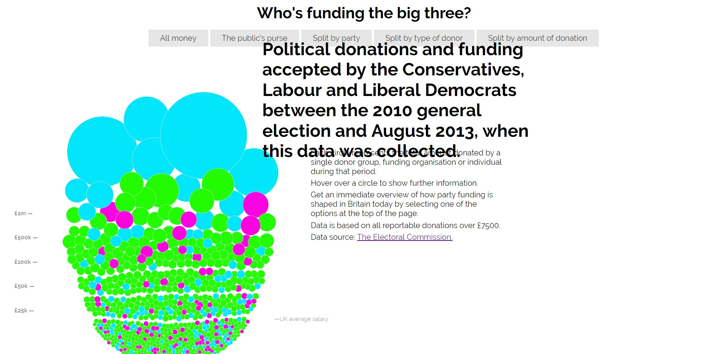
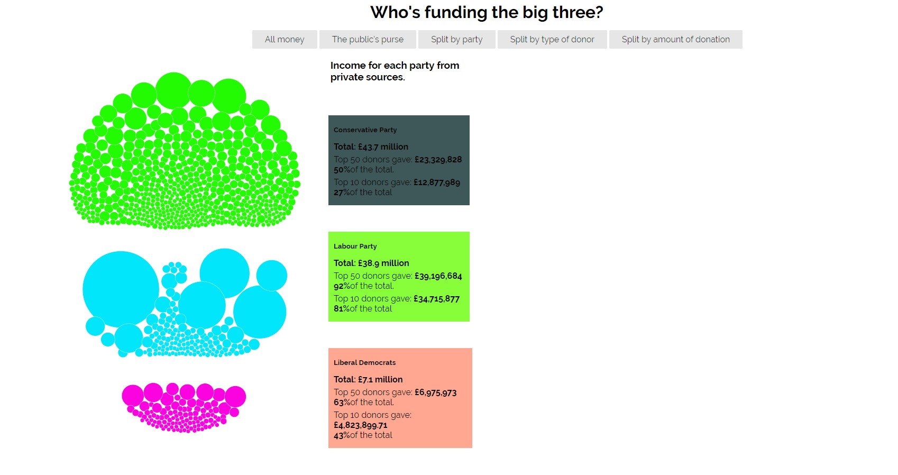
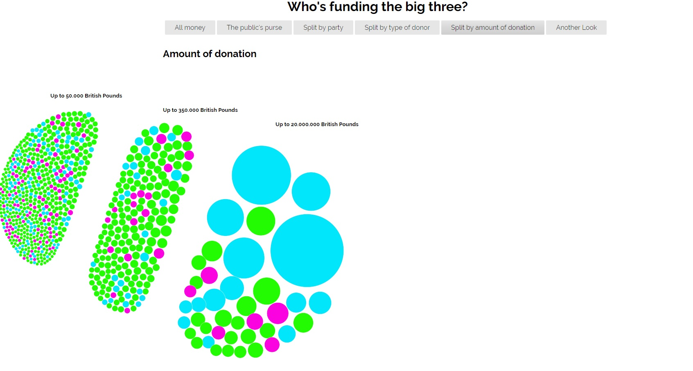
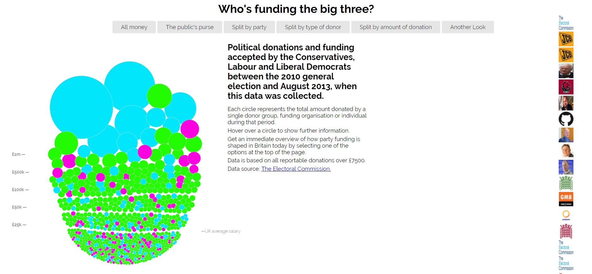

# Μάθημα: Τεχνολογίες Λογισμικού

### Ονοματεπώνυμο: Μαρία Χριστοδούλου 
### Αριθμός Μητρώου: Π2015001

## Εργασία: Οπτικοποίηση δεδομένων χορηγιών (UK)

## Παραδοτέο 1

### Link για το αποθετήριο του κώδικα: https://github.com/MariaChGeo/D3js-uk-political-donations

### Link για το εκτελέσιμο του κώδικα: https://mariachgeo.github.io/D3js-uk-political-donations/

## Παραδοτέο 2

## Τελική αναφορά
----
