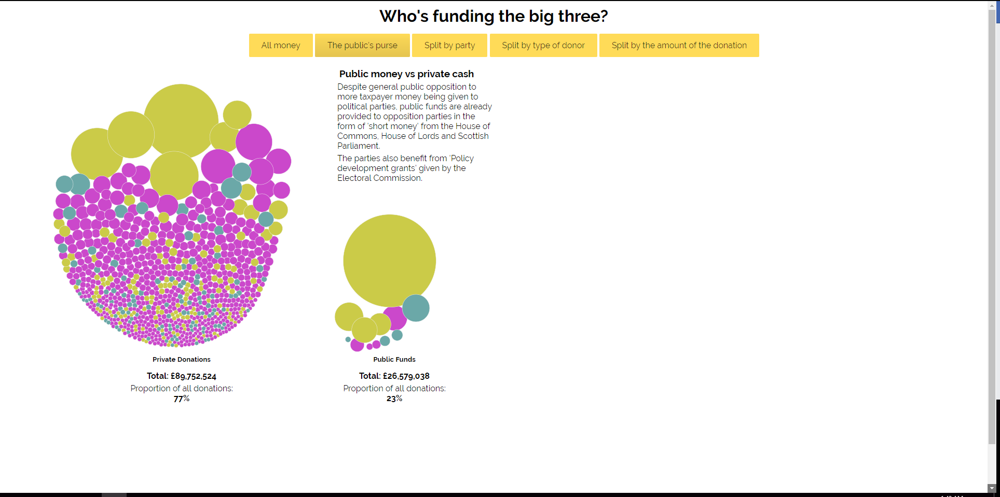
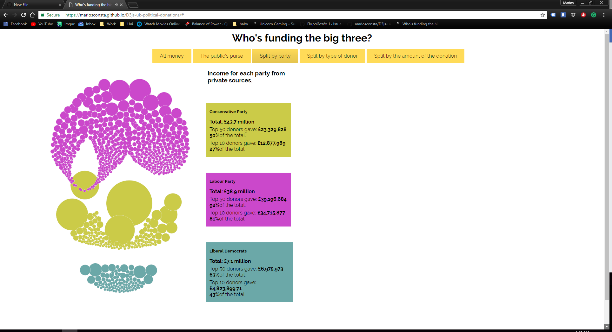
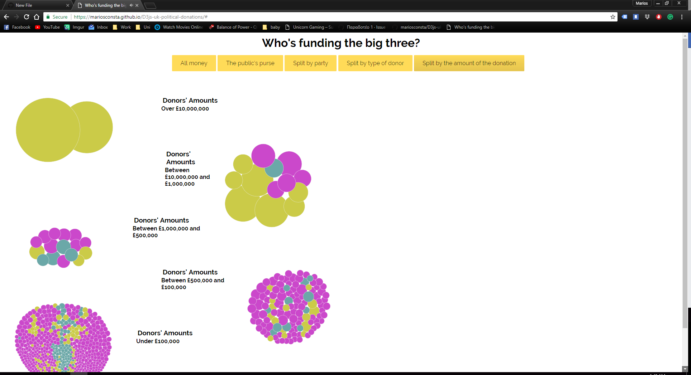

Παραδοτέο 1: Αρχικό έργο και ενδιάμεση αναφορά προόδου - 25% (4 Μαρτίου)

•	Ονοματεπώνυμο Φοιτητή: Μάριος Κωνσταντίνου

•	Αριθμός Μητρώου: Π2015002

•	Εξάμηνο Φοίτησης: ΣΤ

•	E-mail: p15konst@ionio.gr

•	Θέμα Εργασίας: Οπτικοποίηση Δεδομένων Χορηγιών (UK) - Data Visualization

•	Προσωπικό αποθετήριο του κώδικα: https://github.com/mariosconsta/sw/tree/2015002

•	 Link για το εκτελέσιμο:  https://mariosconsta.github.io/D3js-uk-political-donations/

 Οι δωρητές τους οποίους διάλεξα είναι οι εξής:
 
1.Peter Crystal(563)
2.Michael J Hutchinson(324)
3.Chris Huhne MP(560)
4.Stephen Brown(577)
5.Scottish Unionist Association Trust(83)

