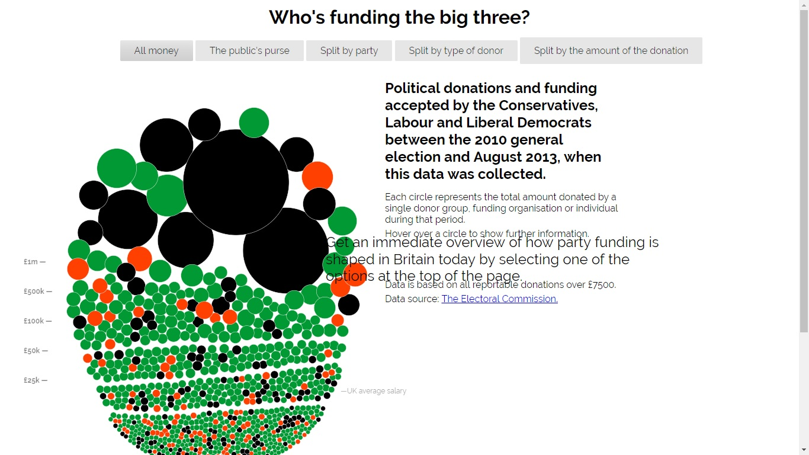
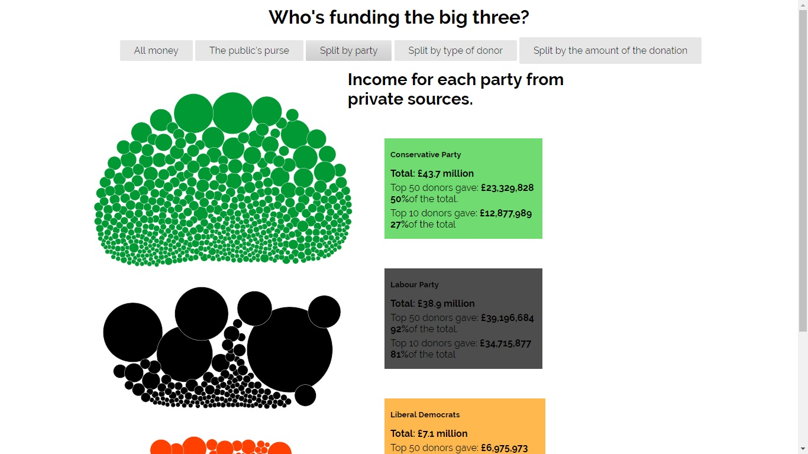
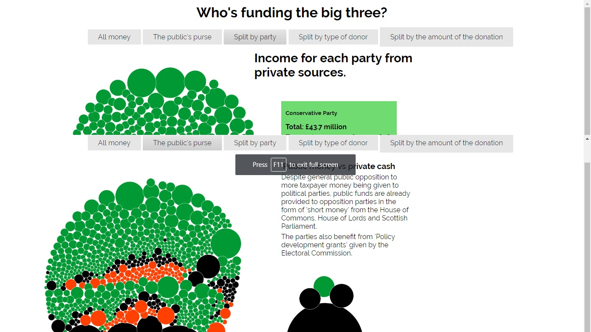
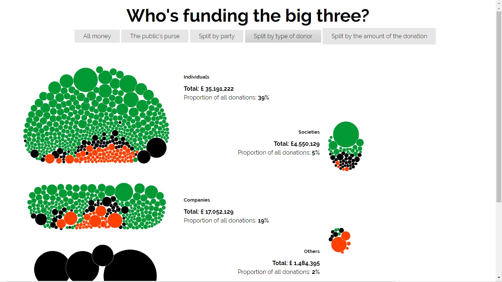
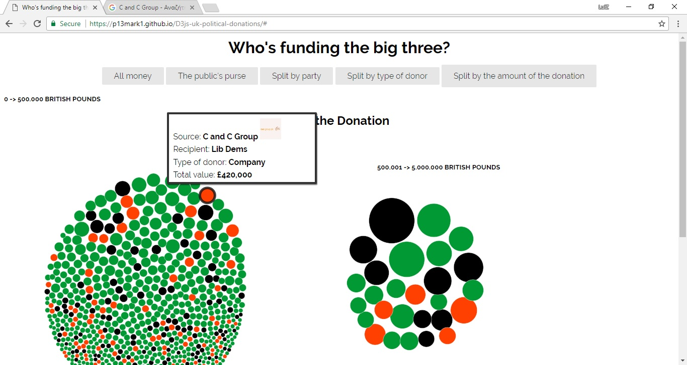

Μάθημα: Τεχνολογίες Λογισμικού

Τίτλος Εργασίας: Οπτικοποίηση δεδομένων χορηγιών (UK)

Μαρκού Λοίζος
ΑΜ: Π2015003

e-mail: p13mark1@ionio.gr
Link προσωπικόυ αποθετήριου κώδικα: https://github.com/p13mark1/D3js-uk-political-donations/tree/2015003
Link εκτελέσιμου κώδικα: https://p13mark1.github.io/D3js-uk-political-donations/
Σύνοψη:
Η παρούσα εργασίας αποτελεί τροποποίηση της εργασίας https://ioniodi.github.io/D3js-uk-political-donations/full-viz., στην οποία μέσω των HTML, CSS και Javascript γίνεται οπτικοποίηση δεδομένων. Έτσι, κάνοντας fork το αποθετήριο του ioniodi, το τροποποιούμε στο προσωπικό μας αποθετήριο, σύμφωνα με τις οδηγίες των παραδοτέων.

Παραδοτέο 1: Αρχικό έργο και ενδιάμεση αναφορά προόδου - 14 Μαρτίου (25%)
Για το πρώτο παραδοτέο έγιναν οι εξής ενέργειες:

Αρχικά, τροποποίησα το URL του προσωπικού μου αποθετηρίου από https://github.com/p13mark1/D3js-uk-political-donations/full-viz.html --> https://github.com/p13mark1/D3js-uk-political-donations, διαγράφοντας την κατάληξη full_viz.html και αλλάζοντας την ονομασία του αρχείου full_viz.html --> index.html.

Προσέθεσα των ήχο όταν κάνει κάποιος click στα κουμπιά, μέσω της συνάρτησης onmousedown() στη κεφαλίδα του(sound.currentTime=0;
		sound.play(); και μια μεταβλητη var sound = new Audio("Sound.mp3");)
.
Χρησιμοποιώντας τα rgba και των HEX κώδικα, άλλαξα τα χρώματα από τις μπάλες.(https://www.w3schools.com/colors/colors_picker.asp)

Χρησιμοποιώντας τη συνάρτηση SpeechSynthesisUtterance(), εντός της συνάρτησης mouseover(), στον κώδικα του αρχείου chart.js, προσέθεσα την φωνή που θα ακούγεται για να λέει το όνομα και το ποσό του δωρήτη. Χρησιμοποιώντας το κομμάτι του κώδικα που προσέθεσα στο αρχείο index.html, κάνω zoom στα texts της ιστοσελίδας, τοποθετώντας το class=zoom εντός των κεφαλιδών των texts.

Προσέθεσα μία ακόμη ομαδοποίηση δεδομένων.

Εντός της συνάρτησης start() του αρχείου chart.js προσθέτοντας το .on("click", function(d) { window.open("http://www.google.com/search?q=" + d.donor);});, και δημιουργοντας μια μεταβλητη με το link(http://www.google.com/search?q=κάνοντας) κλικ πάνω σε κάποια μπάλα ο χρήστης θα κάνει αναζήτηση σε καινούργιο παράθυρο.

Τέλος, για το δεύτερο σκέλος σύμφωνα με τις οδηγίες έστειλα 5 φωτογραφίες από δωρητές.
