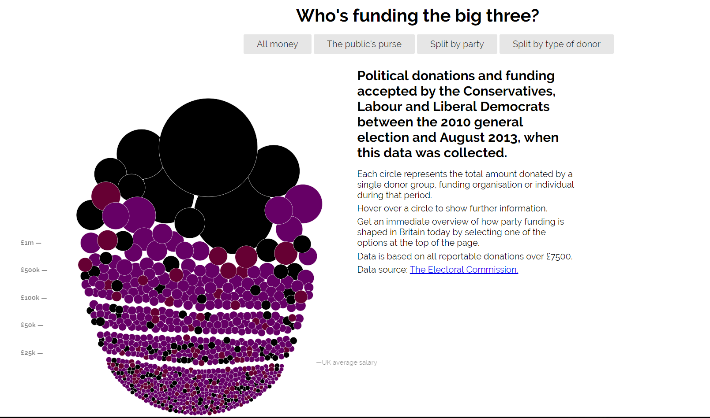
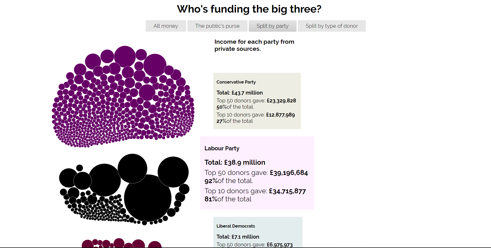
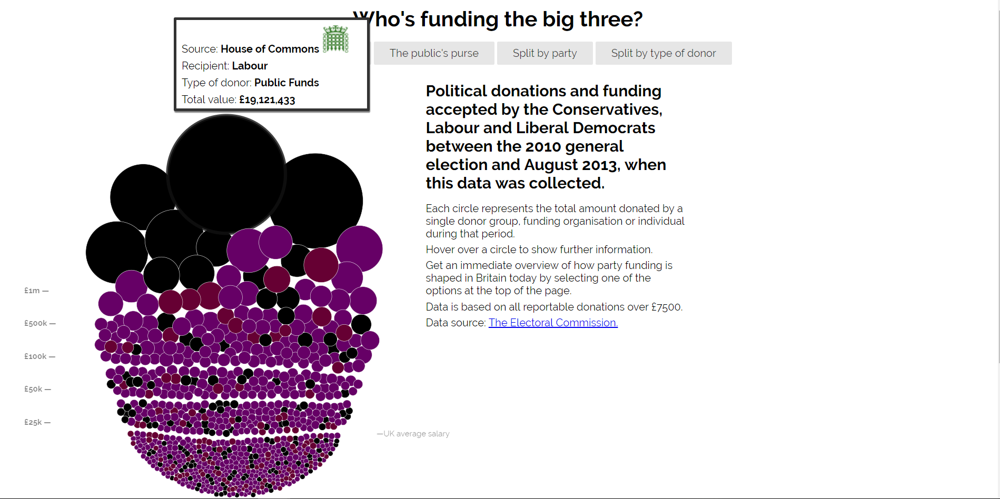

# Μάθημα: Τεχνολογίες Λογισμικού

## Στοιχεία Φοιτητή:
<strong>Ονοματεπώνυμο: Χρύσω Χριστοδούλου 
ΑΜ: Π2015005 
Εξάμηνο: ΣΤ' </strong>

## Εργασία: Οπτικοποίηση δεδομένων χορηγιών (UK)

## Παραδοτέο 1
### Link για το αποθετήριο του κώδικα: https://github.com/p15chri2/D3js-uk-political-donations/tree/gh-pages
### Link για το εκτελέσιμο του κώδικα: https://p15chri2.github.io/D3js-uk-political-donations/

### Υλοποίηση Ερωτημάτων στο Αποθετήριό μου
<or>
 <li>Άλλαξα στην σελίδα του αποθετηρίου μου τον σύνδεσμο της ιστοσελίδας και άλλαξα το branch σε "gh-pages".</li>
 <li>Μετονόμασα το full-viz.html σε index.html </li>
<li> Άλλαξα τα χρώματα στις μπάλες με τα δεδομένα, καθώς και στα αντίστοιχα 3 πεδία της ομαδοποίησης Split by party.</li>
 <li>Έβαλα ήχο κάθε φορά που ο χρήστης της εφαρμογής κάνει κλικ σε μία από τις επιλογές/κουμπιά ομαδοποίησης των δεδομένων</li>
 <li>Τροποποίησα τον κώδικα έτσι ώστε όταν κάνετε κλικ σε κάθε μπάλα να ανοίγει ένα νέο παράθυρο με τα αποτελέσματα της αναζήτησης στο google για τον αντίστοιχο δωρητή και όταν το ποντίκι μεταφέρεται επάνω από τις λέξεις του κειμένου να λειτουργεί και ως μεγεθυντικός φακός.</li>
<li> Επίσης τροποποιήσα τον κώδικα της εφαρμογής έτσι ώστε όταν το ποντίκι βρίσκεται μέσα στον κύκλο κάποιου δωρητή, να ακούγεται η ονομασία του δωρητή και το ποσό της δωρεάς.</li>
  </or>

