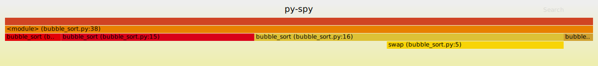
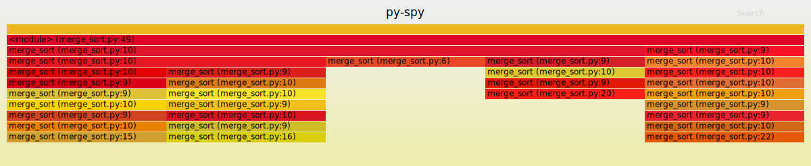
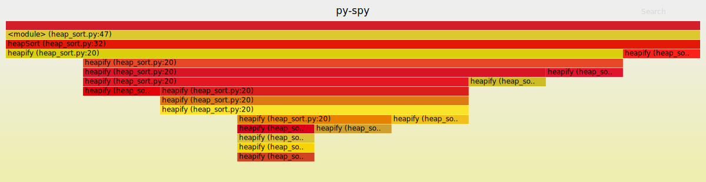

# Μάθημα: Τεχνολογία Λογισμικού
# Τελική Αναφορά 

* ### A.M.: Π2015009
* ### Ονοματεπώνυμο: Τιμόθεος Αυγερινός
 
- Σκοπος του μαθήματος Τεχνολογία Λογισμικού ήταν η κατανόηση του λογισμικού Linux και η πληρης λειτουργία του μεσα απο το terminal shell. Ολες οι παραμετροποιήσεις και τα εργαλεία τα οποία ζητήθηκαν σαν εργασίες να χρησημοποιηθούν και να καταγραφούν, θα μπορούσαν να χρησημέυσουν και να  διευκολίνουν κάθε χρήστη σε καθημερινή βάση. Ακόμα μαθένεις να βρίσκεις τις λύσεις των προβλημάτων σου ψάχνωντας στο διαδίκτυο και αναζητόντας άτομα τα οποία είχαν ή εχουν ακόμα το ίδιο πρόβλημα .

## Πρώτο παραδοτέο _Ημερομηνία λήξης προθεσμίας παράδωσης : 30/Μαρτίου/2020_
### Για το πρώτο παραδοτέο πραγματοποιήθηκαν 3 ασκήσεις απο το set ασκήσων στη περιοχή SW
- Πρώτη εργασία : Use the terminal as an IDE
- Δεύτετερη εργασία : Τry different terminals and shells
- Τρίτη εργασία : Send notifications to your desktop-mobile

## Δέυτερο παραδοτέο _Ημερομηνία λήξης προθεσμίας παράδωσης : 10/Μαϊου/2020_
### Για το δέυτερο παραδοτέο πραγματοποιήθηκαν ακόμα 3 ασκήσεις απο το set ασκήσων στη περιοχή SW
- Τέταρτη άσκηση: Performance Monitoring
- Πεμπτη άσκηση : Choose Your Stack
- Έκτη άσκηση : Set-up Cloud Services
#### _Όλες οι ασκήσεις περιγράφωνται αναλυτικά παρακάτω_


##  Συμμετοχικό εκπαιδευτικό υλικό
###  Για το συμμετοχικό εκπαιδευτικό υλικό επέλεξα να υλοποήσω δύο ασκήσεις τύπου Β: _ένα νέο διαδραστικό παράδειγμα_ και μία άσκηση τύπου Γ:_1)μια νέα μελέτη περίπτωσης_
#### Β: ένα νέο διαδραστικό παράδειγμα
- Δημιουργίθηκε κώδικας ωστέ να εμφανίζεται ένα κουμπί το οποίο να πηγαίνει το χρήστη στο τέλος της σελίδας. Μπορείτε να βρείτε την άσκηση [εδώ](https://github.com/p15avge/gr/blob/2015009/_remix/back_2_top.md).
- Δημιουργίθηκε κώδικας ωστέ να δημιουργέιται λίστα απο αντικείμενα ή απο ενέργειες που πρέπει να γίνουν και δίπλα απο αυτα υπάρχει ένα κουτάκι οπού ο χρήστης μπορεί να το επιλέξει και να το κάνει check με ένα click. Μπορείτε να βρείτε την άσκηση [εδώ](https://github.com/p15avge/gr/blob/2015009/_remix/to_do_list.md).

### Γ:1)μια νέα μελέτη περίπτωσης
- Έγινε μία μελέτη περπιπτωσης επάνω στην επίδραση και στις αλλαγές που έφερε η κυκλόφορία του πρώτου iPhone. Τα πλήπη αρχεία βρίσκονται [εδώ](https://github.com/p15avge/gr/blob/2015009/_case-study/cs-iphone.md) και [εδώ](https://github.com/p15avge/gr/blob/2015009/_case-study/iphone.md).


## Προαπαιτούμενα 
#### Έγινε αλλαγή στο .bashrc με τις παρακάτω εντολές ώστε να δείχνει τον αριθμό μητρώου
       vim .bashrc
       export PS1='Π2015139:\w$ '
       source .bashrc
#### Για όλες τις ασκήσεις χρησιμοποιήθηκε το εργαλείο  **asciinema**
 - Για την εγκατάσταση του _asciinema_ 
       
       sudo apt-add-repository ppa:zanchey/asciinema

       sudo apt-get update
       
       sudo apt-get install asciinema

## 1. Use the terminal as an IDE
* ### Edit your files (e.g., cv, website, code, etc) in vim or emacs and compile it in a different panel or use a plug-in.

### Αντιμετόπιση Προβλήματος 
####  1. Για την επήλυση του προβλήματος χρησιμοποιήθηκε το εργαλείο **Vim**(text editor)
   - Για την εγκατάσταση του **Vim** εκτελέστηκε η εντολή :
   
             sudo apt install vim
             
#### 2. Φτιάχτηκε ένα βιογραφικό σημείωμα με την βοήθεια του https://latexresu.me/
#### 3. Εγκαταστήθηκε το εργαλείο _Tex_ _Live_ και η επέκταση του _Xe_ _Tex_
         
         sudo apt-get install texlive-xetex
         
#### 4. Πέγαμε στο φάκελο _resume_   
         cd resume 
#### 5. Επεξεργασία του αρχείου _resume.tex_
         vim resume.tex
#### 6. Αποθήκευση των αλλαγών και δημιουργία αρχείου _resume.pdf_ 
         xelatex resume.tex
* #### Το video με όλη τη διαδικασία βρήσκεται εδω : https://asciinema.org/a/327709

## 2. Τry different terminals and shells
nfiguration that fits your needs

#### 1. Για την άσκηση χρησιμοποιήθηκε το _fish shell_
  - Για την εγκατάσταση του **fish** εκτελέστηκαν οι εντολές :
  
         sudo apt-add-repository ppa:fish-shell/release-3
         sudo apt-get update
         sudo apt-get install fish
         
#### 2. Εκτελέστικαν οι εντολές μέσα στο _fish_ :
         pwd 
         
         ll
         
         cd 
         
         for i in 1 2 3; echo $i; end
         
         math 2+2
         
         random 
         
 - Για την έξοδο απο το _fish_ χρησιμοποιήθικε η εντολή
 
          exit
          
          
* #### Το video με όλη τη διαδικασία βρήσκεται εδω : https://asciinema.org/a/327717
## 3. Send notifications to your desktop-mobile  
* ### Send a notifcation when a big task completes, eg download, compiling, etc 

#### 1. Για την αποστολή ειδοποίησης στο desktop χρησιμοποιήθηκε το εργαλείο ```ntfy```
-  Για την εγκατάσταση του ```ntfy``` χρησιμοποιήθηκε η εντολή :

            sudo pip install ntfy
            
- Για να εμφανιστεί ειδοποίηση στο desktop χρησιμοποιήθηκε η εντολή :
           
           ntfy -t 'ntfy' send "I am Timos"
           
           
           
   
    
#### 2. Για την αποστολή ειδοποίησης στο _smartphone_  χρησιμοποιήθηκε το εργαλείο Telegram        
 - Για την εγκατάσταση των πακέτων του _telegram_ χρησιμοποιήθηκε η εντολή :
 
             pip install ntfy[telegram]
 
- Εγκατάσταση της εφαρμογης _Telegram_ στο smartphone και μέσο αυτης δημιουργίθηκε ενα bot με όνομα Samsung2 

- Εισαγωγή του API αριθμού(token) του bot

- Αποστολή της ειδοποίησης με την εντολή 
    
            ntfy -b telegram send "hello"


* #### Το video με όλη τη διαδικασία βρήσκεται εδω :https://asciinema.org/a/327926 


## 4. Performance Monitoring
* ### Monitor the performance of your python scripts and visualize them with colors and/or spark lines

#### 1.Για την εργασία χρειάστηκε να δημιουργήσουμε 3 αρχια .txt με 100 , 1000 και 10000 τυχαίους αριθμούς 
- Για την δημιουργία αυτών των αρχείων χρησιμοποιήθηκε κώδικας από το εργαστήριο [rand_ints.py](https://github.com/p15avge/sw/blob/2015009/projects/2015009/rand_ints.py) 
- Τα τρία αρχεία .txt με τους τυχαίους αριθμούς που δημιουργήθηκαν είναι τα εξής [100.txt](https://github.com/p15avge/sw/blob/2015009/projects/2015009/100.txt) ,[1000.txt](https://github.com/p15avge/sw/blob/2015009/projects/2015009/1000.txt) και [10000.txt](https://github.com/p15avge/sw/blob/2015009/projects/2015009/10000.txt)

#### 2.Επίσης χρησιμοποιήθηκαν οι τρείς αλγόριθμοι bubble sort , merge sort και heap sort 
-Οι κώδικες βρησκονται στα link [bubble_sort.py](https://github.com/p15avge/sw/blob/2015009/projects/2015009/bubble_sort.py) , [merge_sort.py](https://github.com/p15avge/sw/blob/2015009/projects/2015009/merge_sort.py) και [heap_sort.py](https://github.com/p15avge/sw/blob/2015009/projects/2015009/heap_sort.py)

#### 3.Για την σύγκριση των τριών αλγορίθμων ταξηνόμισης χρησιμοποιήθηκε το _Hyperfine_
- Για την εγκατάσταση :
 ```bash
     wget https://github.com/sharkdp/hyperfine/releases/download/v1.9.0/hyperfine_1.9.0_amd64.deb
sudo dpkg -i hyperfine_1.9.0_amd64.deb
```
- Για την μέτρηση της απόδοσης ενως αρχείου χρησιμοποιείται η εντολή :
```bash
hyperfine 'python filename.py 100'
```
- Για την σύγκριση πολλών αρχείων χρησιμοποιείται η εντολή :
```bash
hyperfine -w 10 'python bubble_sort.py 100' 'python selecttion_sort.py 100' 'python insertion_sort.py 100'
```
- Για την αποθήκευση των αποτελεσμάτων χρησιμοποιείται η εντολή :
```bash 
hyperfine --export-mardown results 'python bubble_sort.py 1000' 'python insertion_sort.py 1000' 'python insertion_sort.py 1000'
```
- Το περιεχόμενο του αρχείου results.md βρίσκεται παρακάτω 


| Command | Mean [ms] | Min [ms] | Max [ms] | Relative |
|:---|---:|---:|---:|---:|
| python merge_sort.py 1000 | 23.5 ± 2.0 | 18.6 | 27.4 | 1.00 |
| python heap_sort.py 1000 | 25.3 ± 1.7 | 20.5 | 28.1 | 1.07 ± 0.12 |
| python bubble_sort.py 1000 | 120.3 ± 7.3 | 110.1 | 139.2 | 5.11 ± 0.54 |
 
#### Το video στο Asciinema για το _Hyperfine_ βρίσκεται στο link : https://asciinema.org/a/328313

#### 4.Για την οπτικοποίηση των δεδομένων χρησιμοποιήθηκε το εργαλείο _py-spy_
- Για την εγκατάσταση χρησιμοποιήθηκε η εντολή:
```bash
sudo pip install py-spy
```
- Για την καταγραφή και την μετατροπή των δεδομέννων σε flame graph χρησιμοποιήθηκε η εντολή:
```bash
py-spy record -o filename.svg -- python filename.py 1000
```
- Εικόνες (flame graph) με τα αποτελέσματα απο το _py-spy_


**Bubble sort (10000)**


**Merge sort (10000)**


**Heap sort (10000)**


* #### Το video στο Asciinema για το _py-spy_ βρίσκεται στο link : https://asciinema.org/a/328356

## 5.Choose Your Stack 
* ### Set-up a set of cli tools with minimal dependencies and a software licence that allows commercial use and selling
#### 1.Για την εκτέλεση της άσκησης έγινε χρη΄ση του εργαλείου _howdoi_
- Για την εγκατάσταση του _howdoi_ χρησιμοποιήθηκε η εντολή 
```bash 
pip install howdoi
```
#### 3.Εκτέλεση εντολών στο _howdoi_
- Εκτελέστηκαν οι παρακάτω εντολές :
```bash 
howdoi -h  //help

howdoi -v //version

howdoi find a file 

howdoi -C  //clear cache

howdoi -c delete a folder

howdoi create tar archive 

howdoi format date bash
```
* #### Το video στο Asciinema όπου φένεται να εκτελούνται οι παραπάνω εντολές βρίσκετε στο link : https://asciinema.org/a/328833


## 6.Set-up Cloud Services
* ### ssh to a remote machine and demonstrate your remote cli user land (e.g., email, editor, cv, code, etc)
#### 1.Χρήση του _SSH_
- Εγκατάσταση ή ενεργοποίηση του _ssh_
```bash
sudo apt-get install openssh-server 
```
#### 2.Ευρεση του _IP_ 
- Έυρεση του  IP με την εντολή 
```bash 
ip a
```
#### 3.Εκτελέστηκαν οι εντολές :
```bash
ssh -V

ssh -a ubuntu@192.168.1.34

ssh -4 ubuntu@192.168.1.34

ssh -v ubuntu@192.168.1.34

ssh -c ubuntu@192.168.1.34

ssh -C ubuntu@192.168.1.34
```
- Για την έξοδο εκτελέστηκε η εντολή :
```bash
exit
```

* #### Το video στο Asciinema βρίσκεται στο link : https://asciinema.org/a/328865


