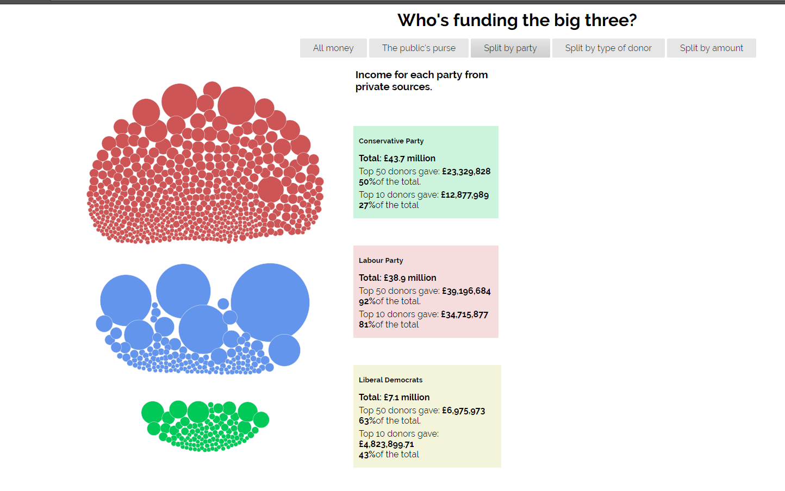
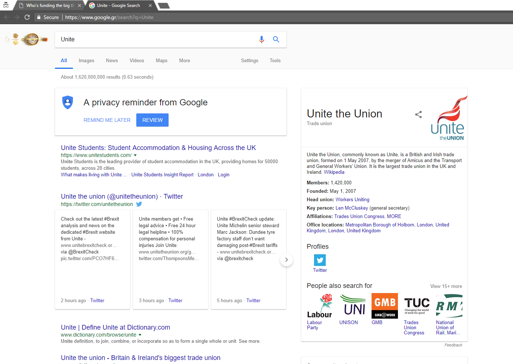
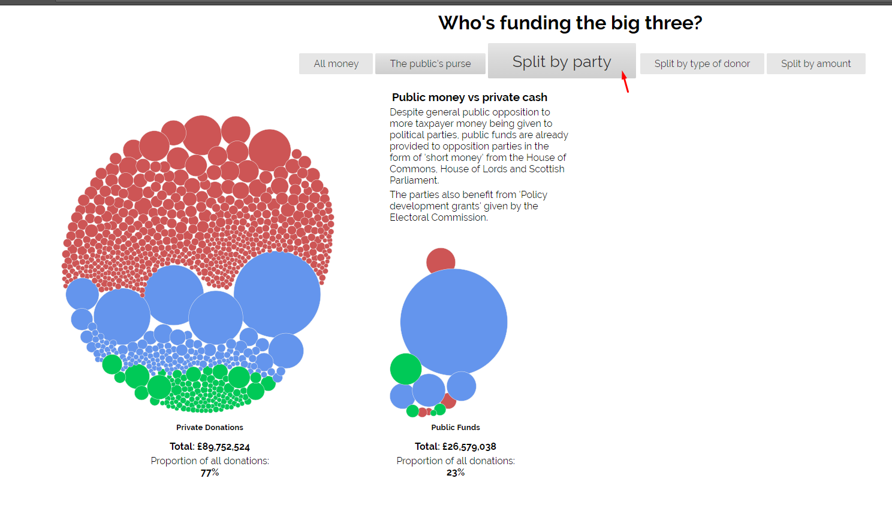
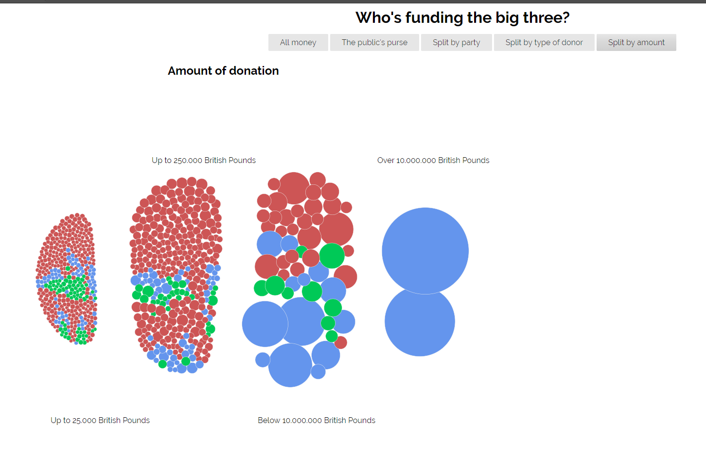

# Μάθημα: Τεχνολογίες Λογισμικού

### Ονοματεπώνυμο: Ντορέζι Αγκίμ
### Αριθμός Μητρώου: Π2015014

## Εργασία: Οπτικοποίηση δεδομένων χορηγιών (UK)

#### Aλλαγές: https://doreziagim.github.io/D3js-uk-political-donations/
#### Αποθετήριο κώδικα : https://github.com/doreziagim/D3js-uk-political-donations/tree/gh-pages

## Παραδοτέο 1

### Εκπλήρωση ζητούμενων πρώτου παραδοτέου

* Αλλαγή χρωμάτων στις μπάλες με τα δεδομένα, καθώς και στα αντίστοιχα 3 πεδία της ομαδοποίησης Split by party.

* Ήχος κάθε φορά που ο χρήστης της εφαρμογής κάνει κλικ σε μία από τις επιλογές/κουμπιά ομαδοποίησης των δεδομένων.
* Το κλικ σε κάποια μπάλα ανοίγει ένα νέο παράθυρο με τα αποτελέσματα της αναζήτησης στο google για τον αντίστοιχο δωρητή.

* Μεγένθυση όταν ο δείκτης βρίσκεται πάνω από τις λέξεις του κειμένου.

* Όταν το ποντίκι βρίσκεται μέσα στον κύκλο κάποιου δωρητή ακούγεται η ονομασία και το ποσό της δωρεάς του δωρητή.
* Νέο κουμπί για νέα ομαδοποίηση δεδομένων: Split by amount of donation.

## Παραδοτέο 2
----

## Τελική αναφορά
----
