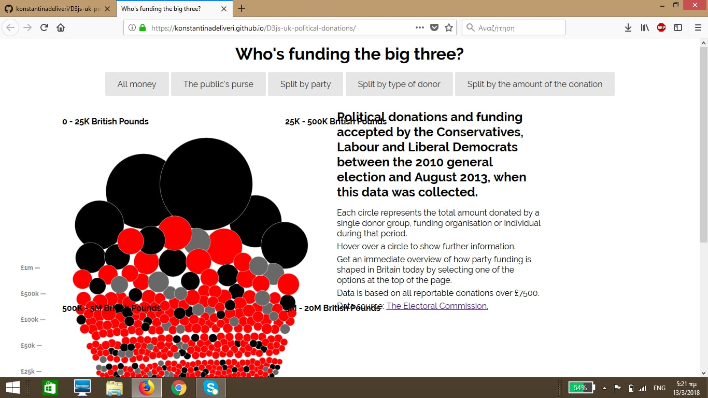
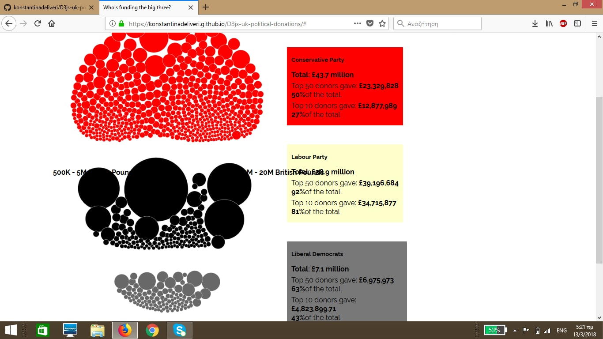
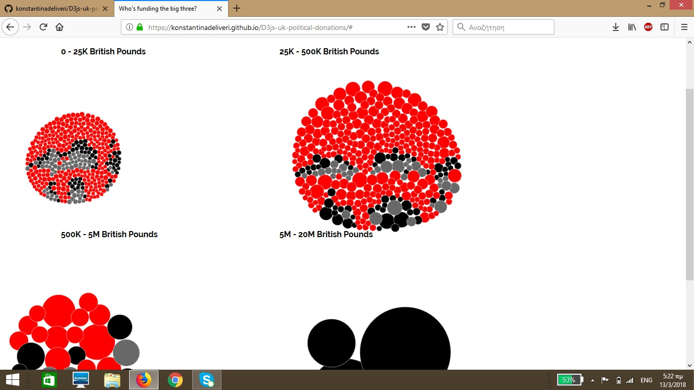
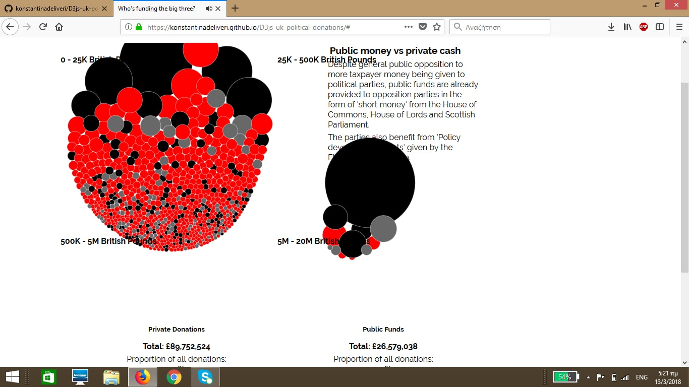

# Οπτικοποίηση δεδομένων χορηγιών (UK)

## Δεληβέρη Κωνσταντίνα Π2015020

## Σύνοψη 
 Στο συγκεκριμένο έγγραφο παρουσιάζεται η πλήρης αναφορά της εργασίας του μαθήματος Τεχνολογία Λογισμικού με θέμα Οπτικοποίηση δεδομένων χορηγιών (UK).
 Στόχος της εργασίας είναι η εξοικείωση με τις γλώσσες HTML, CSS και JavaScript σε ένα ήδη υπάρχον περιβάλλον το οποίο καλούμαστε να τροποποιήσουμε.
 
 ### Link στο εκτελέσιμο του κώδικα: https://konstantinadeliveri.github.io/D3js-uk-political-donations/
 ### Link στο προσωπικό αποθετήριο του κώδικα:https://github.com/konstantinadeliveri/D3js-uk-political-donations/tree/2015020
 ### Link (gh-pages) για το 1ο παραδοτέο: https://github.com/konstantinadeliveri/D3js-uk-political-donations/tree/gh-pages
 
 ### Δήλωση και δέσμευση θέματος εργασίας στο μάθημα Τεχνολογία Λογισμικού
 
 ## Παραδοτέο 1 (14 Μαρτίου 2018)
 
 *  Ονοματεπώνυμο: **Κωνσταντίνα Δεληβέρη**
 *  Αριθμός Μητρώου: **Π2015020**
 *  Θέμα εργασίας **"Οπτικοποίηση δεδομένων χορηγιών (UK)"**

### Διαδικασία ανάπτυξης και τροποποίησης
Αρχικά έγινε fork του κοινού αποθετηρίου του μαθήματος και της εφαρμογής. Στη συνέχεια έγινε η μετατροπή του αρχείου full-viz.html
σε index.html ώστε να ανοίγει το αρχείο χώρις την κατάληξη full-viz.html, επιπλέον φαίνεται το όνομα χρήστη στο URL και όχι το αρχικό όνομα. Μετά ξεκίνησα να κάνω τις απαραίτητες αλλαγές στα αρχεία index.html, style.css και chart.js. Έγιναν οι απαραίτητες αλλαγές ώστε να αλλάξουν τα χρώματα στις μπάλες αλλά και στα τρία πλαίσια στο Split by Party. Επιτυχής ήταν και η προσθήκη ενός ήχου κάθε φορά που κάνουμε κλικ σε κουμπιά διαχωρισμού. Επιπλέον προστέθηκε μια λειτουργία ώστε όταν κάνουμε κλικ σε μία μπάλα και ο χρήστης να οδηγείται στην αναζήτηση Google όπου ανοίγει η πληροφορία της συγκεκριμένης μπάλας. Ακόμη έγιναν τροποποιήσεις ώστε να μεγενθύνονται τα κειμενάκια και να ακούγεται ομιλία για τα στοιχεία της κάθε μπάλας όταν ο κέρσορας βρίσκεται πάνω σε αυτή.
Τέλος, δημιουργήθηκε κουμπάκι διαχωρισμού Split by The Amount of Donation.
Το επόμενο στάδιο ήταν να δημιουργηθεί ένα αρχείο .csv με τα στοιχεία μου, καθώς και να προσθέσω 5 φωτογραφίες δωρητών 42x42 px σε .ico ώστε να προστεθούν στα κατάλληλα σημεία.

Οι εικόνες είναι :   122. John Frieda
                     166. Andrew Scott
                     204. Timothy Jones
                     450. Lord Edward Haughey
                     455. Amanda Shaw
                     
                     

### Σχετικές Εικόνες:

  Αλλαγές στα  χρώματα

  
  Νέος Διαχωρισμός

  
 
  

  Γενικά                   
              
              
              
              
                   
## Παραδοτέο 2 (9 Μαΐου 2018)     
Έχω κάνει τις κατάλληλες αλλαγές στον κώδικα ώστε να εμφανίζονται τα εικονίδια στο πλάι της σελίδας όταν ο κέρσωρας είναι πάνω σε κάποια μπάλα.
Οι αλλαγές αυτές βρίσκονται στον αποθετήριο κώδικα: https://github.com/konstantinadeliveri/D3js-uk-political-donations/tree/master
Στη συνέχεια, έκανα τις απαραίτητες αλλαγές ώστε να καλύψω το 3ο ερώτημα. Βρήκα μία επίσημη στατιστική αρχή από το Υπουργείο Παιδείας σχετικά με τα αποτελέσματα των πανελλήνιων εξετάσεων του έτους 2016 και 2017.Το αρχείο βρίσκεται στο φάκελο data στο link (gh-pages):https://github.com/konstantinadeliveri/D3js-uk-political-donations/tree/gh-pages καθώς και τα κατάλληλα έγγραφα (new data,new_chart, new_style) για την δημιουργία του καινούριου D3.
Επιπλέον, για τα υποερωτήματα του pull-request έχω δεσμεύσει την "posision #49" και έχω αλλάξει το παράδειγμα του κώδικα όπου χρειαζόταν, καθώς και έχω ενημερώσει το αρχείο με το ΑΜ μου.
 
