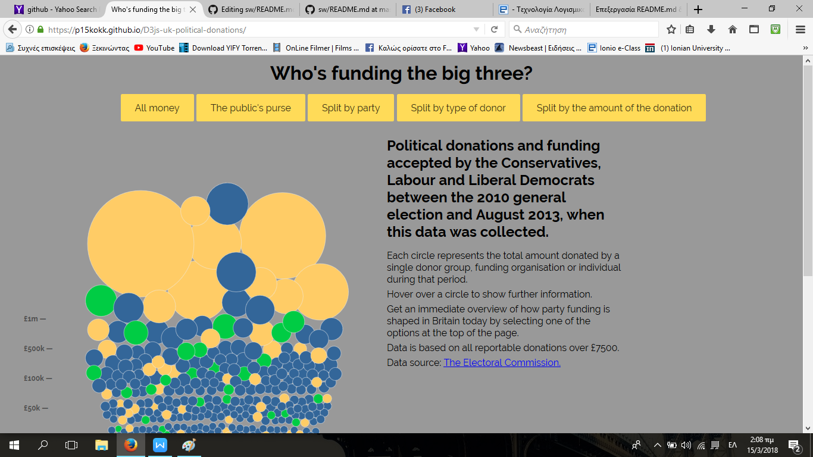
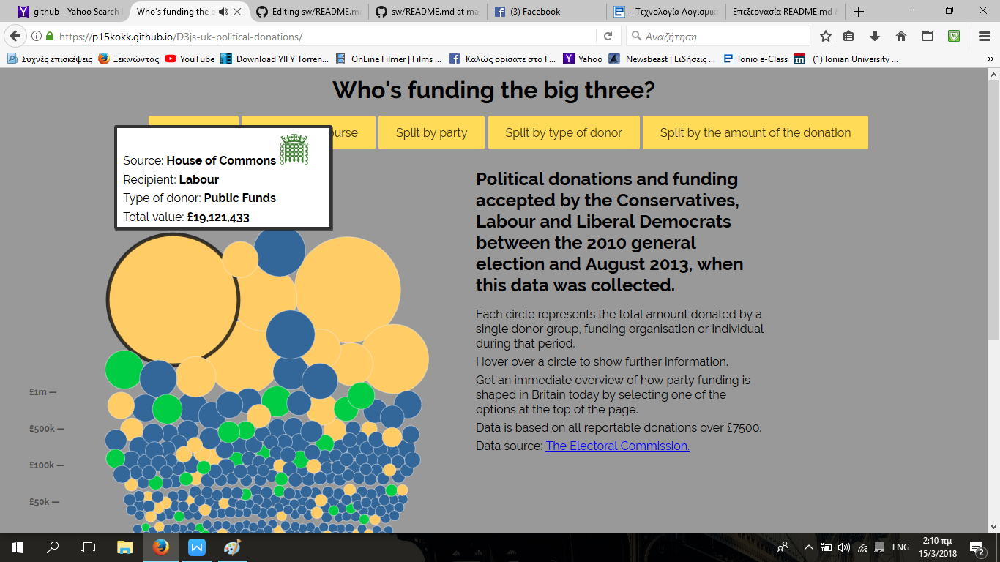
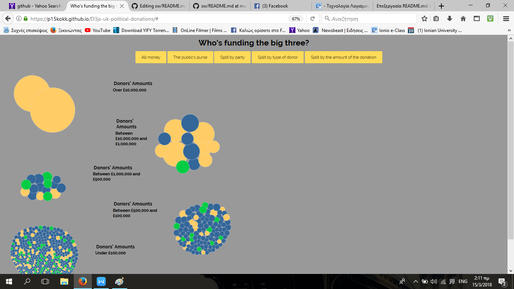

ΜΑΘΗΜΑ : ΤΕΧΝΟΛΟΓΙΕΣ ΛΟΓΙΣΜΙΚΟΥ 
ΤΙΤΛΟΣ ΕΡΓΑΣΙΑΣ : ΟΠΤΙΚΟΠΟΙΗΣΗ ΔΕΔΟΜΕΝΩΝ ΧΟΡΗΓΙΩΝ (UK)
ΜΙΧΑΗΛ ΚΟΚΚΟΡΗΣ
Α.Μ.:Π2015022
E-MAIL: p15kokk@ionio.gr
LINK ΠΡΟΣΩΠΙΚΟΥ ΑΠΟΘΕΤΗΡΙΟΥ ΚΩΔΙΚΑ :https://github.com/p15kokk/D3js-uk-political-donations/tree/master
LINK ΕΚΤΕΛΕΣΙΜΟΥ ΚΩΔΙΚΑ : https://p15kokk.github.io/D3js-uk-political-donations/ 

ΓΙΑ ΤΟ ΠΡΩΤΟ ΠΑΡΑΔΟΤΕΟ ΕΓΙΝΑΝ ΟΙ ΕΞΗΣ ΑΛΛΑΓΕΣ :
1 ΑΡΧΙΚΑ ΤΡΟΠΟΠΟΙΗΣΑ ΤΟ URL ΤΟΥ ΠΡΟΣΩΠΙΚΟΥ ΜΟΥ ΑΠΟΘΕΤΗΡΙΟΥ 
2 ΕΠΙΤΑ ΠΡΟΣΘΕΣΑ ΤΟΝ ΗΧΟ ΜΕΣΑ ΣΤΟ ΑΡΧΕΙΟ CHART.JS 
3 ΠΡΟΣΘΕΣΑ ΑΚΟΜΑ ΜΙΑ ΟΜΑΔΟΠΟΙΗΣΗ ΔΕΔΟΜΕΝΩΝ 
4 ΠΡΟΣΘΕΣΑ ΤΟ on("click", function(d) { window.open("http://www.google.com/search?q=" + d.donor);});, ΓΙΑ ΝΑ ΜΠΟΡΕΙΣ ΝΑ ΑΝΑΖΗΤΑΣ ΣΤΟ ΔΙΑΔΥΚΤΙΟ ΤΟΝ ΔΩΡΗΤΗ ΠΑΤΩΝΤΑΣ ΠΑΝΩ ΣΤΗΝ ΑΝΤΙΣΤΟΙΧΗ ΜΠΑΛΑ 

