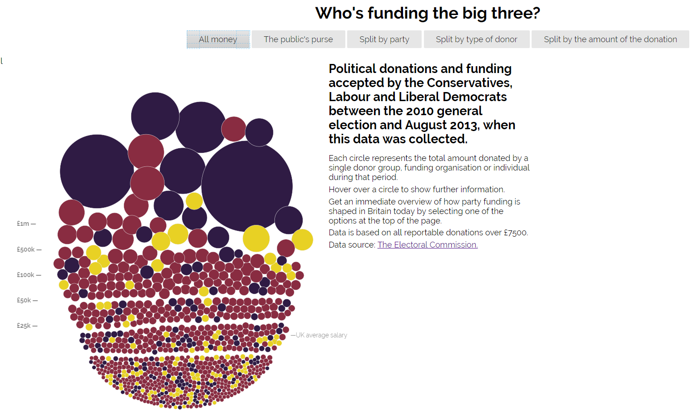
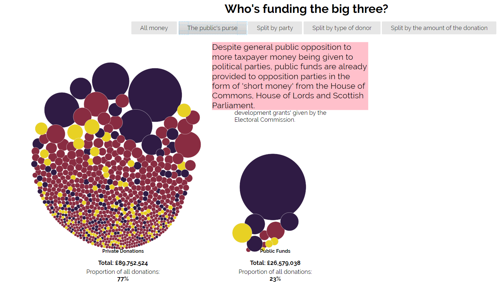

Θέμα: Οπτικοποίηση δεδομένων χορηγιών (UK)

Ονοματεπώνυμο: Μέμος Σεβαστιανός
 Α.Μ.: Π2015027
 Προσωπικό αποθετήριο του κώδικα: https://github.com/sevosmem/D3js-uk-political-donations
 Link για το εκτελέσιμο: https://sevosmem.github.io/D3js-uk-political-donations/

1ο Παραδοτέο

Ζητούμενα στο προσωπικό μου αποθετήριο
 1)Άλλαξα το url της εφαρμογής ώστε να μην χρειάζεται να καταλήγει σε "full-viz.html"
 2)Άλλαξα χρώματα στις μπάλες με τα δεδομένα, καθώς και στα αντίστοιχα 3 πεδία της ομαδοποίησης Split by party.
 3)Πρόσθεσα ήχο κάθε φορά που ο χρήστης της εφαρμογής κάνει κλικ σε μία από τις επιλογές/κουμπιά ομαδοποίησης των δεδομένων.
 4)Τροποποίησα τον κώδικα έτσι ώστε όταν ο χρήστης κάνει κλικ σε κάθε μπάλα να ανοίγει ένα νέο παράθυρο με τα αποτελέσματα της αναζήτησης στο google για τον αντίστοιχο δωρητή.
 5)Τροποποίησα τον κώδικα της εφαρμογής έτσι ώστε το ποντίκι να λειτουργεί και ως μεγεθυντικός φακός όταν μεταφέρεται επάνω από τις λέξεις του κειμένου.
 6)Τροποποίησα τον κώδικα της εφαρμογής έτσι ώστε όταν το ποντίκι βρίσκεται μέσα στον κύκλο κάποιου δωρητή, να ακούγεται η ονομασία του δωρητή και το ποσό της δωρεάς.

Ζητούμενα στο κοινό αποθετήριο του κώδικα
 1)Δημιούργησα ένα αρχείο .csv στον φάκελο participants του αποθετηρίου του κώδικα. Το αρχείο έχει για τίτλο τον Α.Μ. μου και περιεχόμενο τα στοιχεία μου.
 2)Στον φάκελο photos αποθετηρίου, τοποθέτησα εικόνες 5 δωρητών.
   Root Capital (591)
   Irwin Mitchell LLP (592)
   JCB Research - Bamford (598)
   Babyway International (620)
   CH2M Hill (677)
  
  Εικόνες
  
  
  
 
 
  
