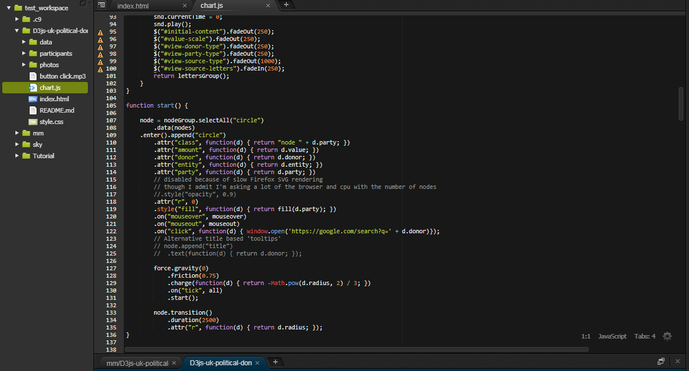
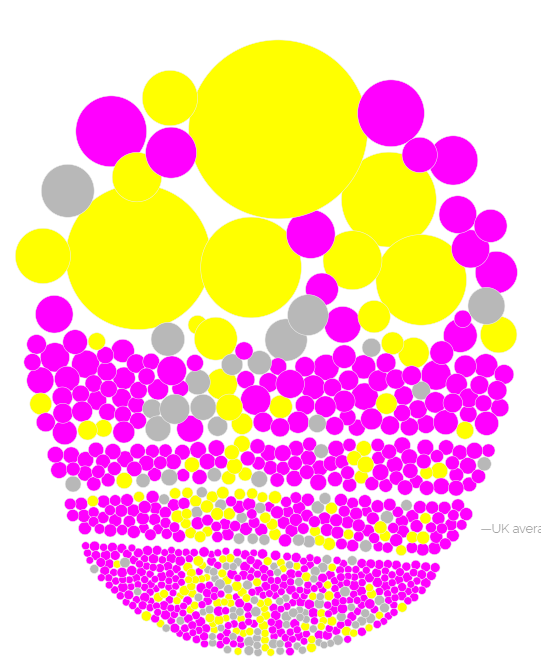
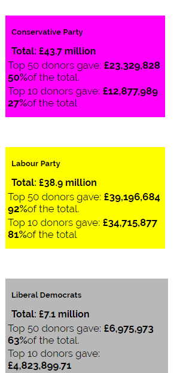
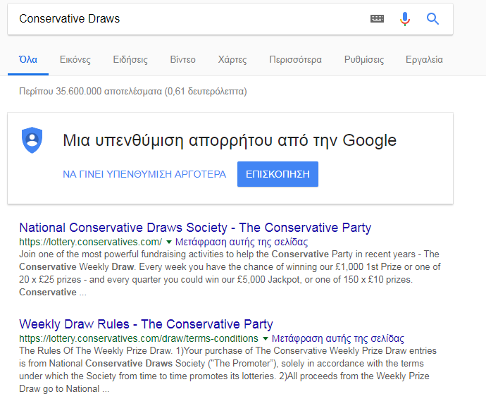
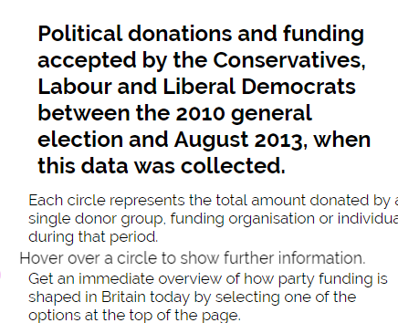
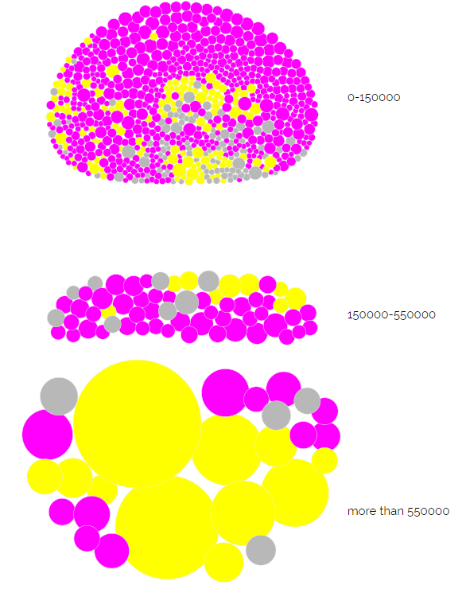
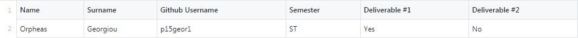

# Οπτικοποίηση δεδομένων χορηγιών (UK)

## ΓΕΩΡΓΙΟΥ ΟΡΦΕΑΣ - Π2015033
## ΕΞΑΜΗΝΟ ΦΟΙΤΗΣΗΣ: ΣΤ'

#### Link στο προσωπικό αποθετήριο του κώδικα: https://github.com/p15geor1/D3js-uk-political-donations/tree/paradoteo1
#### Link στον εκτελέσιμο κώδικα: https://p15geor1.github.io/D3js-uk-political-donations/index.html

##### Αλλαγές που έγιναν: 
* Ο σύνδεσμος της σελίδας δείχνει στην εφαρμοφή 
* To url δεν καταλήγει σε full-viz.html
* Αλλαγή στις μπάλες με τα δεδομένα, καθώς και στα αντίστοιχα 3 πεδία της ομαδοποίησης Split by party
* Ακούγεται ήχος κάθε φορά που ο χρήστης της εφαρμογής κάνει κλικ σε ένα κουμπί ομαδοποίησης των δεδομένων
* Όταν γίνεται κλικ ανοίγει νέο παράθυρο με τα αποτελέσματα της αναζήτησης στο google για τον αντίστοιχο δωρητή
* Το ποντίκι λειτουργεί και ως μεγεθυντικός φακός όταν μεταφέρεται επάνω από τις λέξεις του κειμένου
* Όταν το ποντίκι βρίσκεται μέσα στον κύκλο κάποιου δωρητή, ακούγεται η ονομασία του δωρητή και το ποσό της δωρεάς
* Δημιουργήθηκε νέα επιλογή ομαδοποίησεις των δεδομένων
* Δημιουργήθηκε ένα αρχείο .csv στον φάκελο participants
* Στον φάκελο photos αποθετηρίου, τοποθετήθηκαν εικόνες 5 δωρητών

#### Το εργαλείο που χρησιμοποίησα παράλληλα με το github για την επεξεργασία και εκτέλεση του κώδικα είναι το Cloud9
Η επιλογή έγινε για την αποφυγή του μεγάλου χρόνου αναμονής όταν γίνεται η φόρτωση της σελίδας μέσω του github, παρακάτω φαίνεται 
το προγραμματιστικό περιβάλλον του cloud9 με τον επεξεργασμένο κώδικα: 

Παρακάτω δίνονται φωτογραφίες απο τις αλλαγές που έχουν γίνει: 

* Το καινούριο url:

* Τα χρώματα στις μπάλες  και στα κουτιά:

 

* Η δυνατότητα αναζήτησης:

* Η δυνατότητα μεγένθυσης των γραμμάτων:

* Η καινούρια κατηγορία παρουσίασης των στοιχείων: 

Επίσης δύνεται η δυνατότητα να ακούγεται ήχος κάθε φορά που ο χρήστης της εφαρμογής κάνει κλικ σε ένα κουμπί 
ομαδοποίησης των δεδομένων και όταν το ποντίκι βρίσκεται μέσα στον κύκλο κάποιου δωρητή, ακούγεται η ονομασία 
του δωρητή και το ποσό της δωρεάς.

Τέλος έχει δημιουργηθεί το αρχείο στοιχείων που ζητήθηκε: 

και προστέθηκαν 5 φωτογραφίες:

1.Richard Caring(227)
2.Vincos(645)
3.Carol Lazarus(281)
4.David J Lyons(243)
5.Graeme Hossie(244)
