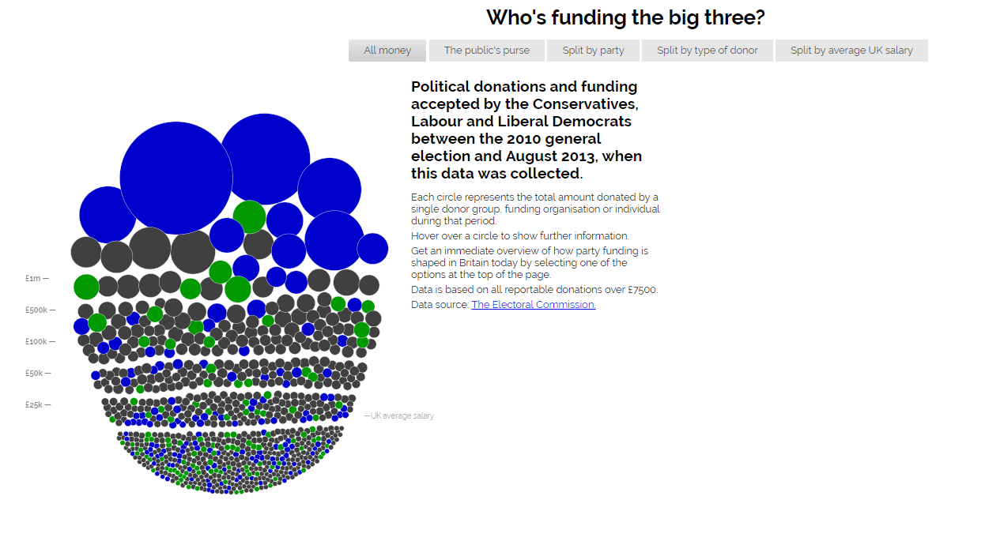
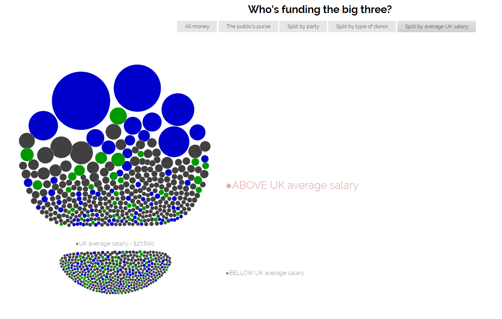
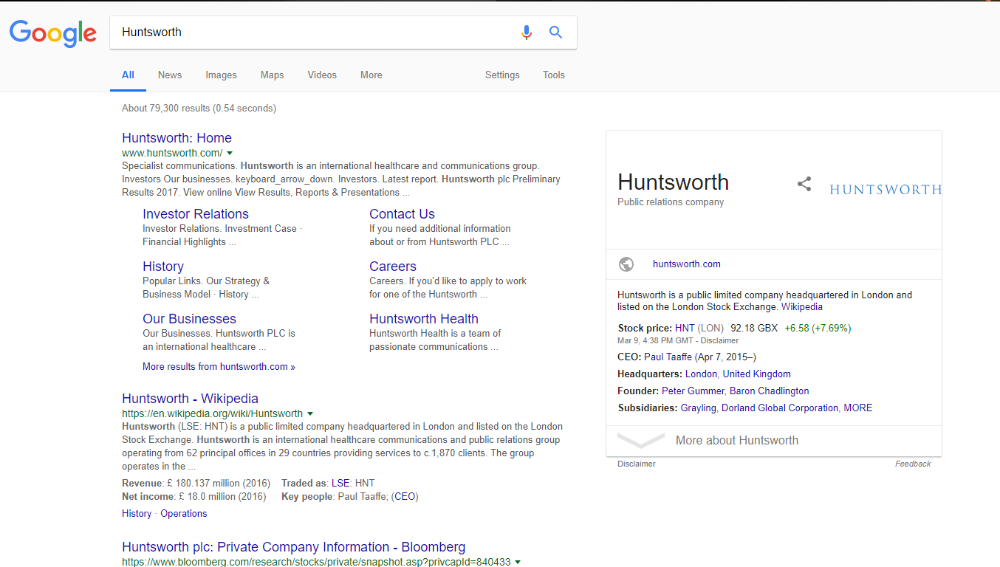

# Οπτικοποίηση Δεδομένων Χορηγιών (UK)

## Στοιχεία Φοιτητή:
<strong>Ονοματεπώνυμο: Σπυρίδων Θεοδωρόπουλος 
ΑΜ: Π2015035 
Εξάμηνο: ΣΤ' </strong>

## 1ο Παραδοτέο

 Forked Repository (SW): https://github.com/p15theo2/sw
 Forked Repository (D3js-uk-political-donations): https://github.com/p15theo2/D3js-uk-political-donations

### Υλοποίηση Ερωτημάτων στο Αποθετήριό μου

<or>
  <li>Σύνδεσμος Εργασίας (gh-pages): https://p15theo2.github.io/D3js-uk-political-donations/</li>
  <li>Αλλαξα το όνομα του .html αρχείου σε <b>index.html</b> για να λειτουργεί το site χωρίς την κατάληξη σε full-viz.html</li>
  <li>Άλλαξα τα χρώματα του γραφήματος</li>
  <li>Πρόσθεσα ήχο κάθε φορά που ο χρήστης πατάει κάποιο απο τα κουμπιά</li>
  <li>Κάθε φορά που ο χρήστης πατάει πάνω σε κάποιον κύκλο του γραφήματος ανοίγει ένα παράθυρο με αποτελέσματα αναζήτησης του αντίστοιχου δωρητή</li>
  <li>Όποτε ο χρήστης τοποθετει το ποντικι πάνω από κείμενο της σελίδας, γίνεται zoom πάνω σε αυτό το κομμάτι κειμένου</li>
  <li>Επιπλέον όποτε ο χρήστης τοποθετει το ποντικι πάνω από έναν κύκλο του γραφήματος, το όνομα και το ποσό της δωρεάς προφέρεται με τεχνολογία text-to-speech</li>
  <li>Δημιούργησα μια επιπλέον επιλογή κατηγοριοποίησης <b>Split by UK average salary</b> η οποια τοποθετει τις μπαλλες αναλογα με τον μεσο ετησιο μισθο.</li>
</or>

### Υλοποίηση Ερωτημάτων στο κοινό Αποθετήριο

<or>
  <li>Πρόσθεσα και έκανα pull request το αρχείο .csv με τα στοιχεία μου το οποίο έγινε merge</li>
  <li>Πρόσθεσα 5 καινούργιες φωτογραφίες για τα παρακάτω πρόσωπα-εταιρίες:<ul>
        <li>Co-operative Group</li>
        <li>Co-operative Party</li>
        <li>FIL Investment Management</li>
        <li>Gloucester Research</li>
        <li>Berkeley Burke</li>
        </ul></li>
</or>

### Εικόνες:

2ο Παραδοτέο - ΤΕΛΙΚΗ ΑΝΑΦΟΡΑ
https://p15theo2.github.io/final-report-sw/
