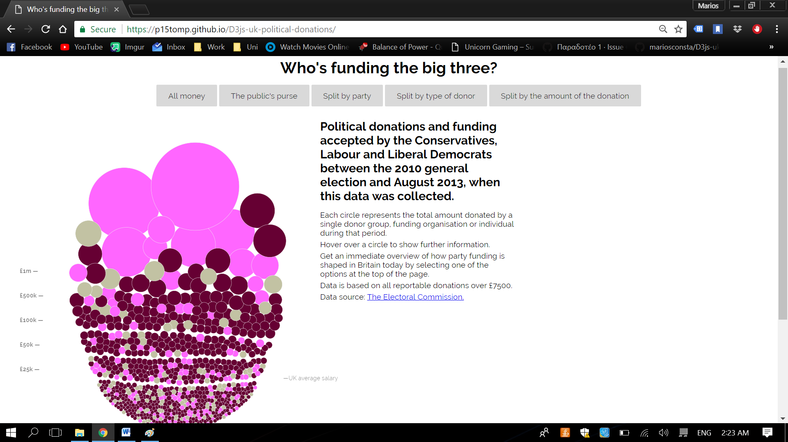
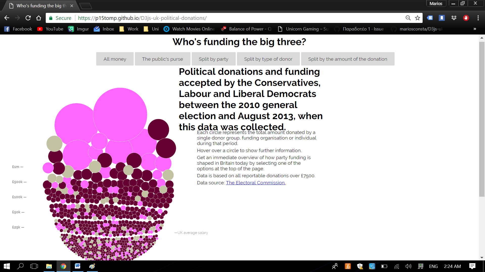
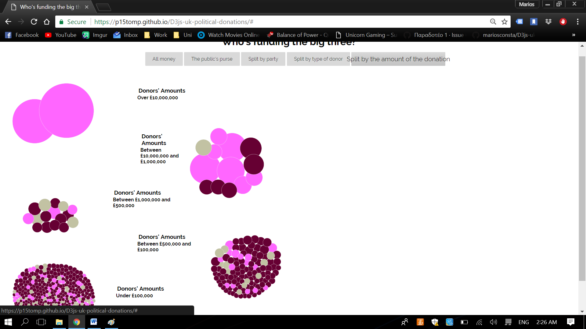
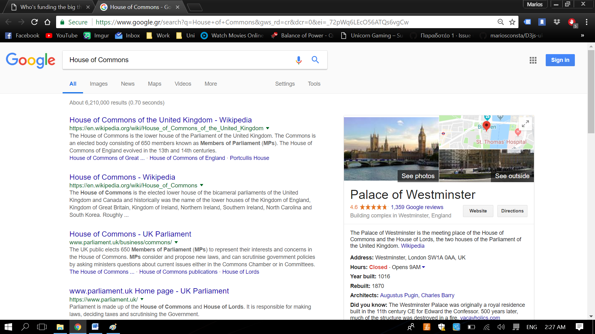

Παραδοτέο 1: Αρχικό έργο και ενδιάμεση αναφορά προόδου - 25% (4 Μαρτίου)
•	Ονοματεπώνυμο Φοιτήτριας: Δήμητρα Τομπουλίδου
•	Αριθμός Μητρώου: Π2015044
•	Εξάμηνο Φοίτησης: Στ
•	E-mail: to.dimitra@gmail.com
•	Θέμα Εργασίας: Οπτικοποίηση Δεδομένων Χορηγιών (UK) - Data Visualization
•	Προσωπικό αποθετήριο του κώδικα: https://github.com/p15tomp/D3js-uk-political-donations/tree/2015044
•	 Link για το εκτελέσιμο: https://p15tomp.github.io/D3js-uk-political-donations/

•Αλλαγή χρωμάτων

•Προπωποίησα των κώδικα ώστε να κανει ζουμ στα γράμματα, για άτομα με περιορισμένη όραση

•Δημιουργία νέας επιλογής με όνομα Split the amoynt of the donation

•Πατώντας πάνω σε οποιαδήποτε μπαλα αναζήτησης μεταβαίνει κατευθείαν σε νέα αναζήτηση στο google με το όνομα του δωρητή

         

