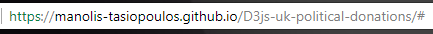
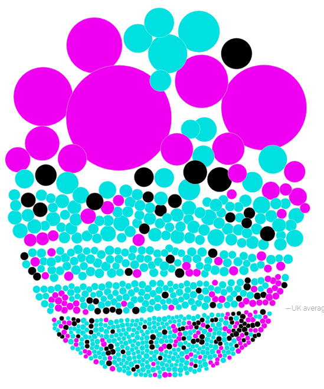
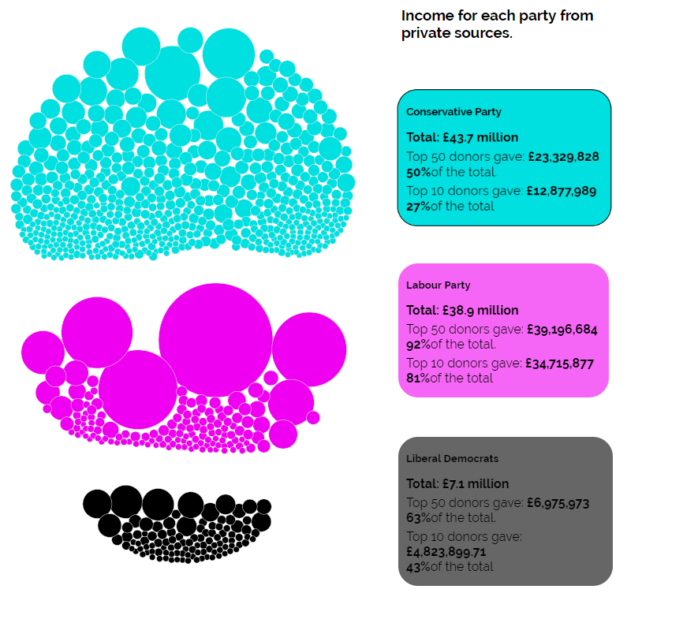
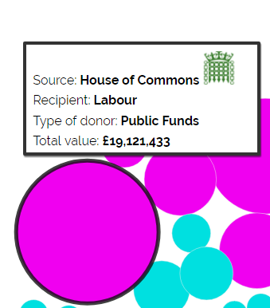
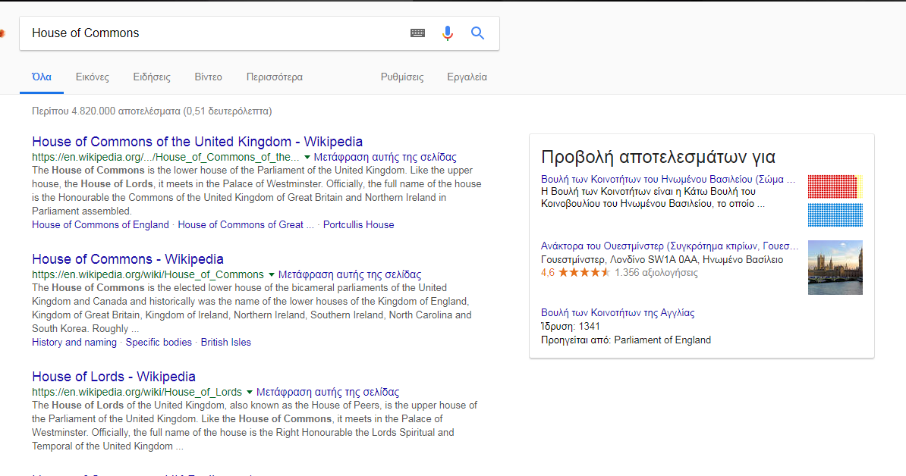
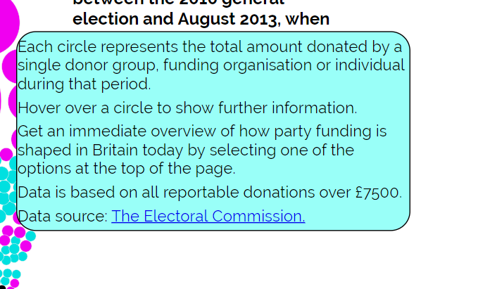
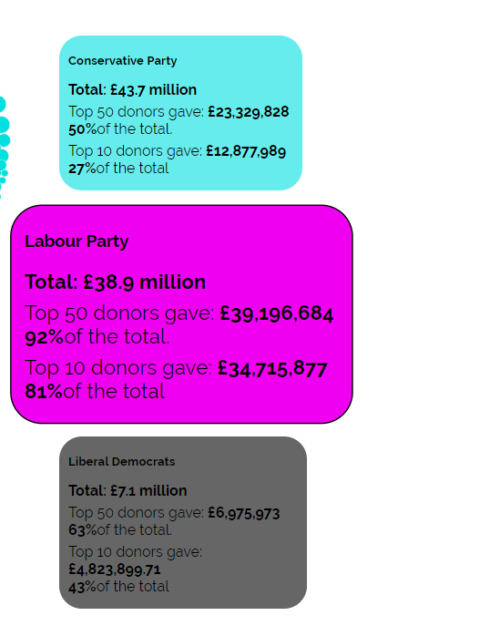
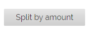
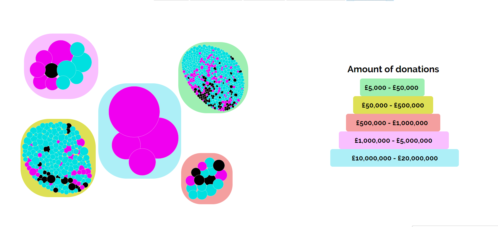
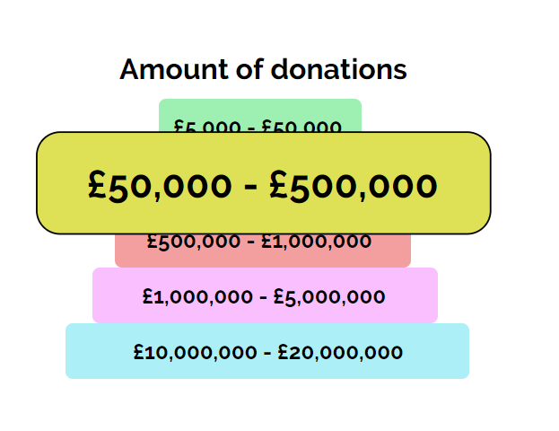

<h1>Οπτικοποίηση Δεδομένων Χορηγιών (UK)</h1>

<h2>Στοιχεία Φοιτητή</h2>
  
  - Ονοματεπώνυμο: <strong>Τασιόπουλος Εμμανουήλ</strong>
  - ΑΜ: <strong>Π2015046</strong>
  - Εξάμηνο: <strong>ΣΤ'</strong>
  
<h2>Παραδοτέο 1</h2>

<h3>---LINKS---</h3>
   
  - [__Forked Repository (SW)__](https://github.com/Manolis-Tasiopoulos/sw)<br>
  - [__Forked Repository (D3js-uk-political-donations)__](https://github.com/Manolis-Tasiopoulos/D3js-uk-political-donations)   
  - [__Link Εργασιας__](https://manolis-tasiopoulos.github.io/D3js-uk-political-donations/)
<h3>---Αλλαγές στο Προσωπικό Αποθετήριο---</h3>

   - __Το url της εφαρμογης δεν καταληγει πλεον σε full-viz.html__
   
   ```
   Url
   ```
   
   - __Αλλαγή χρωμάτων:__    
      * Στις μπάλες με τα δεδομένα<br>
   
   
      * Στα πεδία ομαδοποίησης Split by party<br>
   
   
   
  - __Προσθηκη ήχου καθε φορα που ο χρήστης της εφαρμογής κάνει κλικ σε μία από τις επιλογές__
   
  - __Αναζήτηση δωρητών στο Google με κλικ στις μπάλες των δεδομένων__
      
   ```
   search
   ```
   
   - __Προσθήκη επιλογής μεγένθησης όταν ο χρήστης περνάει με το ποντίκι πάνω απο ένα κείμενο__
      
   ```
   Zoom
   ```
  
  - __Ακούγεται το όνομα και το ποσό των δωρητών όταν ο χρήστης περνάει με το ποντίκι πάνω από τις μπάλες των δεδομένων__
  
  - __Δημιουργία νέας επιλογής Split by amount:__  
    * Ομαδοποίηση των δεδομένων με βάση το ποσό των δωρεών
     
     ```
     button
     ```
     
     ```
     Split
     ```
     
     ```
     zoom
     ```
      
<h2>Τελική αναφορά</h2>

 - https://manolis-tasiopoulos.github.io/FinalReportSW/

