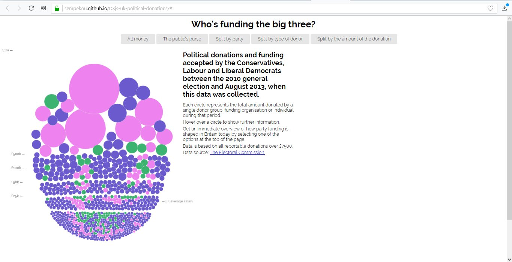
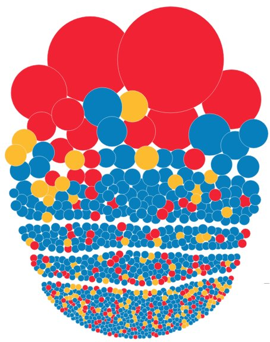
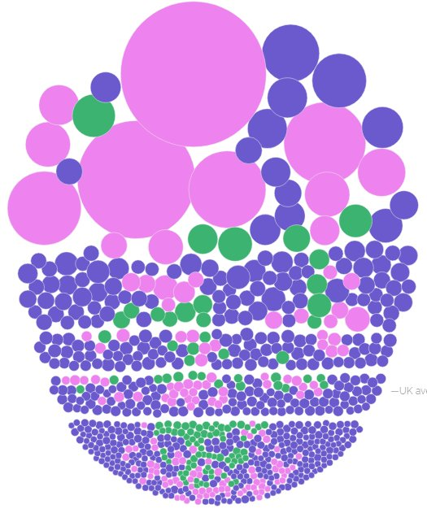
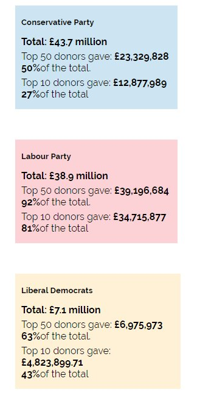
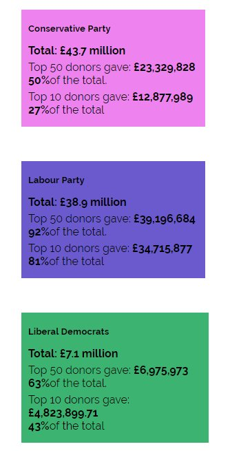
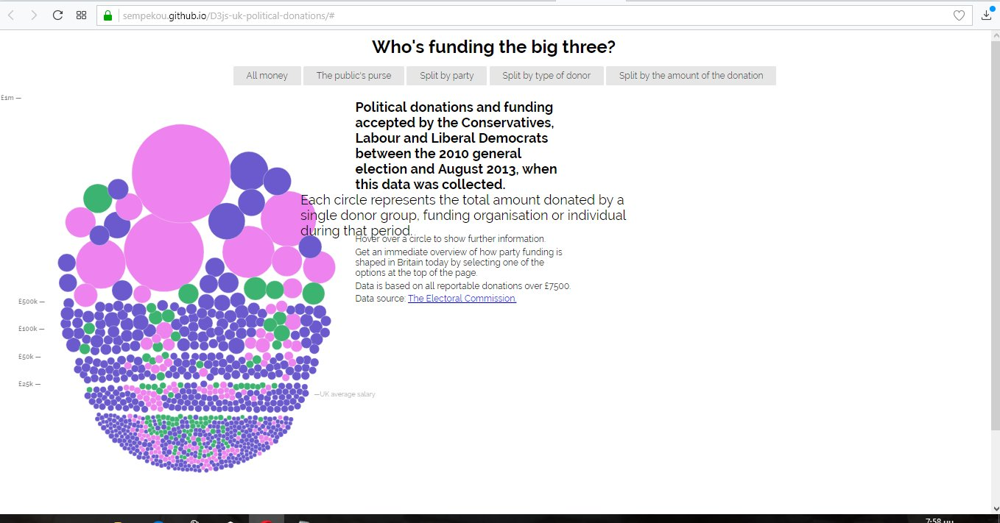

# Τεχνολογία Λογισμικού

## Οπτικοποίηση δεδομένων χορηγιών (UK)

## Στοιχεία Φοιτητή

**Ονοματεπώνυμο: Μαρκέλλα Σεμπέκου**

**Αριθμός Μητρώου: Π2015052**

**Εξάμηνο Φοίτησης: ΣΤ**

**ionio-email: p15sebe@ionio.gr**

**username: sempekou**

**Link αποθετήριου κώδικα της εφαρμογής (master branch): https://github.com/sempekou/D3js-uk-political-donations**
Επισημαίνεται οτι το master branch χρησιμοποιείται για τις αλλαγές (pull request) στο κοινο αποθετήριο.

**Link Παραδοτέου 1 (gh-pages branch): https://github.com/sempekou/D3js-uk-political-donations/tree/gh-pages**
Επισημαίνεται οτι στο gh-pages branch φαίνονται όλες οι αλλαγές στον κώδικα.

**Link ιστοσελίδας της εφαρμογής μου: https://sempekou.github.io/D3js-uk-political-donations/#**

## Σύνοψη
Η παρούσα εργασία βασίζεται στην ήδη υπάρχουσα εργασία https://ioniodi.github.io/D3js-uk-political-donations/full-viz η οποία τροποποιήθηκε σύμφωνα με τις οδηγίες του παραδοτέου 1. Το θέμα της εργασίς είναι η οπτικοποίηση δεδομένων χορηγιών. Στο πλαίσιο της εργασίας επιτυγχάνεται η εξοικείωση των φοιτητών με τις γλώσσες HTML, CSS και JavaScript μέσα από τροποποιήσεις σύμφωνα με τα ζητούμενα στην εκφώνιση της εργασίας. Ακολουθούν οι αλλαγές που πραγματοποιήθηκαν.

# ΠΑΡΑΔΟΤΕΟ 1

**-Αλλαγή κατάληξης URL του προσωπικού μου αποθετηρίου**
Για να μην καταλήγει το url της εφαρμογής μου σε "full-viz.html" μετονόμασα το αρχείο "full-viz.html" σε "index.html" διαγράφοντας έτσι την κατάληξη https://github.com/sempekou/D3js-uk-political-donations/full-viz.html -->https://github.com/sempekou/D3js-uk-political-donations . 

**-Αλλαγή χρωμάτων στις μπάλες**
Με την χρήση των rgba και hex κώδικα άλλαξα τους κωδικους των χρωμάτων που είχαν οι μπάλες στο αρχείο "chart.js".
## ΠΡΙΝ

## ΜΕΤΑ

**-Αλλαγή χρωμάτων στα 3 πεδία της ομαδοποίησης Split by party**
Για να έχω διαφορετικά χρώματα στα 3 πεδία της ομαδοποίησης Split by party, χρειάστηκε να αλλάξω τους κωδικούς των χρωμάτων στο αρχείο "style.css".
## ΠΡΙΝ

## ΜΕΤΑ

**-Προσθήκη ήχου όταν κάνει κάποιος click στα κουμπιά**
Βρήκα online και ανεβασα ένα mp3 αρχείο στο αποθετήριο της εφαρμογης μου.
Έπειτα στο αρχείο index.html έβαλα το script tag:
     

    
Στο ίδιο αρχείο πρόσθεσα και την εντολή:
onmousedown="bs.play()" μέσω της οποίας ακούγεται ο ήχος όταν κάνει κάποιος click στα κουμπιά.

**-Άνοιγμα νέου παραθύρου για αναζήτηση δωρητή (ενεργοποίηση με κλικ πάνω σε οποιαδήποτε μπάλα)**
Εντός της συνάρτησης start() του αρχείου chart.js πρόσθεσα το:
.on("click", function(d) { window.open("http://www.google.com/search?q=" + d.donor);});

**-Μεγέθυνση κειμένου**
Στο αρχείο index.html πρόσθεσα το class=zoom μέσα στις κεφαλίδες των texts.

**-Δημιουργία νέας επιλογής ομαδοποίησης των δεδομένων**
 
 **-Ζητούμενα που απαιτούν αλλαγές (pull request)**
 Σύμφωνα με τις οδηγίες πρώτον δημιούργησα ενα αρχείο με τα στοιχεία μου 2015052.csv και δεύτερον  δέσμευσα και έστειλα 5 φωτογραφίες για τους δωρητές:
 
  -Slough Labour Group
  -Tony and Guy Holdings
  -Silvesta
  -SITA
  -BM Creative Management

