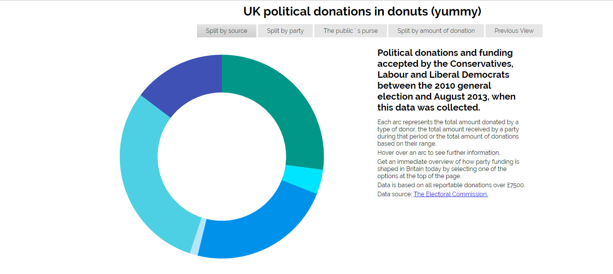
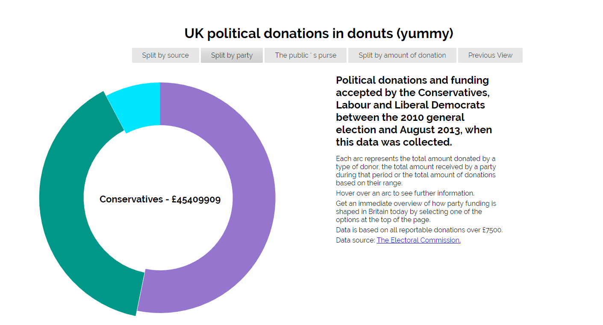
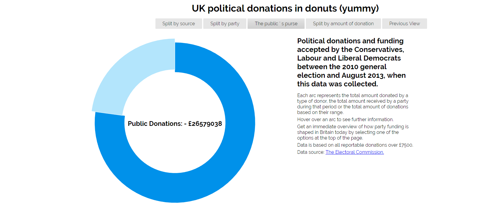
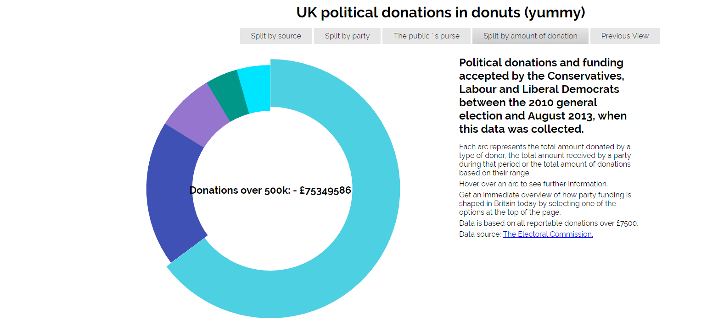
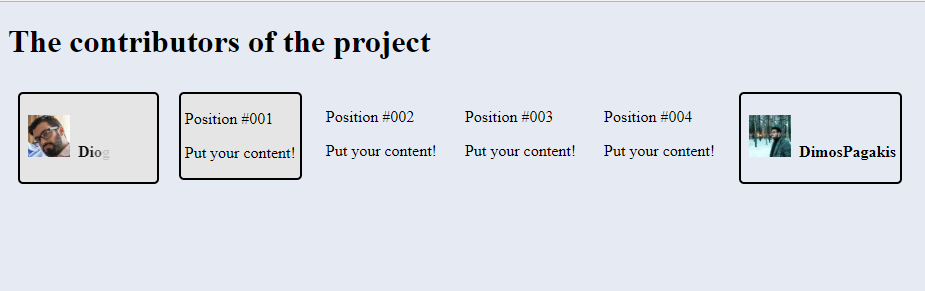
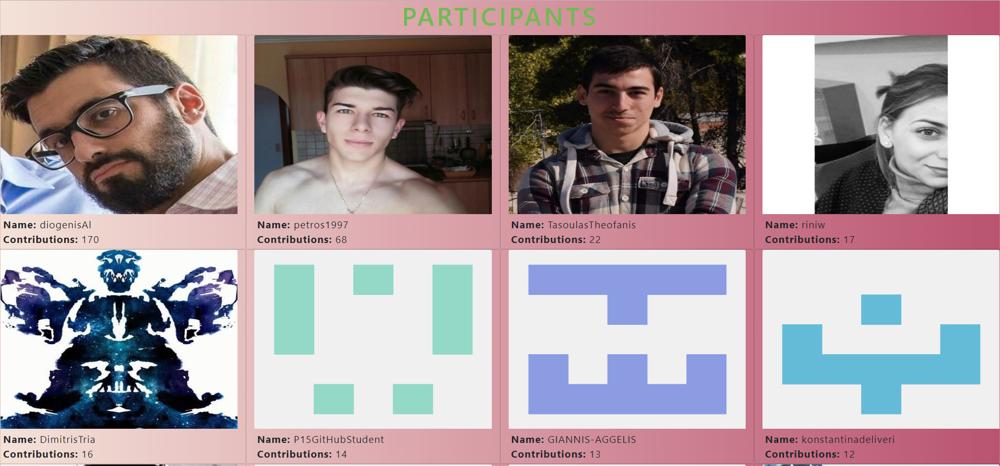

# Οπτικοποίηση δεδομένων χορηγιών (UK)
## Παγκάκης Δημοσθένης - Π2015053
#### Link στο προσωπικό αποθετήριο του κώδικα: https://github.com/DimosPagakis/D3js-uk-political-donations
#### Link στο εκτελέσιμο του κώδικα:           https://dimospagakis.github.io/D3js-uk-political-donations/

 Η παρούσα αναφορά είναι για εργασία στα πλαίσια του μαθήματος της Τεχνολογίας Λογισμικού του Ιονίου Πανεπιστημίου.
 Με τη χρήση της D3, βιβλιοθήκη της javascript, οπτικοποιούμε δεδομένα σχετικά με τις δωρεές για τα πολιτικά κόμματα του Ηνωμένου Βασιλείου.
 
 ## 1ο Παραδοτέο
 
 Το πρώτο παραδοτέο αποτελούταν από ένα σύνολο αλλαγών που έπρεπε να υλοποιήσουμε. Ορισμένες αφορούσαν το προσωπικό αποθετήριο του κώδικα μας
 και άλλες που έπρεπε να γίνουν pull request στο κεντρικό-κοινό αποθετήριο του κώδικα.
 
 Πρώτα παρουσιάζονται τα απαιτούμενα και η προσωπική προτεινόμενη λύση για τις πρώτες αλλαγές.
 
 ## Αλλαγές στο προσωπικό αποθετήριο
 
### Ο σύνδεσμος της σελίδας σας με την εφαρμογή.
 Ενεργοποιούμε τα github pages από τα settings του αποθετηρίου μας και στη συνέχεια κατευθυνόμαστε στο κατάλληλο path ώστε να οδηγούμαστε
 στο .html αρχείο. Στη συνέχεια κάνουμε copy & paste το url στην κορυφή του αποθετηρίου μας.
 
 ### Εφαρμόστε τις κατάλληλες αλλαγές έτσι ώστε το url της εφαρμογής σας να μην χρειάζεται να καταλήγει σε "full-viz.html"
 Αρκεί η μετονομασία του αρχείου full-viz.html σε index.html.
 
 ### Αλλαγή χρωμάτων στις μπάλες με τα δεδομένα, καθώς και στα αντίστοιχα 3 πεδία της ομαδοποίησης Split by party.
 
 Η αλλαγή στα χρώματα στις μπάλες έγινε με αλλαγή στο κώδικα που αφορά τις κλάσσεις που τους αποδίδονται. Άλλαξα το fill και χρησιμοποίησα το !important για να κάνω overwrite οποιονδήποτε άλλο κανόνα για τα συγκεκριμένο attribute.
 Η αλλαγή στα χρώματα των πεδίων έγινε με το attribute background στα id που αφορούν καθένα από τα 3 πεδία στην εν λόγω ομαδοποίηση.
 
 ### Να ακούγεται ήχος κάθε φορά που ο χρήστης της εφαρμογής κάνει κλικ σε μία από τις επιλογές/κουμπιά ομαδοποίησης των δεδομένων.
 
 Βρήκα ένα minimal pop sound effect το οποίο ανέβασα στην συνέχεια στο αποθετήριο. Στη συνέχεια το πέρασα στον κώδικα του html αρχείου μας
 και ανέθεσα μια onClick function στις επιλογές/κουμπιά. Ο ορισμός της συνάρτησης βρίσκεται στο τέλος του αρχείου εντός script tags όπου
 αρχικά περνάω το sound effect σε μια μεταβλητή και μετά καλώ την αναπαραγωγή του.
 
 ### Τροποποιήστε τον κώδικα έτσι ώστε όταν κάνετε κλικ σε κάθε μπάλα να ανοίγει ένα νέο παράθυρο με τα αποτελέσματα της αναζήτησης στο google για τον αντίστοιχο δωρητή.
 
 Αρχικά, στο chart.js πήγα στον κώδικα που αφορά κάθε σφαίρα και πρόσθεσα ένα onClick handler το οποίο καλεί την συνάρτηση search().
 Παρακάτω στον κώδικα ορίζω την συνάρτηση αυτή όπου παίρνω τον δωρητή και ανοίγω ένα καινούριο παράθυρο στο οποίο κάνω focus ώστε ο browser
 να μεταβεί απευθείας στο καινούριο παράθυρο. Ταυτόχρονα τρέχει ένα google search με q parameter το όνομα του δωρητή.
 
 ### Ορισμένοι από τους αναγνώστες της εφαρμογής ενδεχομένως να είναι άτομα με περιορισμένη όραση. Τροποποιήστε τον κώδικα της εφαρμογής έτσι ώστε το ποντίκι να λειτουργεί και ως μεγεθυντικός φακός όταν μεταφέρεται επάνω από τις λέξεις του κειμένου.
 
 Το παρόν πρόβλημα λύθηκε με δημιουργία κλάσης (και αντίστοιχης :hover) που αφορά ένα transformation στο μέγεθος του κειμένου.
 Δημιούργησα 2 διαφορετικές κλάσσεις μια για τα h1 και μια για οποιοδήποτε άλλο στοιχείο. Αυτό έγινε μόνο και μόνο για να είναι λίγο πιο 
 ευχάριστο το ui μετά την λειτουργία των κλάσσεων πάνω στα elements. Οι κλάσσεις αυτές στη συνέχεια αποδόθηκαν στα κατάλληλα elements στο 
 index.html
 
 ### Για τον ίδιο λόγο, τροποποιήστε τον κώδικα της εφαρμογής έτσι ώστε όταν το ποντίκι βρίσκεται μέσα στον κύκλο κάποιου δωρητή, να ακούγεται η ονομασία του δωρητή και το ποσό της δωρεάς.
  
  Για την ολοκλήρωση αυτού του τμήματος χρησιμοποίησα την εξής βιβλιοθήκη:
  
  https://code.responsivevoice.org/responsivevoice.js
  
  Από τη στιγμή που συμπεριληφθεί η βιβλιοθήκη, για να την καλέσουμε αρκεί στον javascript κώδικα μας να συμπεριλάβουμε το responsiveVoice.
  και τη συνάρτηση της αρεσκείας μας. Για την αναπαραγωγή της ομιλίας καλούμε την speak() με ορίσματα αυτά που θέλουμε να ακούσουμε και για 
  την ακύρωση της ομιλίας καλούμε την cancel(). Έτσι, στη συνάρτηση mouseover() καλώ τη responsiveVoice.speak(donor + amount) και ακούγεται 
  φωνή που λέει το όνομα του δωρητή και το ποσό της δωρεάς. Αντίστοιχα, στη συνάρτηση mouseout() καλώ την responsiveVoice.cancel().
  
  ### Δημιουργήστε τουλάχιστον μία ακόμα επιλογή ομαδοποίησης των δεδομένων (π.χ. Split by the amount of the donation).
  
  H επιπρόσθετη κατηγορία που προσέθεσα είναι αυτή που προτάθηκε από την εκφώνηση, δηλαδή η Split by the amount.
  Με μπούσουλα τις αντίστοιχες συναρτήσεις για τις άλλες ομαδοποιήσεις, όρισα καινούριες και μετά από πειραματισμό με τους αριθμούς ομαδοποίσα επιτυχώς
  τις δωρεές στις 4 εξής ομάδες: 
    
    1) Δωρεές μέχρι 25.000 βρετανικές λίρες.
    
    2) Δωρεές μέχρι 250.000 βρετανικές λίρες.
    
    3) Κάτω από 10.000.000 βρετανικές λίρες.
    
    4) Πάνω από 10.000.000 βρετανικές λίρες.
  Κάποιες αλλαγές πραγματοποιήθηκαν και στα html και css αρχεία έτσι ώστε οι ομαδοποίησεις να έχουν την κατάλληλη εκφώνηση και τοποθέτηση 
  πάνω στην σελίδα.
  
  ## Αλλαγές για το κοινό αποθετήριο του κώδικα
  
  ###  Δημιουργήστε ένα αρχείο .csv στον φάκελο participants του αποθετηρίου του κώδικα.
  
  Σύμφωνα με το αρχείο csv που υπήρχε στο αποθετήριο του κώδικα όταν πραγματοποιήθηκε το προσωπικό μου fork έκανα και "έστειλα" και το δικό μου
  με τα δικά μου προσωπικά στοιχεία.
  
  ### Στον φάκελο photos αποθετηρίου, θα πρέπει να τοποθετήσετε εικόνες 5 δωρητών
  
  Μετά από εξονυχιστική και εριστική αναζήτηση αν μου επιτρέπετε, βρήκα, ανέβασα και "έστειλα" 5 εικόνες για τους εξής δωρητές:
  
  Women2Win
  
  Chelmsford Conservative Group
  
  Movement For Change
  
  National Union of Labour and Socialist Clubs
  
  Fabian Society
  
  ## Ενδεικτικές εικόνες πρώτου παραδοτέου
  
  
  
  
  
  
  
  
  
  Για οπτικοακουστικές αλλαγές παρακαλώ ακολουθήστε το εξής link:
  
  https://dimospagakis.github.io/D3js-uk-political-donations/
  
  ## 2ο Παραδοτέο
  
  Με το τέλος του πρώτου παραδοτέου που επικεντρώνεται κυρίως σε μια πρώτη γνωριμία με το website και τον σκοπό τον οποίο έχει ήρθαμε ήδη σε επαφή με κώδικα σε javascript. Μάλιστα η εμπειρία που αποκτήσαμε ήταν hands on εφόσον έπρεπε από τα πρώτα ζητούμενα ακόμα να "πειράξουμε" τον κώδικα και να δούμε τις αλλαγές που προκαλούνται.
  Το δεύτερο παραδοτέο αποσκοπούσε στην γνωριμία με την βιβλιοθήκη D3.js. Η D3 είναι μια βιβλιοθήκη η οποία μπορεί να λαμβάνει δεδομένα,είτε αυτά είναι hard coded ή φορτώνονται από κάποιο αρχείο csv,json κ.ά., και στη συνέχεια τα οπτικοποιεί. Η οπτικοποίηση αυτή μπορεί να πραγματοποιηθεί με κύκλους (όπως μπορούμε να δούμε στο master του πρώτου παραδοτέου), σε μπάρες, σε πίτες ή donut αλλά και πολλά περισότερα.
  Πιο συγκεκριμένα στο δεύτερο παραδοτέο έπρεπε να κάνουμε τις παρακάτω αλλαγές στον κώδικα της ιστοσελίδας.
  
  ## Δυναμικό ιστορικό
  
  Στο συγκεκριμένο ζήτημα έπρεπε να προγραμματίμουσε την δυναμική εμφάνιση των εικονών των δωρητών ανάλογα με τον δωρητή που κάνει hover εκείνη την ώρα το ποντίκι. Αρχικά άλλαξα το αρχείο index.html προσθέτοντας ένα div με id: ImageHolder. Όπως πιθανώς να προδίδει και το όνομα του, είναι το div στο οποίο θα πραγματοποιούνται οι εμφανίσεις των εικονών. Ο κώδικας ο οποίο γράφτηκε στον κώδικα σε javascript εμπεριέχθηκε στην συνάρτηση mouseover, αφού θέλουμε η συγκεκριμένη ενέργεια του ζητήματος να γίνεται κάθε φορά που ο κέρσορας μας βρίσκεται πάνω από κάποιον κόμβο. Ο κώδικας που έγραψα είναι textbook δημιουργία ενός img element,δίνοντας τους κάποια καλλοπιστικά χαρακτηρηστικά και στη συνέχεια κάνοντας το append (πάλι με textbook τρόπο) στο καινούριο div που όρισα.
  
  ## Νέα οπτικοποίηση των ίδιων δεδομένων
   Η νέα οπτικοποίση που επέλεξα προσωπικά είναι αυτή του pie/donut chart. Η μόνη διαφορά που έχουν τα δύο αυτά charts,ως προς την υλοποίηση του με τη D3, είναι ότι το pie chart είναι ένα donut chart χωρίς inner radius.
   ### Γιατί επέλεξα donut chart
   Παρά το γεγονός ότι τα pie/donut charts δεν είναι και τα βέλτιστα από άποψη διεπαφής,διότι ο άνθρωπος δεν είναι τόσο καλός στο να συγκρίνει κλίσεις γωνιών (ακόμα τουλάχιστον), θεωρώ ότι και οπτικά αλλά και προγραμματιστικά είναι αρκετά πιο ενδιαφέρουσες από απλά barcharts. Η υλοποίηση δεν ήταν όσο "smooth sailing" θα ήθελα. Αρχικά, παρακολουθώντας κάποια απλά tutorials για την υλοποίηση pie charts στο [YouTube](https://www.youtube.com/watch?v=kMCnzUE07QA) θεώρησα πως η υλοποίηση δεν θα ήταν και τόσο δύσκολη. Δε θα μπορούσα να έχω περισσότερο άδικο. Η υλοποίηση πήρε πολύ περισσότερο από ότι νόμιζα. Μάλιστα, τελικά βρήκα καταφύγιο σε συζήτηση με συναδέλφους ώστε να φτάσω σε μια υλοποίηση but that's what software is all about.
   
## Ίδια οπτικοποίηση νέων δεδομένων
 Δεν το υλοποίησα ^_^
 
## Αλαγές στο κοινό αποθετήριο
 ## Προσθήκη στοιχείων και animation
 
Το παρόν ζήτημα ήθελε την προσθήκη των στοιχείων μας εντός μιας δεσμευμένης περιοχής και τη χρήση ενός animation για το GitHub username μας. Χρησιμοποίησα κάποια βασικά animation που μας παρέχει η jQuery όπως το slideUp και το fadeOut. Του έθεσα ένα delay και τα καλώ αναδρομικά μέσα σε συνάρτηση έτσι ώστε το πανέμορφο αυτό animation να μην πάψει ποτέ.

## Δυναμικά στατιστικά με το GitHub API

Για την πραγματοποίηση αυτού του ζητήματος ακολούθησα textbook workflow με το XMLHttpRequest για τη javascript. Επικοινωνόντας με το API του GitHub μπορούμε να αντλούμε διάφορα δεδομένα για αποθετήρια, χρήστες, contributions κ.ά. Κάνοντας parse το json response του API αποθηκεύω σε array τα δεδομένα των χρηστών ομαδοποιημένα (Object like). Για κάθε ένα στοιχείο του array καλώ μια συνάρτηση που δημιουργεί htm elements ανάλογα με τις τιμές των δεδομένων. Τέτοια δεδομένα είναι το GitHub username, η φωτογραφία προφίλ και τα contributions. Για την παρουσίαση σους σε html προτίμησα τα cards του Bootstrap.

## Ενδεικτικές εικόνες

## Sidenote : Shoutout to the beautiful people in the first row
 
 
