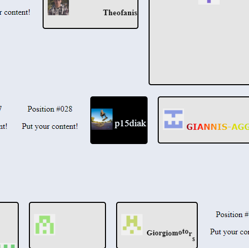

# Οπτικοποίηση Δεδομένων Χορηγιών (UK)
## Στοιχεία Φοιτητή:
<strong>Ονοματεπώνυμο: Βασίλης Διακουμάκος 
ΑΜ: Π2015088 
Εξάμηνο: ΣΤ' </strong>

## 1ο Παραδοτέο

 Forked Repository (SW): https://github.com/p15diak/sw
 Forked Repository (D3js-uk-political-donations):https://github.com/p15diak/D3js-uk-political-donations/tree/gh-pages

### Υλοποίηση Ερωτημάτων στο Αποθετήριό μου

<or>
  <li>Σύνδεσμος Εργασίας : https://p15diak.github.io/D3js-uk-political-donations/# </li>
  <li>Αλλαξα το όνομα του .html αρχείου σε <b>index.html</b> για να λειτουργεί το site χωρίς την κατάληξη σε full-viz.html</li>
  <li>Άλλαγή χρωμάτων στους κύκλους</li>
  <li>Προσθήκη  ήχου κλικ  για καθε κουμπι</li>
  <li>Κανωντας κλικ σε καποιο κυκλο γινεται αναζητηση του donator στο google</li>
  <li>Προσθηκη μεγενθυντικού φακού σε ολα τα texts</li>
  <li>Προσθήκη text to voice με την βοηθεια της ιστοσελιδας responsivevoice.org</li>
  <li>Προσθήκη νεας κατηγοριας ομαδοποιησης των δεδομένων</li>
  

### Υλοποίηση Ερωτημάτων στο κοινό Αποθετήριο

<or>
 
</or>

### Εικόνες:

### Αλλαγη χρωματων

### Zoom

### Google Search

### split by amount

#### 2ο Παραδοτέο
<ul>
  <li>Προσθήκη είκονας donor στο ίστορικο οταν το ποντίκι περνάει απο πάνω</li>
  <li>Προσθήκη στοιχείων στα credits </li>
  </ul>
  
  
### Ιστορικό

### Credits

