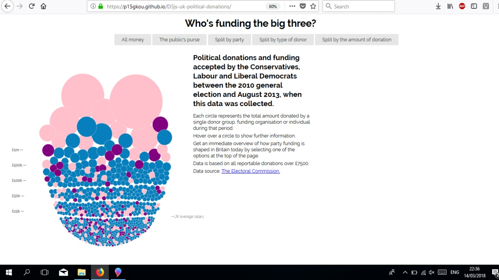
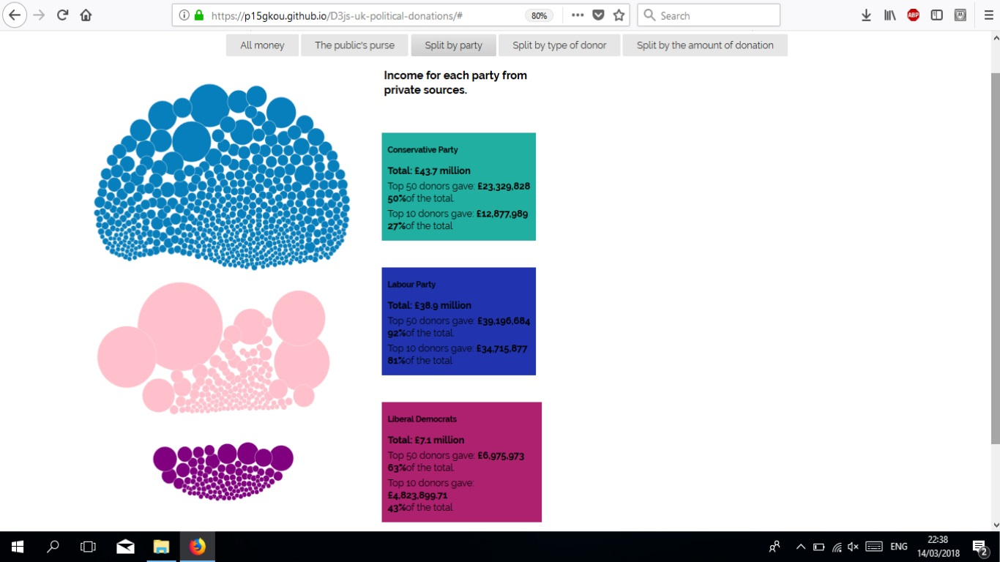
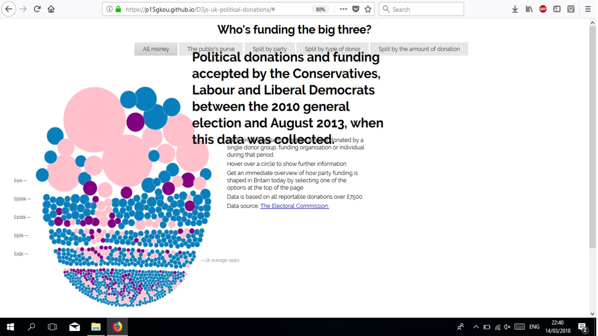
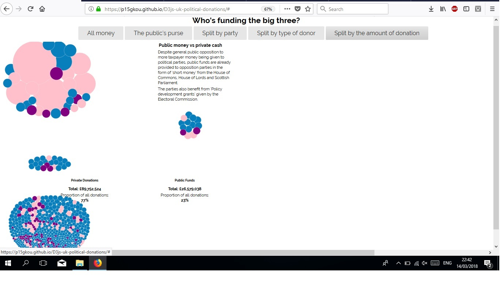

Μάθημα: Τεχνολογίες Λογισμικού

Τίτλος Εργασίας: Οπτικοποίηση δεδομένων χορηγιών (UK)

ΑΜ: Π2015178

Γκουντενούδη Βασιλική-Ολυμπία

e-mail: p15gkou@ionio.gr

Link προσωπικόυ αποθετήριου κώδικα:https://github.com/p15gkou/D3js-uk-political-donations/tree/2015090

Link εκτελέσιμου κώδικα: https://p15gkou.github.io/D3js-uk-political-donations/

Σύνοψη:

Η παρούσα εργασίας αποτελεί τροποποίηση της εργασίας https://ioniodi.github.io/D3js-uk-political-donations/full-viz.

Παραδοτέο 1: 

Για το πρώτο παραδοτέο έγιναν οι εξής ενέργειες:

Αλλαγή έτσι ώστε το url της εφαρμογής να μην χρειάζεται να καταλήγει σε "full-viz.html" 

Aλλαγή χρωμάτων στις μπάλες καθώς και στα 3 αντίστοιχα πεδία του split by party

Προσθήκη ήχου κάθε φορά που ο χρήστης της εφαρμογής κάνει κλικ σε μία από τις επιλογές/κουμπιά ομαδοποίησης των δεδομένων.

Τροποποίηση του κώδικα έτσι ώστε όταν γίνεται κλικ σε κάθε μπάλα να ανοίγει ένα νέο παράθυρο με τα αποτελέσματα της αναζήτησης στο google για τον αντίστοιχο δωρητή.

Τροποποίηση του κώδικα της εφαρμογής έτσι ώστε το ποντίκι να λειτουργεί και ως μεγεθυντικός φακός όταν μεταφέρεται επάνω από τις λέξεις του κειμένου.

Τροποποίηση του κώδικα της εφαρμογής έτσι ώστε όταν το ποντίκι βρίσκεται μέσα στον κύκλο κάποιου δωρητή, να ακούγεται η ονομασία του δωρητή και το ποσό της δωρεάς.

Δημιουργία μία ακόμα επιλογή ομαδοποίησης των δεδομένων Split by the amount of the donation

