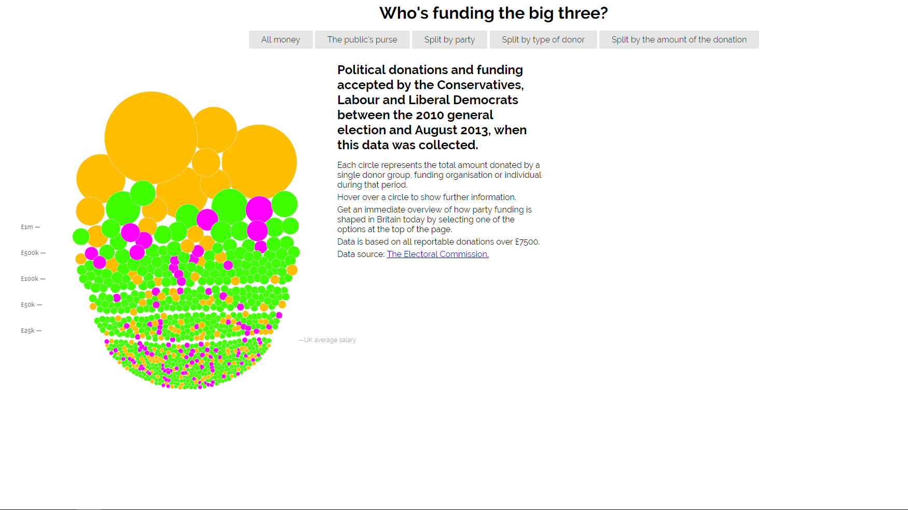
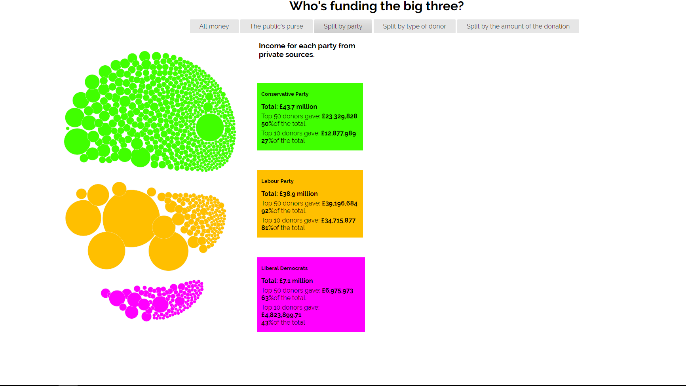
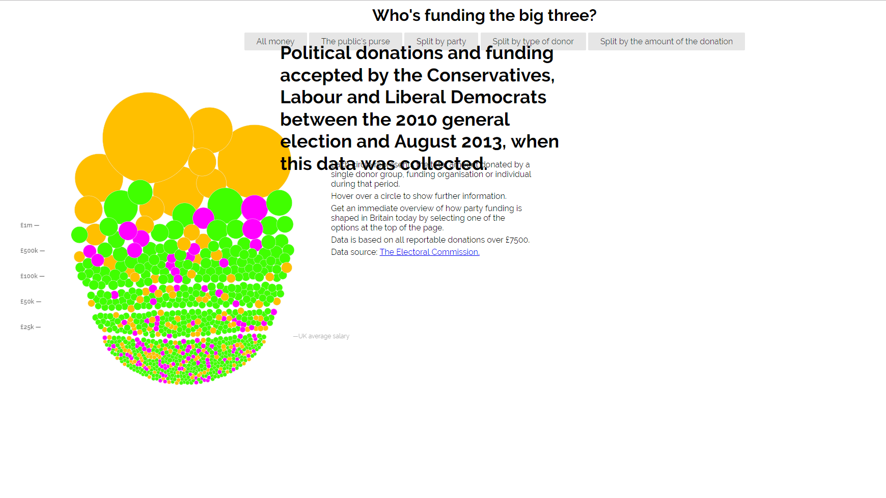
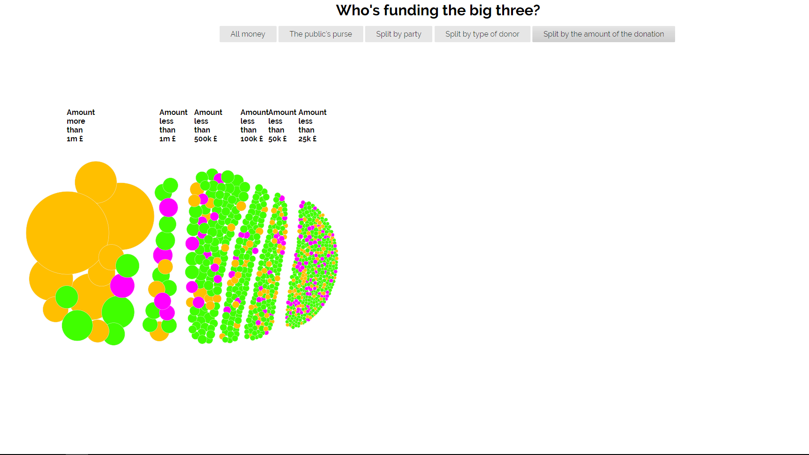

# Μάθημα: Τεχνολογίες Λογισμικού
## Τίτλος Εργασίας: Οπτικοποίηση δεδομένων χορηγιών (UK)
**Όνομα: Βασίλης Αργυρός  
ΑΜ: Π2015098  
email: p15argy@ionio.gr**  
* Προσωπικό αποθετήριο του κώδικα: [Link Αποθετηρίου Κώδικα](https://github.com/p15argy/D3js-uk-political-donations)
* Link για το εκτελέσιμο: [Link Εκτελέσιμου](https://p15argy.github.io/D3js-uk-political-donations/)

## Αρχικό έργο και ενδιάμεση αναφορά προόδου (25%), 14 Μαρτίου


 Αρχικά δημιουργησα τον συνδεσμο για την σελιδα μου αλλαζοντας το αρχειο full_viz.html σε index.html : https://p15argy.github.io/D3js-uk-political-donations/
 
  Για την αλλαγή των χρωμάτων στις μπάλες αρκει να αλλάξουμε στο chart.js τον παρακάτω κώδικα:
  
  ```
  var fill = d3.scale.ordinal().range(["#ffbf00", "#40ff00", "#ff00ff"]);
  ```
  
  Το αποτέλεσμα φαίνεται στην φωτογραφία:
  
  

  
  
  
  Στην συνέχεια για την αλλαγή των χρωμάτων στα αντίστοιχα 3 πεδία της ομαδοποίησης Split by party αρκεί να αλλάξουμε στο style.css το παρακάτω κώδικα:
  
 ```
  #conservative {
    background: #40ff00;
    top: 110px;
 }
 
#labour {
    background: #ffbf00;
    top: 330px;
}

#libdem {
    background: #ff00ff;
    top: 550px;
}

```




Στην συνέχεια έκανα upload στο repository μου ένα αρχείο ήχου .wan και στο αρχείο index.html πρόσθεσα την συνάρτηση playSound 


```
<audio id="sound" src="Mousclik.wav"></audio>
    <a onclick = "playSound();"></a>
    <script>
        function playSound() {
          var sound = document.getElementById("sound");
          sound.play();
      }
      
 ```

και με την χρήση της  "onclick" kάθε φόρα που πατάω μια  απο τις επίλογες ομαδοποίησης παίζει το αρχείο μου.


```

li><a href="#" role="button" class="pure-button switch" id="all-donations"  onclick = "playSound()">All money</a>

```


Δημιουργώντας στο αρχείο chart.js μια συνάρτηση με το όνομα Search κάθε φορά που κανουμε κλικ σε μια μπάλα το όνομα του δωρητη αναζητήται στο google search.


```
function search(d) { //search function 
	var donor=d.donor;
	window.open("https://www.google.com/search?q=" + donor);
}
```


Στο αρχείο index.html με την εισαγωγή του παρακάτω κώδικα κατάφερα να φτίαξω μία κλάση την οποία την εισάγω μπροστά από κάθε επικεφαλίδα και παράγραφο έτσι ώστε να μεγαλώνει το περιεχόμενο όταν περνάει το ποκντίκη από πάνω.

```
<style>
     .zoom {
         transition: transform .2s;
        }
        
        .zoom:hover {
          transform: scale(1.5);
        }
    
    <div class=zoom></div> 
```


```
 <h1 class=zoom>Who's funding the big three?</h1>
```

  


Με την χρήση της συνάρτησης 

```
responsiveVoice.speak(donor + " " + amount + "£","UK English Male",{volume: 1});
```

κάθε φορά που ο cursoras  περνάει πάνω από μία μπάλα ακούγεται το ονομα του δωρητη καθώς και το ποσό που δώρησε.


Σύμφωνα με τις ομαδοποιήσεις που υπήρχαν συμπλήρωσα τον κώδικα κατάληλα τον κώδικα στο chart.js αρχείο έτσι ώστε να δημιουργησω δική μου ομαδοποίηση. Αλλαγές έγιναν και στα αρχεία index.html και style.css.





Τέλος ,  δημιούργησα αρχείο 2015098.csv στο φάκελο participants και 

 τοποθετήθηκαν 5 εικόνες για τους εξής δωρητές:
# Bolton Aerospace
# Stockford
# Hartley Property Trust
# China Tang London
# United Wholesale (Scotland)
  
  οι οποίες πληρούν τις προδιαγραφές: 42x42px, format .ico και οι ονομασίες τους είναι οι επωνυμίες των δωρητών, όπως εμφανίζονται στο     αρχείο με τους δωρητές.
  
  Η δέσμευση των δωρητών έγινε, όπως ζητήθηκε, σε αντίστοιχο σχόλιο του issue του Παραδοτέου 1 και το pull request έγινε δεκτό στο         κεντρικό αποθετήριο.
