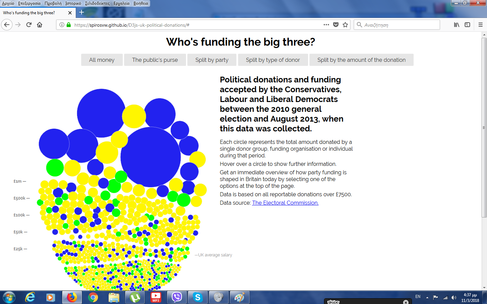
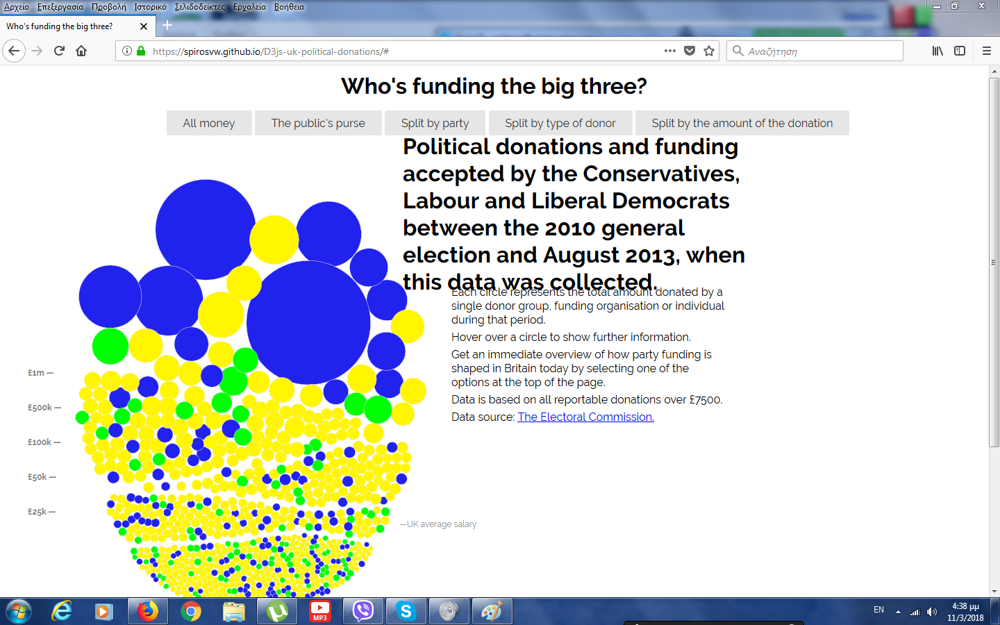
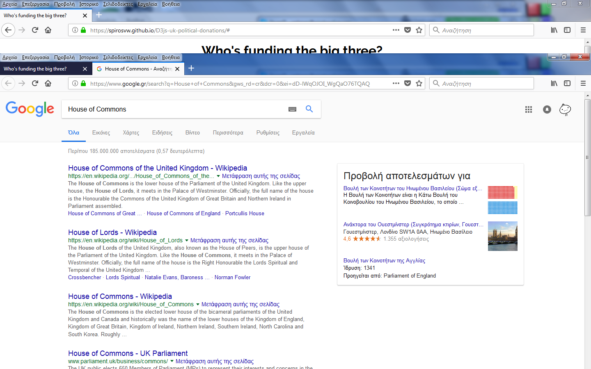
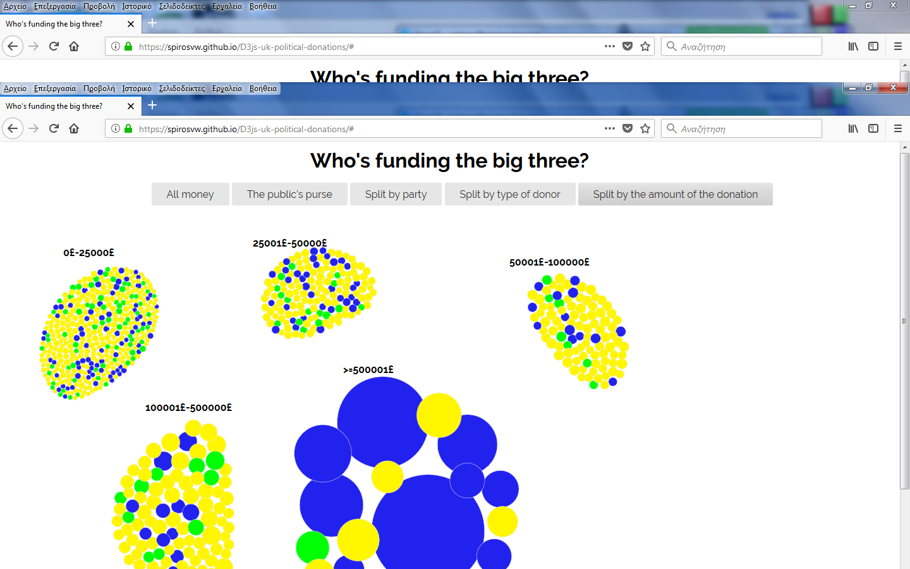
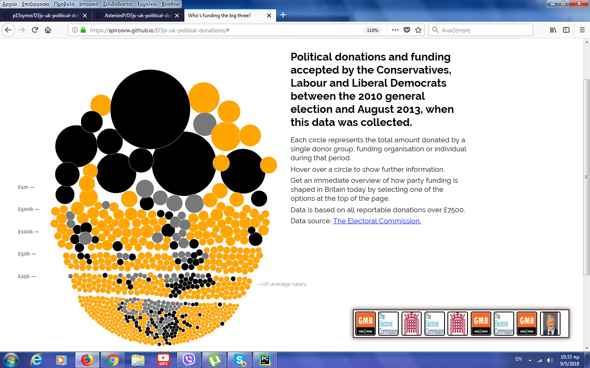
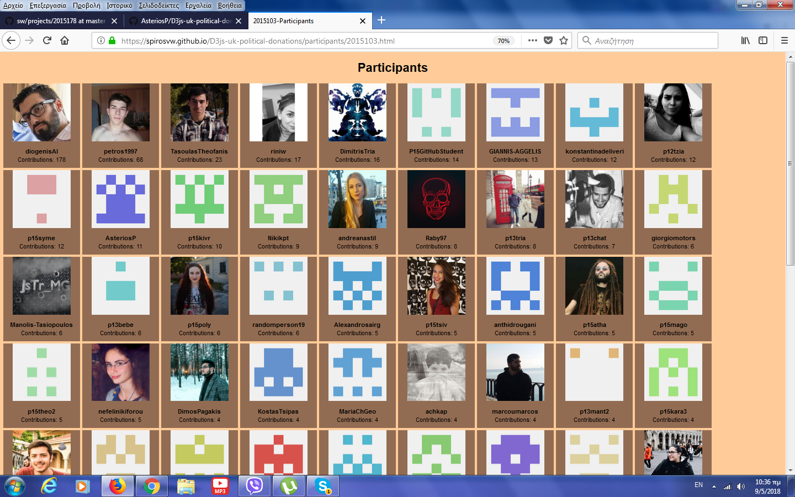
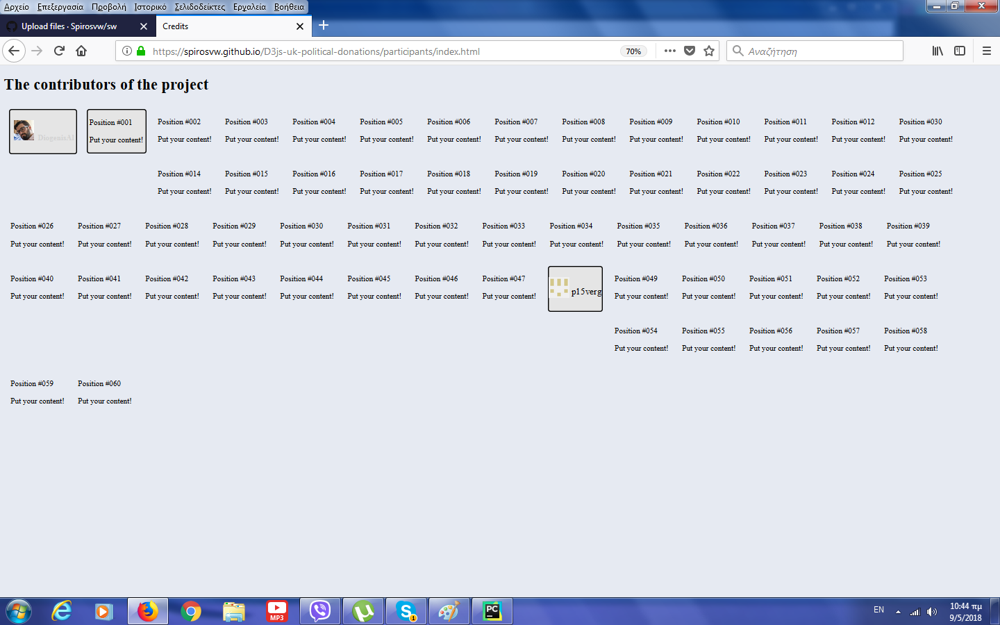

# Αναφορά πρώτου παραδοτέου

## Οπτικοποίηση δεδομένων χορηγιών 

**Όνομα:Σπύρος Βέργης**

**Α.Μ:Π2015103**

**Εξάμηνο φοίτησης:ΣΤ΄ Εαρινό 2018**

**email:p15verg@ionio.gr**

**link σελίδας:https://spirosvw.github.io/D3js-uk-political-donations/**

**link αποθετηρίου:https://github.com/Spirosvw/D3js-uk-political-donations**

**link gh-pages της αναφοράς:https://spirosvw.github.io/SW-REPORT/

**link index.html:https://spirosvw.github.io/D3js-uk-political-donations/participants/index.html

**link participants website:https://spirosvw.github.io/D3js-uk-political-donations/participants/2015103.html

# Πρώτο Παραδοτέο

## Αναλυτική Περιγραφή Σελίδας

## Σύνοψη:

Η παρούσα εργασίας αποτελεί τροποποίηση της εργασίας https://ioniodi.github.io/D3js-uk-political-donations/full-viz., στην οποία μέσω των HTML, CSS και Javascript γίνεται οπτικοποίηση δεδομένων. Έτσι, κάνοντας fork το αποθετήριο του ioniodi, το τροποποιούμε στο προσωπικό μας αποθετήριο, σύμφωνα με τις οδηγίες των παραδοτέων.

### Στην σελίδα που μας δώθηκε μέσω του αποθετηρίου έγιναν οι εξής αλλαγές.

* Εφαρμόστηκαν οι κατάλληλες αλλαγές προκειμένου να μην είναι ορατό το "full-viz.html" στο url της ιστοσελίδας
* Τροποιώντας το αρχείο js άλλαξα τα χρώματα των τριών ομάδων
* Κάθε φορά που ο χρήστης 'κλικάρει' μία από τις επιλογές ομαδοποίησης ακούγεται ένας χαρακτηριστικός ήχος κλικ.
* Με την επεξεργασία του  κώδικα της javascript έγινε αλλαγή των τριών χρωμάτων των τριών πεδίων που χωρίζουν τις ομάδες
* Προστέθηκε η επιλογή αναζήτησης στοιχείων του κάθε δωρητή μέσω της μηχανής αναζήτησης google. Ουσιαστικά πατώντας κλικ πάνω σε μία απο τις μπάλες, ανοίγει μία νεα καρτέλα με τα αποτελέσματα αναζήτησης της google για τον αντίστοιχο δωρητή
* Για την διευκόλυνση της ανάγνωσης των κειμένων από άτομα με περιορισμένη όραση, δώθηκε η επιλογή την μεγέθυνσης του κειμένου. Όταν το ποντίκι αιωρείται πάνω μία παράγραφο ενός κειμένου,λειτουργεί σαν μεγεθυντικός φακός κάνοντας το κείμενο αρκετά μεγαλύτερο
* Στις μπάλες προστέθηκε ηχητικό υλικό για τον ίδιο σκοπό. Με την χρήση του responsive voice ενός javascript αρχείου που προμηθεύτηκα από την σελίδα (https://responsivevoice.org/) έδωσα στην ιστοσελίδα την δυνατότητα να διαβάζει αναλυτικά τα στοιχεία της μπάλας που αιωρείται το ποντίκι πάνω. Διαβάζει το όνομα του δωρητή και το ποσό που έχει δώσει σαν δωρεά.
* Για το τελευταίο κομμάτι του παραδοτέου δημιούργησα μία νέα επιλογή ομαδοποιήσης των δεδομένων. Την ονόμασα 'Split by the amount of the donation' και ουσιαστικά ομαδοποιεί τα δεδομένα με βάσει το ποσό της δωρεάς που έχει κάνει ο κάθε δωρητής.

# Δεύτερο Παραδοτέο 

Στο δεύτερο παραδοτέο της εργασίας στις τεχνολογίες διαδικτύου έγιναν οι εξής αλλαγές:

* Με την επεξεργασία του js αρχείου τοποθετήθηκε ένα μικρό παράθυρο στο κάτω αριστερό μέρος της ιστοσελίδας. Σε αυτό το παράθυρο κάθε φορά που ο κέρσωρας περνάει πάνω από έναν δωρητή, εμφανίζεται η εικόνα του μέσα στο παράθυρο αυτό. Μέσα στο παράθυρο αυτό μπορούν να εμφανίζονται ταυτόχρονα 9 δωρητές. Ο χρήστης μπορεί να μεταφέρει τον κέρσωρα πάνω τους και να ακούσει τα στοιχεία του δωρητή όπως και στο bubblechart. Εάν κλικάρει το εικονίδιο, ανοίγεται νέο tab στον browser του με την αναζήτηση google του ονόματος του δωρητή που κλίκαρε. Όταν το παράθυρο γεμίσει με 9 εικόνες, τότε για να προστεθεί νέα εικόνα ουσιαστικά γίνεται push διώχνοντας την τελευταία και προσθέτοντας την νέα στην αρχή.
* Με την  χρήση των εργαλείων του github αλλά και του API του κατόρθωσα να δημιουργήσω μία σελίδα που να περιέχει την εικόνα και το όνομα του κάθε participant που έχει κάνει commit στο repository του d3. Στην σελίδα αυτή εμφανίζονται το όνομα, η εικόνα και τα contributions του χρήστη.
* Στον αρχείο index.html πρόσθεσα τον κατάλληλο κώδικα στην θέση 48 προκειμένου να εμφανίζεται στο όνομα μου μαζί με την εικόνα προφίλ μου στην θέση εκείνη. Για την εμφάνιση του ονόματός μου πρσέθεσα και animation.

## Αλλαγή χρωμάτων

## Μεγέθυνση κειμένου

## Αποτέλεσμα αναζήτησης

## Νέα ομαδοποίηση ανά ποσό δωρεάς

## Ιστορικό Δωρητών

## Ιστοσελίδα με Participants

## Ιστοσελίδα με Contributors

