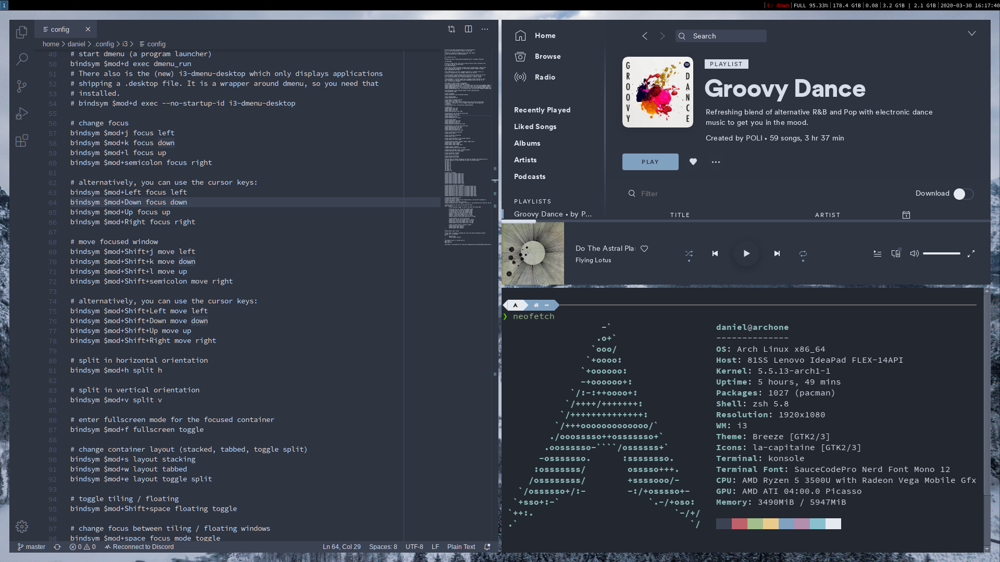
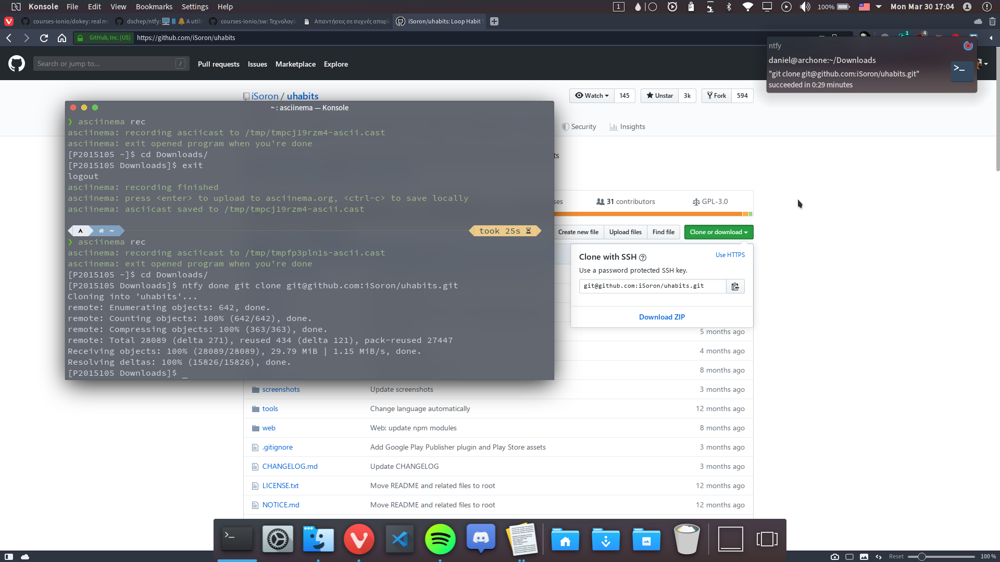
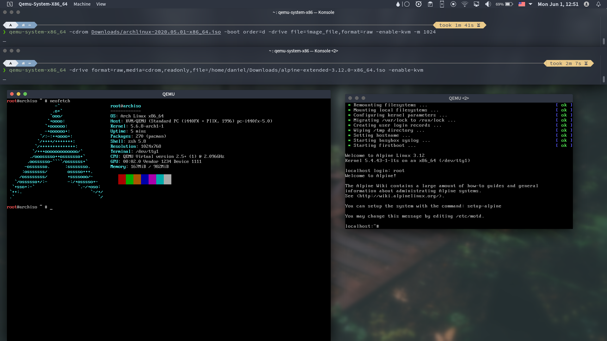

# Ασκήσεις [dokey](https://github.com/courses-ionio/dokey) (real men do it with the keyboard)
## 1. set-up continuous integration
**Deliverable:** build and deploy your static site and your cv dynamically every time you make a small change in the source files

Σε αυτήν την άσκηση επέλεξα το GitHub Pages για να κάνω deploy μια απλή σελίδα. Η διαδικασία έγινε εξ' ολοκλήρου με cli.
Εργαλεία:
- `git`
- `hub`, git wrapper and CLI interface for GitHub

Η διαδικασία που βλέπετε παραπάνω είχε τα εξής βήματα:
1. Έφτιαξα git repo τοπικά για τα αρχεία της σελίδας
2. Έφτιαξα git repo στο GitHub, το οποίο πρέπει να συνδεθεί με το τοπικό
3. Έκανα push για να ενημερωθεί το repo του GitHub
4. Ενεργοποίησα τo GitHub Pages
Στην τελευταία γραμμή του asciinema μπορείτε να δείτε ότι η σελίδα βρίσκεται πλέον στο https://danielyor.github.io/cv-template.

Ιδεές για βελτίωση:
- Η τελευταία εντολή θα μπορούσε να μπεί εν μέρη σε alias (ή εξ ολοκλήρου σε script?) για να γίνει πιο εύχρηστη.

Αναφορες:
- [Hub](https://github.com/github/hub)
- [Hub: Enable github pages [...]](https://github.com/github/hub/issues/2302)

## 2. try different terminals and shells
**Deliverable:** repeat some of the previous exercises with a different terminal-shell and create a custom configuration that fits your needs

Δοκίμασα δύο shells εκτός του γνωστού bash, το fish και το zsh.

### 2.1 fish

Το fish σημειώνει στο site του ότι δουλεύει out of the box:
> fish will delight you with features like tab completions and syntax highlighting that just work, with nothing new to learn or configure.

...οπότε και το δοκίμασα με το default config και χωρίς να αλλάξω κάποια ρύθμιση. Το βρήκα όντως πολύ ευχάριστο στην χρήση, και στο παραπάνω recording βλέπετε μερικές από τις δυνατότητες του: autosuggestions, tab completion, syntax highlighting, command substitutions, default prompt. Μια ιδιαιτερότητα που έχει το fish είναι ότι χρησιμοποιεί συναρτήσεις (functions) αντί για aliases.

### 2.2 zsh

Για το zsh έκανα το ακριβώς αντίθετο και προσπάθησα να το φέρω στα μέτρα μου. Χρησιμοποίησα το Oh My Zsh, ένα framework για την διαχείρηση του config, πάνω στο οποίο μπορούν να προστεθούν themes, plugins, και άλλα extensions. Το theme που χρησιμοποίησα είναι το Powerleve10k και επίσης δοκίμασα extensions για syntax highlighting, autosuggestions, καθώς και για το git. Στο recording επίσης δείχνω και άλλες δυνατότητες όπως είναι τα tab completion, autoexpansion, autocorrection. Κάποια από τα εικονίδια του prompt δεν μπορεί να τα δείξει το asciinema αλλά θα τα δείτε σε screenshot παρακάτω.

Αναφορές:
- [fish](https://fishshell.com/)
- [Oh My Zsh](https://ohmyz.sh/)
- [Powerlevel0k](https://github.com/romkatv/powerlevel10k)

## 3. configure a custom window manager
**Deliverable:** try different wm and configure one to fit your needs

Για αυτήν την άσκηση δοκίμασα ένα tiling window manager, το i3gaps (fork του i3wm). Τα tiling window managers χρησιμοποιούν όλη την επιφάνεια εργασίας και την μοιράζουν ανάμεσα στα ανοιχτά παράθυρα του (virtual) desktop. Το i3gaps χρησιμοποιεί πολύ το πληκτρολόγιο και έχει εύχρηστα defaults στο config του (από το οποίο γίνεται η ρύθμισή του). Παρακάτω θα δείτε recording του asciinema όπου δείχνω τις αλλαγές μου στο config, και μετά ένα screenshot από το τελικό αποτέλεσμα.

Αναφορές:
- [i3wm](https://i3wm.org/)
- [i3gaps](https://github.com/Airblader/i3)

## 4. use the terminal as an IDE
**Deliverable:** edit your files (e.g., cv, website, code, etc) in vim or emacs and compile it in a different panel or use a plug-in	

Σε αυτήν την άσκηση έγραψα το Hello World σε C με editor vi, το οποίο και μετά έκανα compile. Όλα έγιναν με command line.

## 5. send notifications to your desktop-mobile
**Deliverable:** send a notifcation when a big task completes, eg download, compiling, etc

Σε αυτήν την άσκηση χρησιμοποίησα το πρόγραμμα ntfy για να στείλω notification στο desktop μου αυτόματα αφού ολοκληρωθεί ένα download.

Αναφορές:
- [ntfy](https://github.com/dschep/ntfy)

## 6. try different operating systems in the emulator
**Deliverable:** load at least two operating systems without a GUI (only CLI) and create a virtual local network

Για αυτήν την άσκηση δοκίμασα να τρέξω virtual machines με το QEMU. Πιο συγκεκριμένα έτρεξα ταυτόχρονα δύο διανομές Linux που ξεκινάνε σε CLI περιβάλλον, τις Alpine και Arch. Επίσης χρησιμοποίησα το KVM (Kernel Virtual Machine) module του Linux το οποίο πρόσφερε ταχύτητηα στα δύο guests. Δυστυχώς δεν κατάφερα να φτιάξω ένα virtual local network.

## 7. set-up a system for python development (Πρόσθετη Άσκηση)
**Deliberable:** install and configure in a user folder a python project that is not available through the package manager

Ακολουθώντας την πηγή, εγκατέστησα το εργαλείο pipenv στο home μου, το οποίο έπειτα χρησιμοποίησα για να εγκαταστήσω μερικά γνωστά python packages.

Πηγή:
- [python virtual environments](https://docs.python-guide.org/dev/virtualenvs/)
