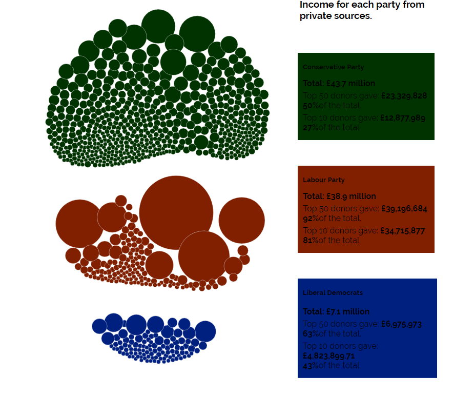
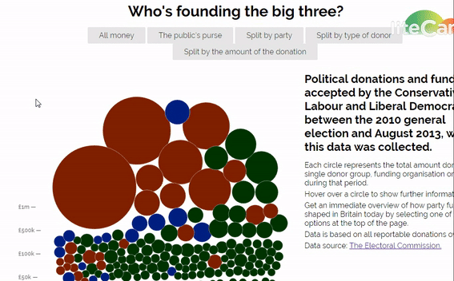
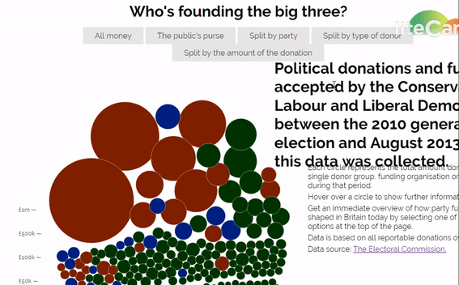
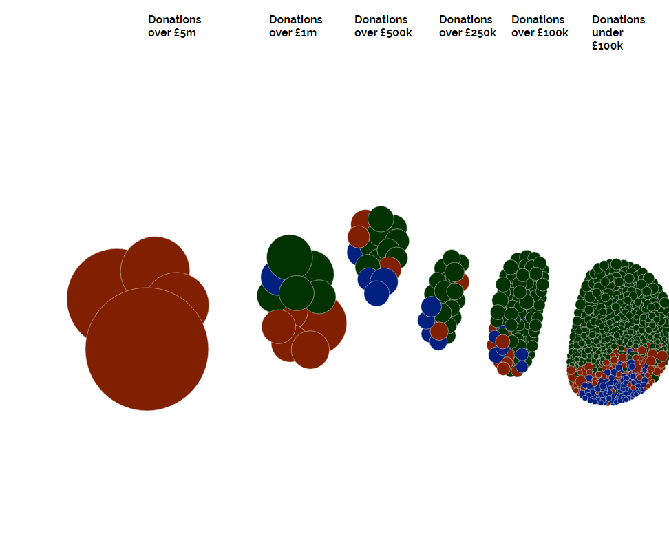

# Μάθημα: Τεχνολογίες Λογισμικού

### Ονοματεπώνυμο: Αυγούστης Ανδρέας
### Αριθμός Μητρώου: Π2015115
### Email: p15avgo@ionio.gr
### Εξάμηνο: ΣΤ'
### Έτος: 2017-2018

## Εργασία: Οπτικοποίηση δεδομένων χορηγιών (UK)
## Links

#### [Εκτελέσιμο](https://p15avgo.github.io/D3js-uk-political-donations/)
#### [Αποθετήριο κώδικα](https://github.com/p15avgo/D3js-uk-political-donations/tree/Αρχικό-έργο-και-ενδιάμεση-αναφορά-προόδου)
#### [Αποθετήριο Github Pages κώδικα](https://github.com/p15avgo/D3js-uk-political-donations/tree/gh-pages)

## Αρχικό έργο και ενδιάμεση αναφορά προόδου

 

### Σύνοψη

Σκοπός της εργασίας είναι η γνωριμία με της γλώσσες προγραμματισμού διαδικτύου(**html**,**css**,**javascript**) και τη βιβλιοθήκη **D3** της **javascript** (οπτικοποίηση δεδομένων), χρησιμοποιώντας παράλληλα τις σελίδες **github pages** και την αξιοποίηση των δυνατοτήτων της γλώσσας **javascript** για λειτουργίες μεγένθυνσης κειμένου και text-to-speech.

### 1ο Μέρος

* Αλλαγή του ονόματος **full-viz.html** σε **index.html** στο αποθετήριο **github pages** έτσι ώστε να μην εμφανίζετε στο τέλος το full-viz.

* Αλλαγή χρωμάτων στις μπάλες με τα δεδομένα,καθώς και στα αντίστοιχα 3 πεδία της ομαδοποίησης **Split by party**.

* Τοποθετήθηκε [ήχος](https://www.soundjay.com/button/sounds/button-17.mp3) κάθε φορά που ο χρήστης κάνει κλικ σε μία από τις επιλογές/κουμπιά ομαδοποίησης των δεδομένων.

* Δημιουργήθηκε η δυνατότητα όπου ο χρήστης να κλικ σε κάποια μπάλα έτσι ώστε να ανοίγει ένα νέο παράθυρο με τα αποτελέσματα της αναζήτησης στο google για τον αντίστοιχο δωρητή.

* Έγινε προσθήκη της μεγένθυση όταν ο δείκτης βρίσκεται πάνω από τις λέξεις του κειμένου.

* Όταν το ποντίκι βρίσκεται μέσα στον κύκλο κάποιου δωρητή ακούγεται η ονομασία και το ποσό της δωρεάς του δωρητή.

* Δημιουργία νέας ομαδοποίηση δεδομένων: **Split by amount of donations**.

### 2ο Μέρος
[Αποθετήριο Participants](https://github.com/p15avgo/D3js-uk-political-donations/tree/Participants)

[Merged pull-request](https://github.com/ioniodi/D3js-uk-political-donations/pull/25)

## Εικόνες

May Makhzoumi (100)

Lord Fink (101)

Peter Cruddas (102)

Michael Davis (103)

James R Lupton (104)

## Αρχείο CSV
2015115
