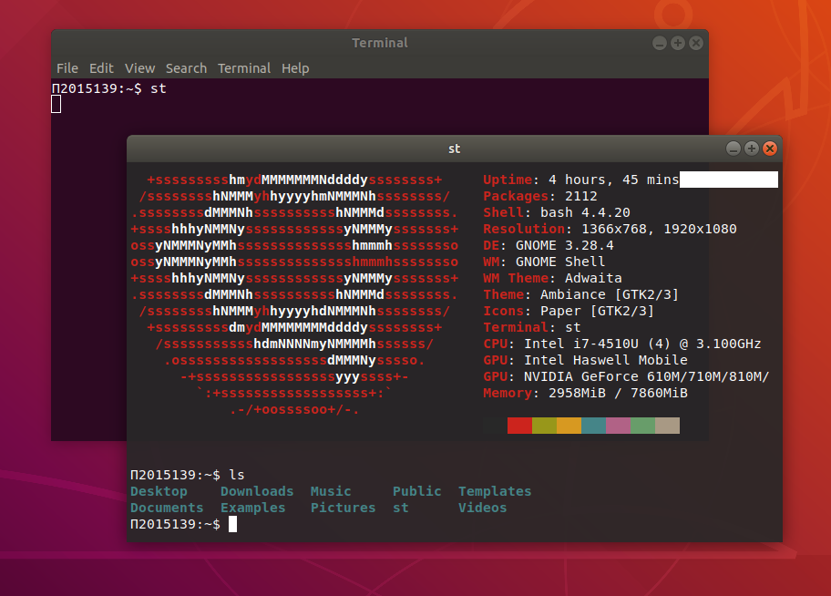
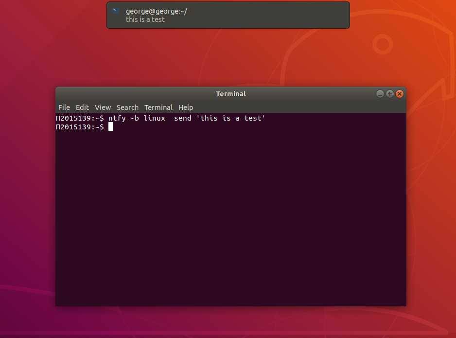
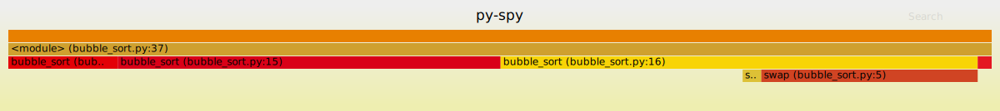
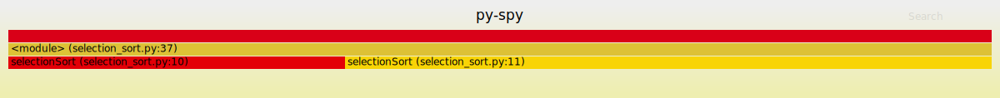
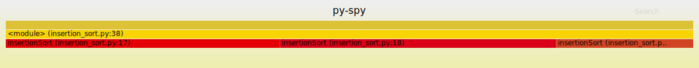

# ΙΟΝΙΟ ΠΑΝΕΠΙΣΤΗΜΙΟ


## ΤΕΧΝΟΛΟΓΙΑ ΛΟΓΙΣΜΙΚΟΥ (SW)

**Γιώργος Μαργαρίτης (Π2015139)**

**Αποθετήριο Ασκήσεων: [dokey](https://github.com/courses-ionio/dokey)**

**Προσωπικό Αποθετήριο Μαθήματος: [sw](https://github.com/gmargaritis/sw)**

**Προσωπικό Αποθετήριο mibook: [mibook](https://github.com/gmargaritis/gr)**

---

## Τελική Αναφορά

## Σύνοψη

Στο πλαίσιο του μαθήματος Τεχνολογία Λογισμικού πραγματοποιήθηκαν 7 ασκήσεις λογισμικού αλλά και 3 ασκήσεις συμμετοχικού υλικού. 

## Προαπαιτούμενα 

Πραγματοποιήθηκε αλλαγή στο .bashrc με τις παρακάτω εντολές ώστε να δείχνει τον αριθμό μητρώου.

```bash
vim .bashrc
```

```bash
export PS1='Π2015139:\w$ '
```

```bash
source .bashrc
```

Έγινε η εγκατάσταση του asciinema για την καταγραφή των sessions.

```bash
sudo apt-add-repository ppa:zanchey/asciinema
sudo apt-get update
sudo apt-get install asciinema
```

***Στο τέλος της κάθε άσκησης βρίσκεται το link για το αντίστοιχο asciicast***

## Άσκηση 1

**Τίτλος:** Try different terminals and shells

**Περιγραφή:** Repeat some of the previous exercises with a different terminal-shell and create a custom configuration that fits your needs

Χρησιμοποιήθηκαν το simple (suckless) terminal (st) αλλά και το z shell (zsh).

### Simple Terminal (st)

Η εγκατάσταση έγινε από αυτό το [fork](https://github.com/LukeSmithxyz/st) χρησιμοποιόντας τις παρακάτω εντολές.

```bash
git clone https://github.com/LukeSmithxyz/st
cd st
sudo make install
```

Για τα Ubuntu χρειάστηκε να εγκατασταθεί και το libxft-dev.

```bash
sudo apt install libxft-dev
```

Εγκαταστήθηκε το πακέτο [neofetch](https://github.com/dylanaraps/neofetch).

Έγινε επεξεργασία του αρχείου .Xdefaults καθώς και η εντολή ```xrdb -merge .Xdefaults``` μέσα στο direcotry st για να αποθηκευτούν οι εντολές.

Χρησιμοποιήθηκε επίσης το zsh shell μαζί με μερικές εντολές όπως ```ls``` και ```lspci```.

Στην παρακάτω φωτογραφία βλέπουμε το παράθυρο του st.



### **Asciinema:** [st](https://asciinema.org/a/yOMSYAhaMkMXWQXTAkMlChPuH)

### Z Shell (zsh)

Εγκατάσταση του zsh

```bash
sudo apt install zsh
```

Πραγματοποιήθηκε η εγκατάσταση του framework oh-my-zsh

```bash
wget https://github.com/robbyrussell/oh-my-zsh/raw/master/tools/install.sh -O - | zsh
```

Έγινε η εγκατάσταση του θέματος [powerlevel9k](https://github.com/Powerlevel9k/powerlevel9k) καθώς και του [powerline](https://github.com/powerline/powerline) μαζί με τη γραμματοσειρά [fonts-powerline](https://github.com/powerline/fonts)

```bash
sudo apt-get install powerline fonts-powerline

sudo apt-get install zsh-theme-powerlevel9k

echo "source /usr/share/powerlevel9k/powerlevel9k.zsh-theme" >> ~/.zshrc
```

Έγινε εγκατάσταση του plugin zsh syntax highlighting

```bash
sudo apt-get install zsh-syntax-highlighting

echo "source /usr/share/zsh-syntax-highlighting/zsh-syntax-highlighting.zsh" >> ~/.zshrc
```

Τροποποιήθηκε το αρχείο .zshrc με διάφορους τρόπους, ενώ έγινε αλλαγή του θέματος σε ```robbyrussel```.

### **Asciinema:** [zsh](https://asciinema.org/a/BYVtK8GQDBrIQf7zaqHrgAO8X)

---

## Άσκηση 2

**Τίτλος:** Use the terminal as an IDE

**Περιγραφή:** Edit your files (e.g., cv, website, code, etc) in vim or emacs and compile it in a different panel or use a plug-in 

Για την άσκηση αυτή έγινε επεξεργασία του βιογραφικού σημειώματος χρησιμοποιώντας το Vim. Το compilation έγινε με το XeLatex. Ακολουθούν οι εντολές που χρησιμοποιήθηκαν για την εγκατάσταση.

```bash
sudo apt-get install vim
```

```bash
sudo apt-get install texlive-xetex
```

Άνοιγμα του .tex

```bash
vim resume.tex
```

Ειδικές εντολές Vim

```vim
h - move left
l - move right
k - move up
j - move down
i - enter insert mode
Esc - enter command mode
x - delete character at cursor
r - replace character
2w - to move the cursor two words forward
:x - write only when changes have been made
:q - quit without saving
:q! - to trash all changes

```

Για το compilation χρησιμοποιήθηκε η παρακάτω εντολή.

```bash
xelatex resume.tex
```

Η εντολή αυτή κάνει compile το .tex αρχείο παράγοντας ένα xdv το οποίο μεταρέπεται αυτόματα σε pdf από ένα driver του πακέτου. Σε άλλες περιπτώσεις θα χρειαζόμασταν παραπάνω εντολές.

### **Asciinema:** [Vim](https://asciinema.org/a/XmJkpk0XJTlTdHdJqvT06y32p)

---

## Άσκηση 3

**Τίτλος:** Send notifications to your desktop-mobile

**Περιγραφή:** Send a notifcation when a big task completes, eg download, compiling, etc

Η υλοποίηση αυτής της άσκησης έγινε με το ntfy αλλά και την εφαρμογή για android Slack. Για την προβολή των εικόνων που αποδεικνύουν την αποστολή ειδοποιήσεων κατά την ολοκλήρωση μεγάλων tasks δείτε στο τέλος της άσκησης.

Eγκατάσταση του ```ntfy```.

```bash
sudo pip install ntfy
```

**Shell integration**

Προσθήκη της παρακάτω εντολής στο .bashrc αρχείο.

```bash
eval "$(ntfy shell-integration)"
```

Εγκατάσταση επιπλέον πακέτων για το Slack.

```bash
sudo pip install ntfy[slack]
```

Για τη λειτουργία με το Slack δημιουργήθηκε μια εφαργμογή (bot) μέσα από τη πλατφόρμα του Slack. Το authentication token και το κανάλι προστέθηκαν στο ntfy.yml.

Εγκατάσταση επιπλέον πακέτων για την υποστήριξη emoji.

```bash
sudo pip install ntfy[emoji]
```

Χειροκίνητη αποστολή μυνήματος στο κανάλι του Slack με 2 τρόπους.

```bash
ntfy -b slack send 'hello'

ntfy send 'testing slack notifications'
```

Αποστολή μυνήματος στο desktop.

```bash
ntfy -b linux send 'this is a test'
```



### Ειδοποιήσεις όταν έχει τελειώσει κάποιο μεγάλο task

Στις παρακάτω εικόνες μπορούμε να δούμε τις ειδοποιήσεις που έχει στείλει το bot στο κανάλι test. Αρχικά βλέπουμε 3 ειδοποιήσεις σχετικά με την 5η άσκηση όπου μας λέει ότι το πρόγραμμα hyperfine έχει τερματίσει. Τέλος υπάρχει η ειδοποίηση ότι το asciinema έχει σταματήσει να καταγράφει.

[slack_notifications.png](https://github.com/gmargaritis/sw/blob/2015139/projects/2015139/images/slack.jpg) | [slack_notifications2.png](https://github.com/gmargaritis/sw/blob/2015139/projects/2015139/images/slack2.jpg) | [slack_notifications3.png](https://github.com/gmargaritis/sw/blob/2015139/projects/2015139/images/slack3.jpg)

**Στο παρακάτω asciicast βλέπουμε τις εντολές στο shell ενώ σε [αυτό](https://github.com/gmargaritis/sw/blob/2015139/projects/2015139/20200330_133733.gif) το gif μπορούμε να δούμε σε πραγματικό χρόνο τα μυνήματα να φτάνουν στην android συσκευή ως ειδοποιήσεις.**

**Όπως φαίνεται και στο παρακάτω gif βλέπουμε ότι έρχονται τα notifications για την ολοκλήρωση διάφορων big tasks όπως το asciinema και το hyperfine**

### **Asciinema:** [ntfy](https://asciinema.org/a/c4DWt0TurQHdpAbujxOxAErkI), **Gif:** [Slack for Android](https://github.com/gmargaritis/sw/blob/2015139/projects/2015139/slack.gif)

---

## Άσκηση 4

**Τίτλος:** Performance monitoring

**Περιγραφή:** Monitor the performance of your python scripts and visualize them with colors and/or spark lines

Ο στόχος αυτής της άσκησης ήταν η μέτρηση της απόδοσης κάποιων αλγορίθμων αλλά και η οτικοποίηση των δεδομένων που καταγράφηκαν. Για αυτό το λόγο χρησιμοποιήθηκαν τα εργαλεία hyperfine και py-spy.

Για την άσκηση αυτή δημιουργήθηκαν 3 αρχεία με τους αλγορίθμους ταξινόμησης bubble sort, selection sort, insertion sort αλλά και ένα αρχείο rand_ints.py για τη δημιουργία .txt αρχείων που περιέχουν τυχαίους αριθμούς (100, 1000, 10000). Τα αρχεία rand_ints.py και bubble_sort.py είναι από το εργαστήριο του μαθήμτος και μπορούν να βρεθούν [εδώ](https://github.com/courses-ionio/sw-lab/tree/master/lab3).

Τα υπόλοιπα αρχεία είναι διαθέσιμα στα παρακάτω links:

[rand_ints.py](https://github.com/gmargaritis/sw/blob/2015139/projects/2015139/rand_ints.py) | [100.txt](https://github.com/gmargaritis/sw/blob/2015139/projects/2015139/100.txt) | [1000.txt](https://github.com/gmargaritis/sw/blob/2015139/projects/2015139/1000.txt) | [10000.txt](https://github.com/gmargaritis/sw/blob/2015139/projects/2015139/10000.txt)

[bubble_sort.py](https://github.com/gmargaritis/sw/blob/2015139/projects/2015139/bubble_sort.py) | [insertion_sort.py](https://github.com/gmargaritis/sw/blob/2015139/projects/2015139/insertion_sort.py) | [selection_sort.py](https://github.com/gmargaritis/sw/blob/2015139/projects/2015139/selection_sort.py)

### Hyperfine

Εγκατάσταση του εργαλείου

```bash
wget https://github.com/sharkdp/hyperfine/releases/download/v1.9.0/hyperfine_1.9.0_amd64.deb
sudo dpkg -i hyperfine_1.9.0_amd64.deb
```

Το εργαλείο hyperfine μας επιτρέπει να μετρήσουμε την απόδοση κάποιου αρχείου. Για τις παρακάτω εντολές χρησιμοποιήθηκαν τα αρχεία με 100 και 1000 ακεραίους.

```bash
hyperfine 'python filename.py 100'
```

Με την παράμετρο -r μπορούμε να τρέξουμε κάποιο από τα αρχεία συγκεκριμένες φορές. Σε αυτή τη περίπτωση η insertion sort έτρεξε 100 φορές.

```bash
hyperfine -r 100 'python insertion_sort.py 100'
```

To εργαλείο μας δίνει επίσης τη δυνατότητα να συγκρίνουμε πολλά αρχεία μαζί. Χρησριμοποιόντας την παράμεττρο -- warmup, -w μπορούμε να τρέξουμε κάποια warmups πριν την κανονική εκτέλεση. 

Με την παρακάτω εντολή έγινε σύγκριση των 3 αλγορίθμων ταξινόμησης.

```bash
hyperfine -w 10 'python bubble_sort.py 100' 'python selecttion_sort.py 100' 'python insertion_sort.py 100'
```

Μπορούμε επίσης να αποθηκεύσουμε τα αποτελέσματα σε markdown αλλά και json.

```bash
hyperfine --export-mardown results 'python bubble_sort.py 1000' 'python insertion_sort.py 1000' 'python insertion_sort.py 1000'
```

```bash
hyperfine --export-json results_json 'python bubble_sort.py 1000' 'python insertion_sort.py 1000' 'python insertion_sort.py 1000'
```

Ακολουθεί το περιεχόμενο του resutls.md ενώ το json μπορεί να βρεθέι [εδώ](https://github.com/gmargaritis/sw/blob/2015139/projects/2015139/results_json).

### Αποτελέσματα

| Command                        | Mean [ms]  | Min [ms] | Max [ms] | Relative    |
|:-------------------------------|-----------:|---------:|---------:|------------:|
| `python insertion_sort.py 100` | 22.1 ± 0.8 | 21.1     | 24.5     | 1.00        |
| `python bubble_sort.py 100`    | 23.0 ± 1.1 | 21.6     | 26.0     | 1.04 ± 0.06 |
| `python selection_sort.py 100` | 22.7 ± 1.1 | 21.2     | 26.3     | 1.03 ± 0.06 |

### **Asciinema:** [Hyperfine](https://asciinema.org/a/tAc7zCPktbfzBsTJTl10MmOlA)

### py-spy

Για την οπτικοποίηση δεδομένων χρησιμοποιήθηκε το εργαλείο ```py-spy```, το οποίο καταγράφει κάποιο αρχείο και παράγει flame graphs.

Η εγκατάσταση του εργαλείου έγινε με το παρακάτω τρόπο.

```bash
sudo pip install py-spy
```

Για την καταγραφή των αρχείων και την μετατροπή των δεδομένων σε flame graph χρησιμοποιήθηκε η παρακάτω εντολή.

```bash
py-spy record -o filename.svg -- python filename.py 1000
```

To ```py-spy``` δίνει επίσης τη δυνατότητα δημιουργίας speedscope profile για τα αρχεία με τη παράμετρο --format, -f.

```bash
py-spy record -f speedscope -o speedscope.json -- python filename.py 1000
```

Κάνοντας upload το αρχείο [speedscope.json](https://github.com/gmargaritis/sw/blob/2015139/projects/2015139/speedscope.json) στη σελίδα https://www.speedscope.app/ μπορεί κανείς να δει το output.

Έγινε επίσης χρήση της εντολής ```top``` η οποία δίνει τη δυνατότητα παρακολούθησης της απόδοσης σε πραγματικό χρόνο. Ως είσοδος ορίστηκε το αρχείο με τους 10.000 ακέραιους.

```bash
py-spy top -- python filename.py 10000
```

Ακολουθούν εικόνες (flame graphs) με τα αποτελεσματα

**Bubble sort (1000)**



**Selection sort (1000)**



**Insertion sort (1000)**



### **Asciinema:** [py-spy](https://asciinema.org/a/xfsnaCULl4wGUS1IGNTRhXCfb)

---

## Άσκηση 5

**Τίτλος:** Choose your stack

**Περιγραφή:** Set-up a set of cli tools with minimal dependencies and a software licence that allows commercial use and selling

### Howdoi

Το howdoi αποτελεί ένα command-line εργαλείο που δίνει τη δυνατότητα στο χρήστη να βρίσκει απαντήσεις για διάφορα ερωτήματα κάνοντας scrape το StackOverflow. Η εγκατάσταση πραγματοποιήθηκε μέσω του ```pip```.

```
pip install howdoi
```

Εκτελέστηκαν οι παρακάτω εντολές για την παρουσίαση του εργαλείου.

```
howdoi -v
howdoi -h
howdoi for loop in python
howdoi -a change directory bash
howdoi -c fizzbuzz python
howdoi -l isntall wine
howdoi -e bing write to file in c
howdoi -n2 convert mp4 to animated gif
```

Πιο συγκεκριμένα με το flag ```-v``` βλέπουμε το version που έχουμε εγκαταστήσει, με το ```-h``` εμφανίζεται το εγχειρίδιο χρήσης, με το ```-a``` μπορούμε να δούμε ολόκληρη την απάντηση, με το ```-c``` η απάντηση είναι χρωματισμένη, με το ```-e``` αλλάζουμε τη μηχανή αναζήτησης (στη συγκεκριμένη περίπτωση το bing), με το ```-l``` επιστρέφεται μόνο το link της απάντησης και τέλος με τη χρήση του flag ```-n2``` επιστρέφονται 2 ή όσες απαντήσεις έχουμε υποδείξει.

### **Asciinema:** [howdoi](https://asciinema.org/a/jRdNjZv3TDawCr8qVMGZvi6gt)

---

## Άσκηση 6

**Τίτλος:** Set-up cloud services

**Περιγραφή:** ssh to a remote machine and demonstrate your remote cli user land (e.g., email, editor, cv, code, etc).

**Local Host**

Το ```ssh``` είναι προεγκατεστημένο στα περισσότερα Linux distributions όποτε δε χρειάστηκε κάποια εγκατάσταση.

**Remote Host**

```
sudo apt-get install openssh-server
```

Εκτελέστηκαν οι παρακάτω εντολές:

```
ssh -V
```
Με την παραπάνω εντολή βλέπουμε την έκδοση την οποία έχουμε.

```
ssh -6 george@192.168.1.106
ssh -4 george@192.168.1.106
```

Χρησιμοποιώντας τα ```-4```, ```-6``` μπορούμε να κάνουμε force την IP, IPv4 και IPv6 αντίστοιχα. Στην πρώτη εντολή βλέπουμε ότι δεν μπορεί να γίνει η σύνδεση αφού δεν έχουμε δώσει την έγκυρη έκδοση IP.

```
ssh -c aes256-ctr george@192.168.1.106
```

Με το ```-c cipher_spec``` έχουμε τη δυνατότητα να καθορίσουμε τον αλγόριθμο κρυπτογράφησης του session μας. Στη συγκεκριμένη περίπτωση επιλέχτηκε ο AES-256.


```
ls

vi dfa.py
python dfa.py

vi resume.tex

neofetch
```

Πραγματοποιήθηκαν και οι παραπάνω εντολές ώστε να εκπληρώσουν το description της άσκησης.

### **Asciinema:** [ssh](https://asciinema.org/a/qM24sUb1u5baGF8lBDzVpQJft)

---

## Άσκηση 7

**Τίτλος:** Set-up a system for python development

**Περιγραφή:** Install and configure in a user folder a python project that is not available through the package manager

Για αυτή την άσκηση έγινε η εγκατάσταση του ```pipenv``` που είναι ενάς dependency manager για Python projects. Με τη χρήση του ```pipenv``` δε χρειάζεται να χρησιμοποιούνται το ```pip``` και το ```virtualenv``` ξεχωριστά, αφού πλέον δουλεύουν μαζί.

Στα πλαίσια της άσκησης εγκαταστήθηκε το πακέτο ```requests```.

Η εγκατάσταση του ```pipenv``` πραγματοποιήθηκε με την παρακάτω εντολή:

```bash
pip install --user pipenv
```

Πραγματοποιήθηκαν οι παρακάτω εντολές:

```bash

mkdir project
cd project

touch test.py

pipenv install requests
pipenv lock 

cat Pipfile
cat Pipfile.lock

vim test.py

pipenv run python test.py

pipenv shell

pipenv graph

ls

exit
```

### **Asciinema:** [pipenv](https://asciinema.org/a/yFNXC5XRMSlWanPveSIjD7Nn4)

---

## Συμμετοχικό Υλικό

Για το συμμετοχικό υλικό πραγματοποιήθηκαν 2 διαδραστικά παραδείγματα (carousel, night mode button) που παρουσιάστηκαν εν ώρα μαθήματος αλλά και μία μελέτη περίπτωσης για το Raspberry Pi.

### **Carousel:** [carousel.md](https://github.com/gmargaritis/gr/blob/carousel/_remix/carousel.md)

### **Night Mode:** [night-mode.md](https://github.com/gmargaritis/gr/blob/night-mode/_remix/night-mode.md)

### **Raspberry Pi :** [cs-rasberry-pi.md](https://github.com/gmargaritis/gr/blob/case-study/_case-study/cs-raspberry-pi.md), [rasberry-pi.md](https://github.com/gmargaritis/gr/blob/case-study/_case-study/raspberry-pi.md), **Images:** [raspberry-pi.jpg](https://github.com/gmargaritis/gr/blob/case-study/images/raspberry-pi.jpg), [raspberry-pi-components.jpg](https://github.com/gmargaritis/gr/blob/case-study/images/raspberry-pi-components.jpg), [raspberry-pi-camera.jpg](https://github.com/gmargaritis/gr/blob/case-study/images/raspberry-pie-camera.jpg), [rasberry-pi-zero.jpg](https://github.com/gmargaritis/gr/blob/case-study/images/rasberry-pi-zero.jpg)

---

## Συμπεράσματα

Μέσω των παραπάνω εργασιών εξοικειώθηκα με το command line, ανακάλυψα νέα ενδιαφέρον projects και επεκτάσεις, ενώ μερικά από αυτά κατέληξα να τα χρησιμοποιώ και στην καθημερινότητα μου. 
