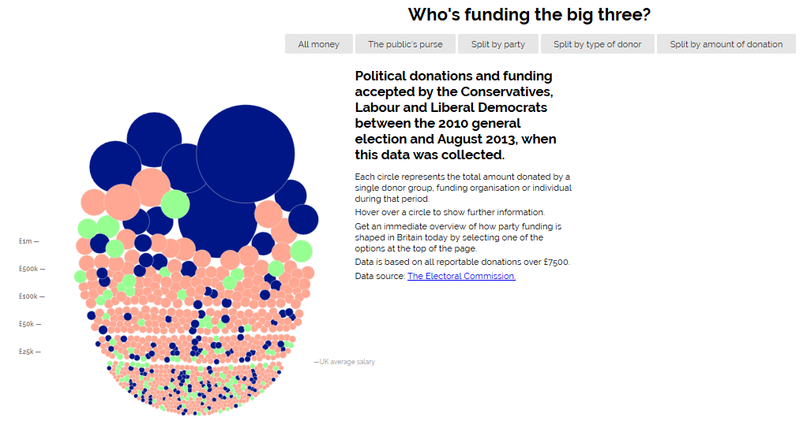
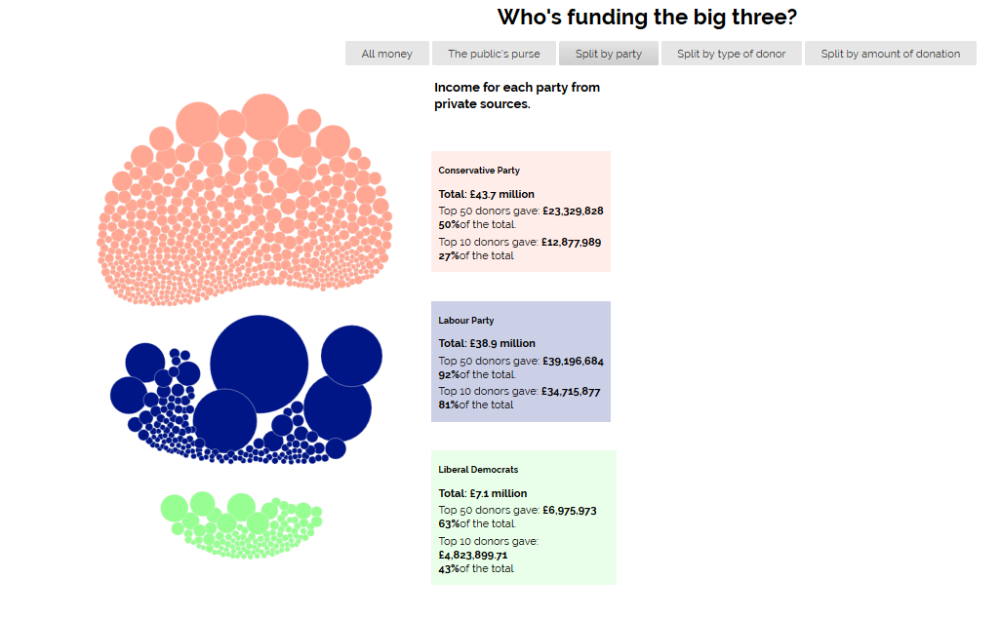

# Ιόνιο Πανεπιστήμιο

# Τμήμα Πληροφορικής

## Τεχνολογία Λογισμικού

## Οπτικοποίηση δεδομένων χορηγιών (UK)

## Γιώργος Μαργαρίτης ΑΜ Π2015139

## Παραδοτέο 1

Έγινε μετονομασία του full-viz.html σε index.html ώστε το url της εφαρμογής να μην καταλήγει σε .html

Εφαρμογή: https://gmargaritis.github.io/D3js-uk-political-donations/

Αποθετήριο εφαρμογής: https://github.com/gmargaritis/D3js-uk-political-donations

### Πραγματοποιήθηκε αλλαγή χρωμάτων στις μπάλες με τα δεδομένα

**Link:**
[chart.js](https://github.com/gmargaritis/D3js-uk-political-donations/blob/db794235aa41e9523ae44336ca7f04baac55eda7/chart.js#L24)

### Πραγματοποιήθηκε αλλαγή στα 3 πεδία της ομαδοποίησης Split by party

**Link:**
[style.css](https://github.com/gmargaritis/D3js-uk-political-donations/blob/db794235aa41e9523ae44336ca7f04baac55eda7/style.css#L66)

### Προστέθηκε ήχος κάθε φορά που ο χρήστης της εφαρμογής κάνει κλικ σε μία από τις επιλογές

**Link:**
[index.html](https://github.com/gmargaritis/D3js-uk-political-donations/blob/db794235aa41e9523ae44336ca7f04baac55eda7/index.html#L48)

### Τροποποιήθηκε ο κώδικας, έτσι ώστε όταν ο χρήστης κάνει κλικ σε κάποια μπάλα να ανοίγει ένα νέο παράθυρο με τα αποτελέσματα της αναζήτησης στο google για τον αντίστοιχο δωρητή.

**Link:**
[chart.js](https://github.com/gmargaritis/D3js-uk-political-donations/blob/db794235aa41e9523ae44336ca7f04baac55eda7/chart.js#L1085)

### Τροποποιήθηκε ο κώδικας της εφαρμογής έτσι ώστε το ποντίκι να λειτουργεί και ως μεγεθυντικός φακός όταν μεταφέρεται επάνω από τις λέξεις του κειμένου.

**Links:**

[index.html](https://github.com/gmargaritis/D3js-uk-political-donations/blob/db794235aa41e9523ae44336ca7f04baac55eda7/index.html#L48)

[style.css](https://github.com/gmargaritis/D3js-uk-political-donations/blob/db794235aa41e9523ae44336ca7f04baac55eda7/style.css#L240)

###  Τροποποιήθηκε ο κώδικας της εφαρμογής έτσι ώστε όταν το ποντίκι βρίσκεται μέσα στον κύκλο κάποιου δωρητή, να ακούγεται η ονομασία του δωρητή και το ποσό της δωρεάς.

**Links:**

[chart.js](https://github.com/gmargaritis/D3js-uk-political-donations/blob/db794235aa41e9523ae44336ca7f04baac55eda7/chart.js#L398)

[index.js](https://github.com/gmargaritis/D3js-uk-political-donations/blob/db794235aa41e9523ae44336ca7f04baac55eda7/index.html#L224)

### Δημιουργήθηκε νεο view, Split by amount of donation

**Links:**

[chart.js](https://github.com/gmargaritis/D3js-uk-political-donations/blob/db794235aa41e9523ae44336ca7f04baac55eda7/chart.js#L82)

[index.html](https://github.com/gmargaritis/D3js-uk-political-donations/blob/db794235aa41e9523ae44336ca7f04baac55eda7/index.html#L56)

[style.css](https://github.com/gmargaritis/D3js-uk-political-donations/blob/db794235aa41e9523ae44336ca7f04baac55eda7/style.css#L29)
