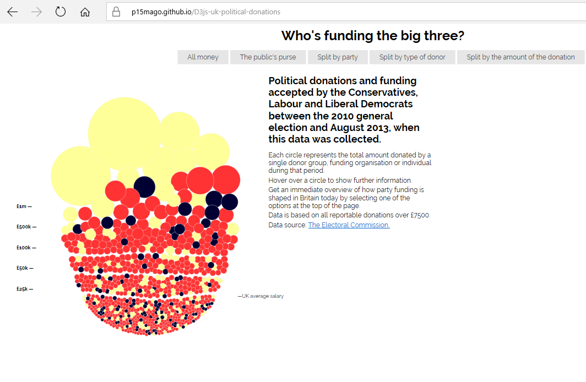
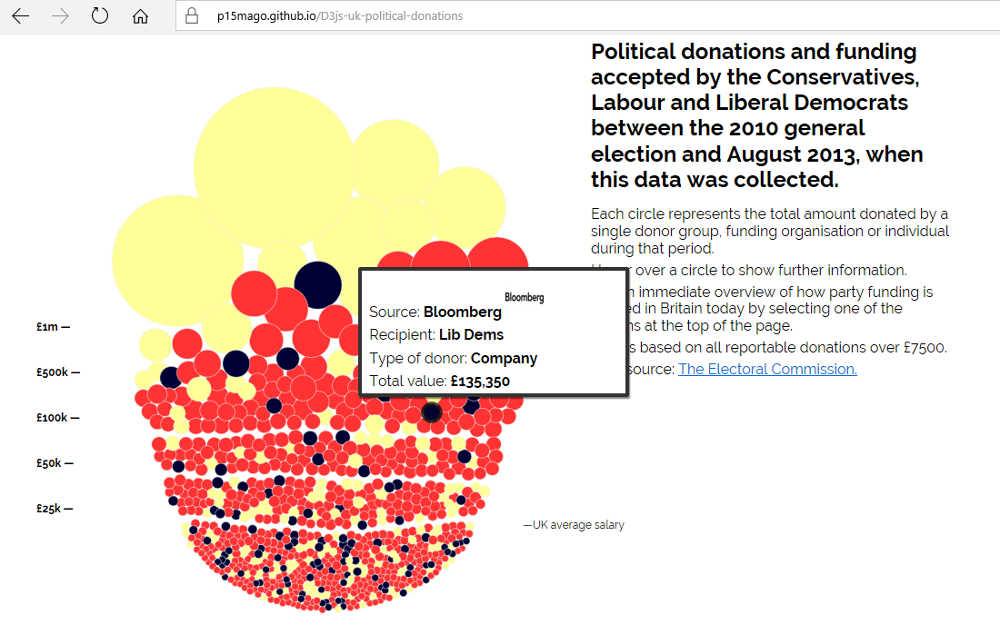
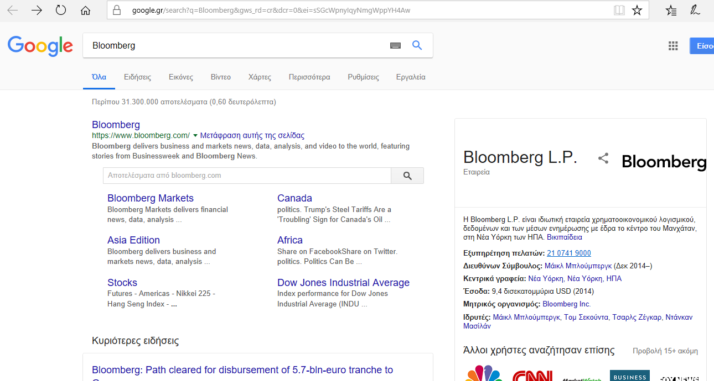
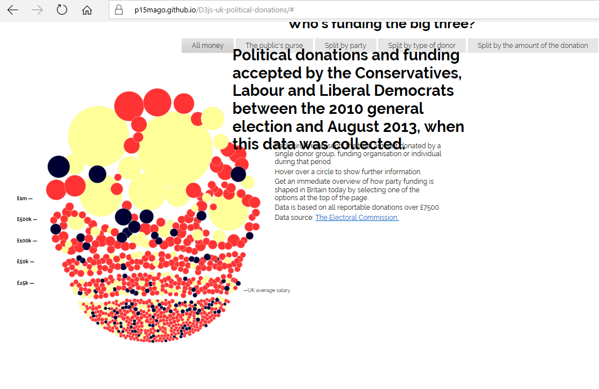
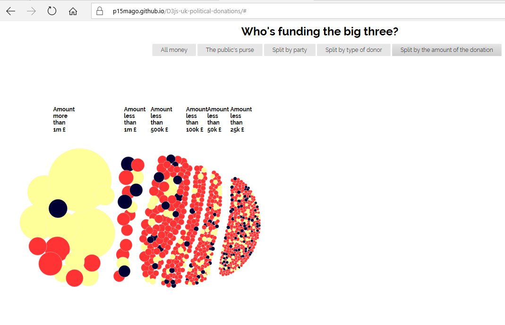

# Μάθημα: Τεχνολογία Λογισμικού
## Οπτικοποίηση δεδομένων χορηγιών (UK)

### Σύνοψη
Η παρούσα εργασία αφορά την οπτικοποίηση των στατιστικών στοιχείων δωρεών που έχουν γίνει σε πολιτικά κόμματα της Μεγάλης Βρετανίας.
Σκοπός της εργασίας είναι η εξοικείωση με την βιβλιοθήκη **D3** της **javascript** χρησιμοποιώντας τις σελίδες **github pages** καθώς και η αξιοποίηση της προκειμένου οι πληροφορίες της ιστοσελίδας να προσαρμοστούν στις ανάγκες των αναγνωστών με προβλήματα όρασης. Επιπλεόν, γίνεται χρήση και άλλων γλωσσών προγραμματισμού διαδικτύου ( **_css_**, **_html_**) προκειμένου να γίνουν οι απαραίτητες αλλαγές που απαιτούνται.
## Διαδικασία ανάπτυξης

### Δήλωση και δέσμευση θέματος εργασίας στο μάθημα Τεχνολογία Λογισμικού
* Ονοματεπώνυμο: **Μαγουνάκη Ουρανία**
* Αριθμός Μητρώου: **Π2015140**
* Θέμα Εργασίας: **"Οπτικοποίηση δεδομένων χορηγιών (UK)**
* Προσωπικό αποθετήριο του κώδικα: [Link Αποθετηρίου Κώδικα](https://github.com/p15mago/D3js-uk-political-donations)
* Link για το εκτελέσιμο: [Link Εκτελέσιμου](https://p15mago.github.io/D3js-uk-political-donations/)

### Παραδοτέο 1: Αρχικό έργο και ενδιάμεση αναφορά προόδου (25%) , 14 Μαρτίου
Αρχικά, με τις κατάλληλες τροποποιήσεις στον κώδικα έγινε αλλαγή των χρωμάτων στις μπάλες με τα δεδομένα καθώς και στα αντίστοιχα τρία πεδία της ομαδοποιήσης **_Split by Party_** όπως παρουσιάζεται στην παρακάτω εικόνα.

Επιπλέον, προστέθηκε το αρχείο **button_sound.mp3** ώστε κάθε φορά που ο χρήστης της εφαρμογής κάνει κλίκ σε μία από τις επιλογές/κουμπιά ομαδοποίησης των δεδομένων να ακούγεται ο χαρακτηριστικός ήχος. Η συγκεκριμένη ενέργεια επιτεύχθηκε με την δημιουργία μιας νέας συνάρτησης **playSound** στον κώδικα **html** η οποία αναπαραγάγει τον ήχο.

Επίσης, για την αναζήτηση του κάθε δωρητή στο **google** δημιουργήθηκε κατάλληλη συνάρτηση ώστε να ανοίγει καινούργιο παράθυρο με τα αποτελέσματα όταν γίνεται κλίκ στην κάθε μπάλα. 

**_H αναζήτηση ενός δωρητή απεικονίζεται στις παρακάτω εικόνες:_**

Επιπρόσθετα, χρησιμοποιώντας την κλάση **zoom** που δημιουργήθηκε, το ποντίκι λειτουργεί ως μεγεθυντικός φακός όταν μεταφέρεται πάνω από τις λέξεις του κειμένου. Στην περίπτωση **Split by Party** μεγεθύνεται το κάθε πεδίο ξεχωριστά.

**_Η παρακάτω εικόνα παρουσιάζει την μεγέθυνση κειμένου:_**

Ακόμη, όταν το ποντίκι βρίσκεται μέσα στον κύκλο κάποιου δωρητή ακούγεται η ονομασία του και το ποσό της δωρεάς. Αυτό επιτυγχάνεται με την χρήση της **ResponsiveVoice**.

Εν κατακλείδι, για την τελευταία αλλαγή δημιουργήθηκε μία ακόμη επιλογή ομαδοποίησης των δεδομένων (**_Split by the amount of the donation_**) η οποία κατηγοριοποιεί τις δωρεές με βάση το χρηματικό ποσό.

Επισημαίνεται η δημιουργία ενός αρχείου **.csv** με τα στοιχεία μου καθώς και προσθήκη 5 εικόνων από δωρητές. Συγκεκριμένα οι εικόνες των δωρητών που προστέθηκαν είναι οι εξής : **_Bloomberg, Addison Lee, RAB Capital, Soneva_** και **_Vitabiotics_** 

### Τελικό έργο και τελική αναφορά (25%) , 9 Μαΐου
