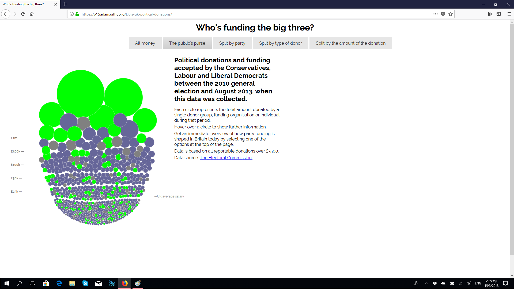
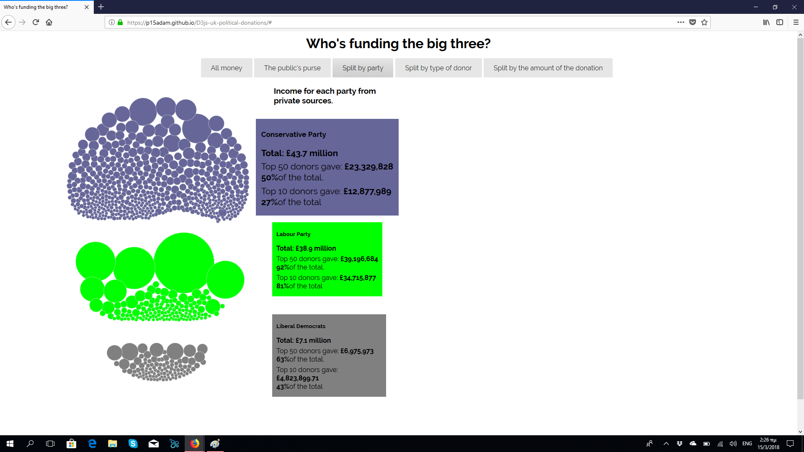
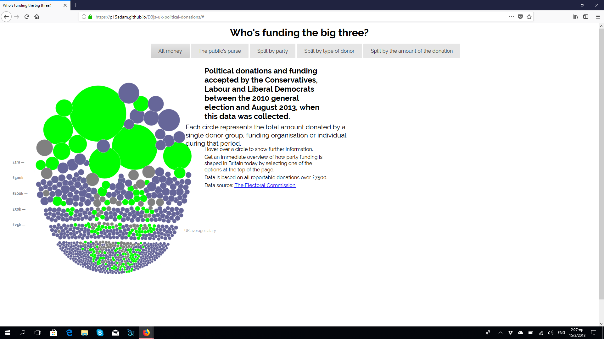

ΤΙΤΛΟΣ ΕΡΓΑΣΙΑΣ: ΟΠΤΙΚΟΠΟΙΗΣΗ ΔΕΔΟΜΕΝΩΝ ΧΟΡΗΓΙΩΝ (UK)

ΜΑΘΗΜΑ: ΤΕΧΝΟΛΟΓΙΕΣ ΛΟΓΙΣΜΙΚΟΥ

ΜΑΡΙΟΣ-ΓΕΩΡΓΙΟΣ ΑΔΑΜΗΣ

Α.Μ.: Π2015163

E-MAIL: p15adam@ionio.gr

LINK ΠΡΟΣΩΠΙΚΟΥ ΑΠΟΘΕΤΗΡΙΟΥ ΚΩΔΙΚΑ:
https://github.com/p15adam/D3js-uk-political-donations/tree/master

LINK ΕΚΤΕΛΕΣΙΜΟΥ ΚΩΔΙΚΑ: https://p15adam.github.io/D3js-uk-political-donations/

ΓΙΑ ΤΟ 1ο ΠΑΡΑΔΟΤΕΟ ΕΓΙΝΑΝ ΟΙ ΕΞΗΣ ΑΛΛΑΓΕΣ:

ΑΛΛΑΓΗ ΧΡΩΜΑΤΟΣ ΤΩΝ ΜΠΑΛΩΝ

ΤΡΟΠΟΠΟΙΗΣΗ URL ΤΟΥ ΑΤΟΜΙΚΟΥ ΑΠΟΘΕΤΗΡΙΟΥ

ΠΡΟΣΘΗΚΗ ΗΧΟΥ ΜΕΣΑ ΣΤΟ ΑΡΧΕΙΟ CHART.JS

ΠΡΟΣΘΗΚΗ ΜΙΑΣ ΟΜΑΔΟΠΟΙΗΣΗΣ ΔΕΔΟΜΕΝΩΝ

ΠΡΟΣΘΗΚΗ ΤΟ  on(“click”, function(d)
{window.open(“http://www.google.com/search?q=” + d.donor);});.ΓΙΑ ΑΝΑΖΗΤΗΣΗ ΣΤΟ ΔΙΑΔΥΚΤΥΟ ΓΙΑ ΤΟΥΣ ΔΩΡΗΤΕΣ

