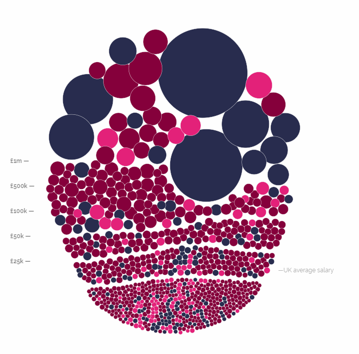
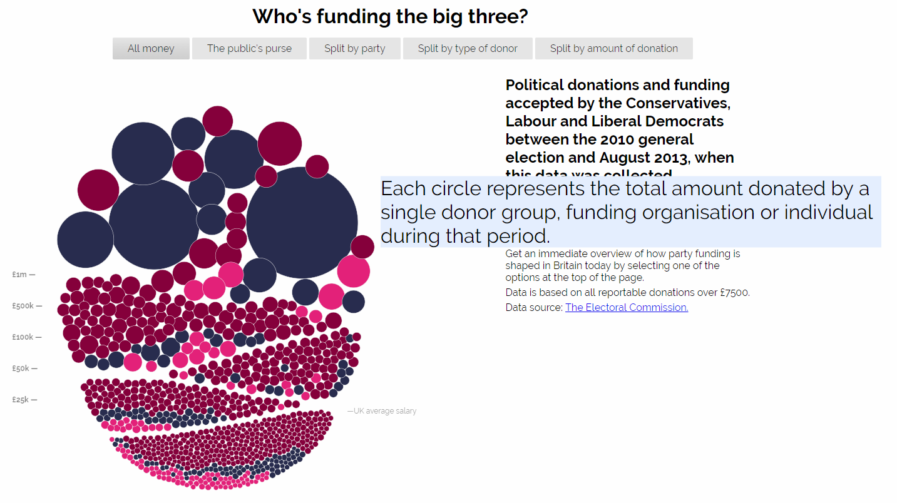
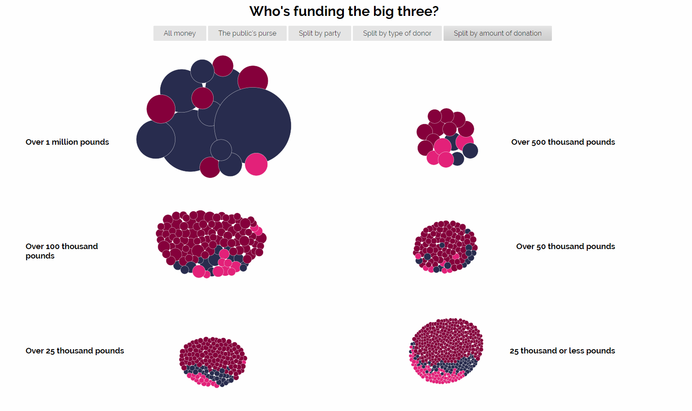
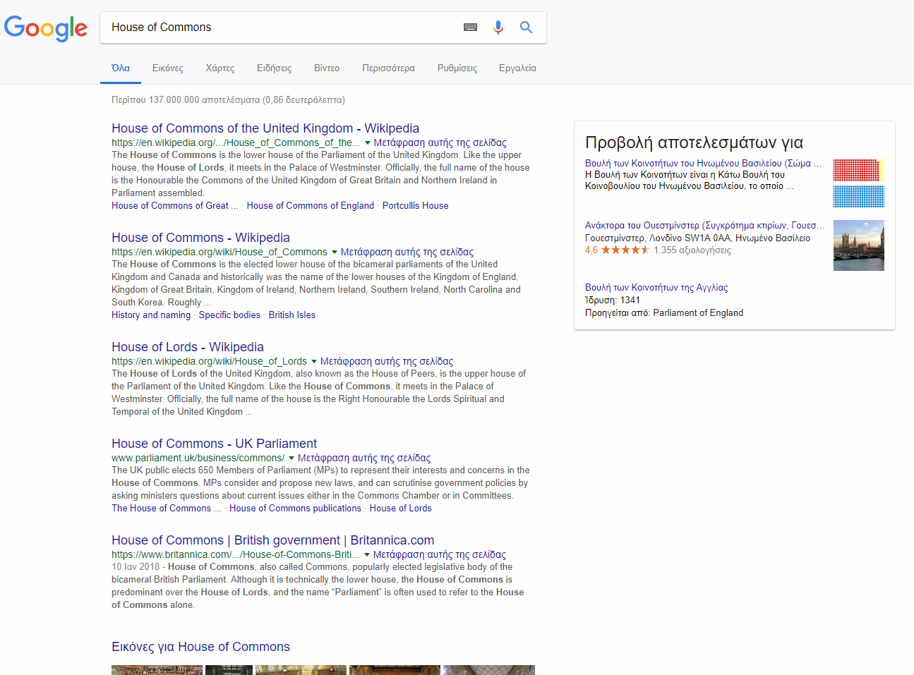
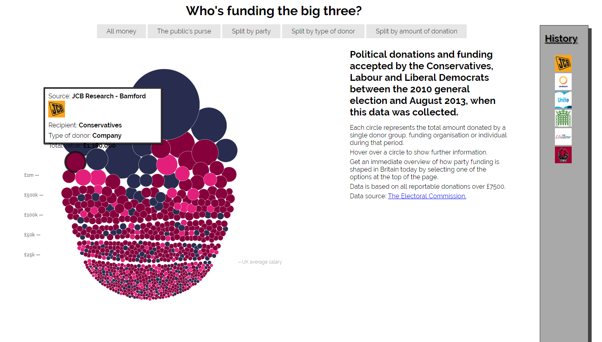
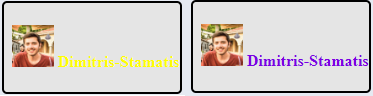
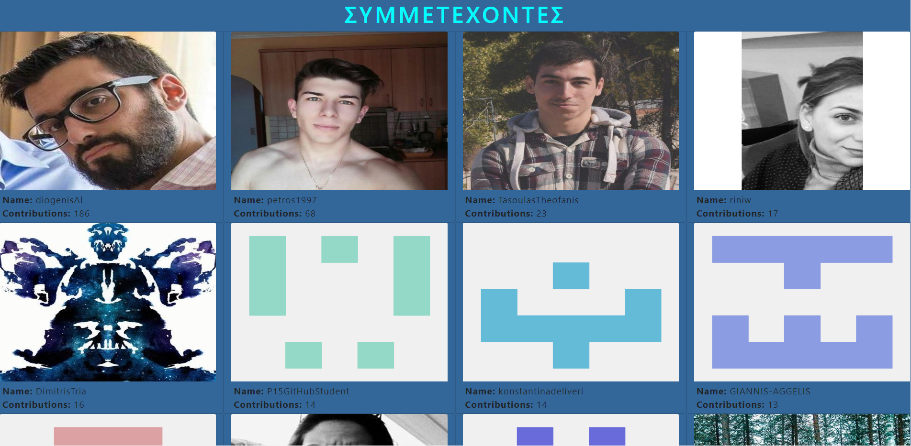

# Οπτικοποίηση Δεδομένων Χορηγιών (UK)

## Στοιχεία Φοιτητή:
<strong>Ονοματεπώνυμο: Δημήτριος Σταμάτης 
ΑΜ: Π2015174 
Εξάμηνο: ΣΤ' </strong>

## 1ο Παραδοτέο

 Forked Repository (SW): https://github.com/Dimitris-Stamatis/sw
 Forked Repository (D3js-uk-political-donations): https://github.com/Dimitris-Stamatis/D3js-uk-political-donations

### Υλοποίηση Ερωτημάτων στο Αποθετήριό μου

<or>
  <li>Σύνδεσμος Εργασίας (gh-pages): https://dimitris-stamatis.github.io/D3js-uk-political-donations/</li>
  <li>Τοποθέτησα τα .js και .css αρχεία σε ξεχωριστό φάκελο για καλύτερη οργάνωση και άλλαξα το όνομα του .html αρχείου σε <b>index.html</b>
  για να λειτουργεί το site χωρίς την κατάληξη σε full-viz.html</li>
  <li>Άλλαξα τα χρώματα του γραφήματος</li>
  <li>Πρόσθεσα ήχο κάθε φορά που ο χρήστης πατάει κάποιο κουμπί στο navigation bar</li>
  <li>Κάθε φορά που ο χρήστης πατάει πάνω σε κάποιον κύκλο του γραφήματος ανοίγει ένα παράθυρο με αποτελέσματα αναζήτησης του αντίστοιχου δωρητή</li>
  <li>Όποτε ο χρήστης κάνει hover πάνω από κείμενο της σελίδας, γίνεται zoom πάνω σε αυτό το κομμάτι κειμένου μέχρι ο κέρσορας να φύγει</li>
  <li>Επιπλέον όποτε ο χρήστης κάνει hover πάνω από έναν κύκλο του γραφήματος, το όνομα και το ποσό της δωρεάς προφέρεται με τεχνολογία text-to-speech</li>
  <li>Δημιούργησα μια επιπλέον επιλογή κατηγοριοποίησης <b>Split by amount of donation</b> η οποία χωρίζει τις μπάλες ανάλογα με το ποσό της δωρεάς</li>
</or>

### Υλοποίηση Ερωτημάτων στο κοινό Αποθετήριο

<or>
  <li>Πρόσθεσα και έκανα pull request το αρχείο .csv με τα στοιχεία μου το οποίο έγινε merge</li>
  <li>Πρόσθεσα 5 καινούργιες φωτογραφίες για τα παρακάτω πρόσωπα-εταιρίες:<ul>
        <li>Sun Mark (663)</li>
        <li>Tattersall (664)</li>
        <li>SITA (665)</li>
        <li>Microsoft (668)</li>
        <li>Multitone Electronics (669)</li>
        </ul></li>
</or>

## 2ο Παραδοτέο

 Forked Repository (SW): https://github.com/Dimitris-Stamatis/sw
 Forked Repository (D3js-uk-political-donations): https://github.com/Dimitris-Stamatis/D3js-uk-political-donations
 Contributors' site: https://dimitris-stamatis.github.io/Contributors-Page/2015174.html

### Υλοποίηση Ερωτημάτων στο Αποθετήριό μου

<ul>
  <li>Σύνδεσμος Εργασίας (gh-pages): https://dimitris-stamatis.github.io/D3js-uk-political-donations/</li>
  <li>Στον υπάρχοντα κώδικα πρόσθεσα τμήμα το οποίο λειτουργεί ως ιστορικό των hovers που έχει κάνει ο χρήστης σύμφωνα με το ερώτημα 1</li>
  <li>Πρόσθεσα ένα περίγραμμα τύπου box με σκιά και γέμισμα</li>
</ul>

### Υλοποίηση Ερωτημάτων στο Κοινό Αποθετήριο (Στο φάκελο Participants)

<ul>
  <li>Πρόσθεσα τα στοιχεία μου στην ιστοσελίδα με τους φοιτητές στη θέση 010</li>  
  <li>Έφτιαξα ένα animation του στυλ "ουράνιο τόξο" στο όνομά μου</li>
  <li>Όταν κάποιος πατήσει στην εικόνα μου θα οδηγηθεί στο προφίλ μου στο github σε νέα καρτέλα</li>
  <li>Τροποποίησα κώδικα που βρήκα online για να δημιουργήσω ένα site στο οποίο εμφανίζονται σε grid όλοι οι contributors του αποθετηρίου της εργασίας</li>
  <li>Το site περιέχει τις εικόνες, τα ονόματα καθώς και τον αριθμό των commits του κάθε contributor</li>
</ul>

### Εικόνες:

