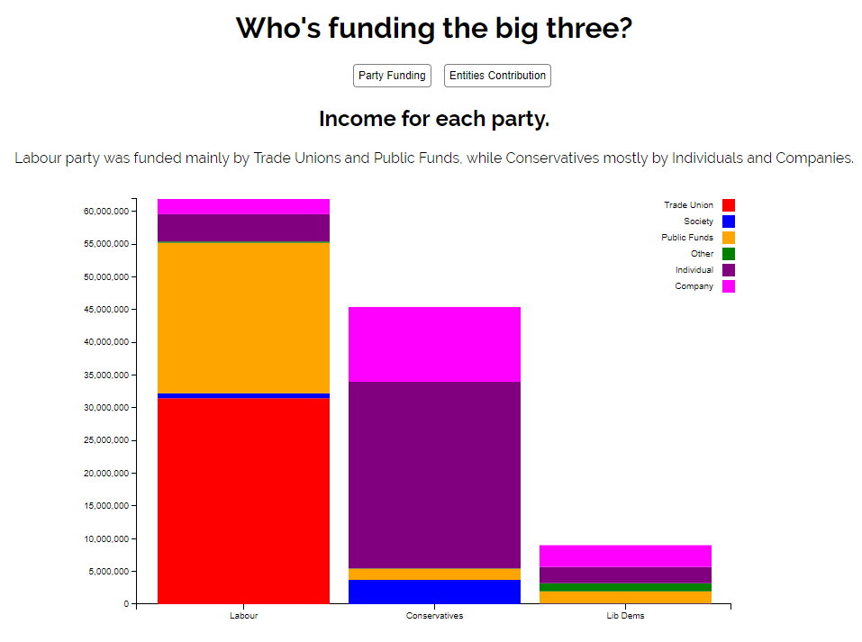
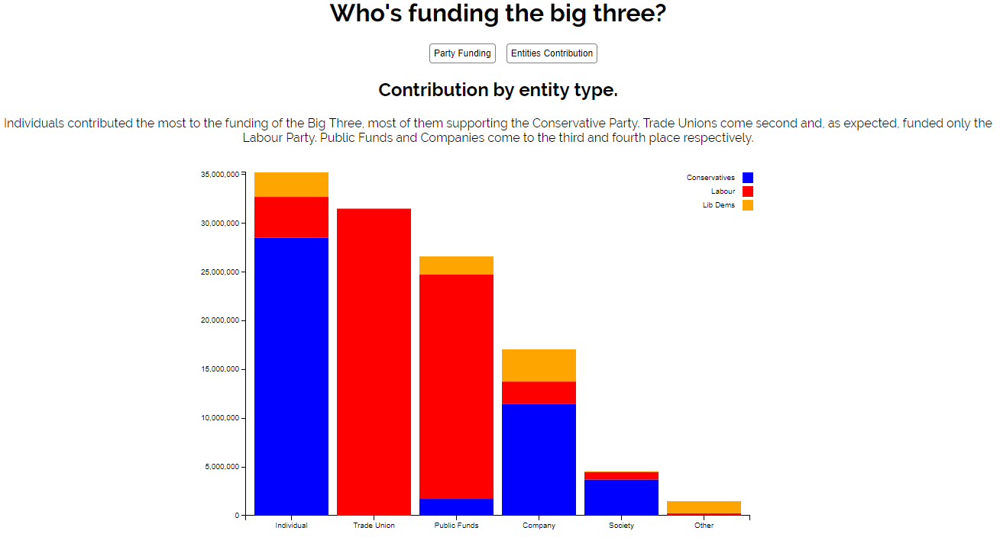

# Τεχνολογία Λογισμικού 
## Νατάσα Τζώρα - Π2015196
## ΕΞΑΜΗΝΟ ΦΟΙΤΗΣΗΣ ΣΤ'

Εργασία που επιλέχθηκε: Data visualisation

**Link στο προσωπικό αποθετήριο του κώδικα:** https://github.com/ntzora/sw

## Παραδοτέο 1
**Link στο παραδοτέο 1:**  https://github.com/ntzora/D3js-uk-political-donations

**Link στον εκτελέσιμο κώδικα:** https://ntzora.github.io/D3js-uk-political-donations/

### Υλοποίηση Ερωτημάτων στο Αποθετήριό μου

* Μετονομασία σε index.html του full-viz.html
* Δημιουργία εκτελέσιμου αρχείου της εφαρμογής τη σελίδα μου στο αποθετήριο
* Αλλαγη χρωμάτων του γραφήματος

* Αλλαγές css έτσι ώστε να υποστηρίζει μεγέθυνση κειμένου όταν το ποντίκι περνάει από πάνω

* Υποστήριξη ανάγνωσης κειμένου με τη χρήση κώδικα javascript
* Προσθήκη ήχου κατά την επιλογή κουμπιών ομαδοποίησης δεδομένων
* Προσθήκη νέας ομαδοποίησης με βάση το ύψος της δωρεάς

### Υλοποίηση αποθεμάτων στο κοινό αποθετήριο

* Προσθήκη αρχείου csv με τα στοιχεία μου 
* 5 λογότυπα δωρητών :
 * DLA Piper
 * Cellcrypt
 * LFIG
 * Noble Foods
 * B&S Properties

## Παραδοτέο 2

### Υλοποίηση Ερωτημάτων στο Αποθετήριό μου

* Δημιουργία περιοχής στα δεξιά της ιστοσελίδας του γραφήματος στο αρχείο html στην οποία εμφανίζονται διαδοχικά οι εικόνες με τους δωρητές πάνω από τους οποίους πέρασε ο δείκτης του ποντικιού στο γράφημα. Πιο συγκεκριμένα, δημιουργήσαμε χώρο στην οθόνη δεξιά στην οποία προσαρμόσαμε μια κυλιόμενη, κατακόρυφη λωρίδα προσαρμόζοντας τις ιδιότητες του συγκεκριμένου div στο style.css. Μέσω javascript προσθέτουμε διαδοχικά εικόνες με τον εξής τρόπο: Στο jQuery, μέσω του mouseover, λέμε να βρει το div που βάλαμε πριν και να του κολλήσει στην αρχή μια εικόνα με το src imageFile που έχει ήδη ορίσει παραπάνω με μέγεθος 30x30 και σε περίπτωση που δε βρεθεί η εικόνα να βάλει την εικόνα του github.

* Δημιουργία D3 γραφήματος οπτικοποίησης των δεδομένων των δωρητών των Βρετανικών εκλογών με μπάρες 
Αρχικά για δική μας ευκολία δημιουργήσαμε ένα αρχείο html μέσα στο οποίο συμπεριλάβαμε το css κομμάτι του κώδικα και το javascript κομμάτι του κώδικα. Στο κομμάτι του css επιλέξαμε να διατηρήσουμε παρόμοια δομή με το style.css όσο αφορά τις ετικέτες. Αφαιρέσαμε κομμάτια που αφορόυν την εμφάνιση του κώδικα σε διαφορετικούς browsers (αγνοήσαμε τις γραμμές από την 210-282). Προσθέσαμε κάποια styles που αφορούν τα ραβδογράμματα.

* Δημιουργία D3 γραφήματος οπτικοποίησης ανοιχτών δεδομένων που βρήκαμε στη σελίδα http://statistics.gr της επίσημης στατιστικής αρχής (ΕΛΣΤΑΤ) με θέμα την κατανάλωση πετρελοειδών, κατά περιφεριακή και κατηγορία για το έτος 2016.
