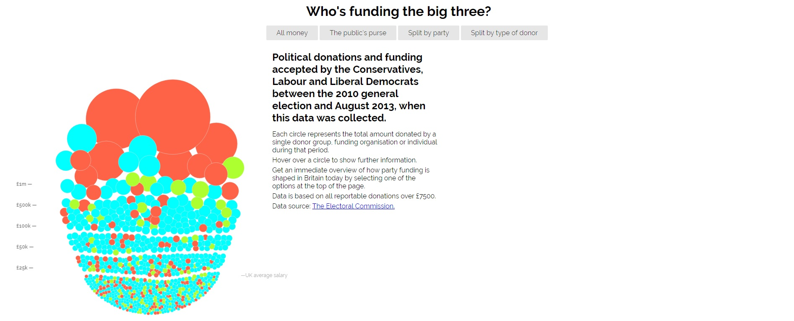
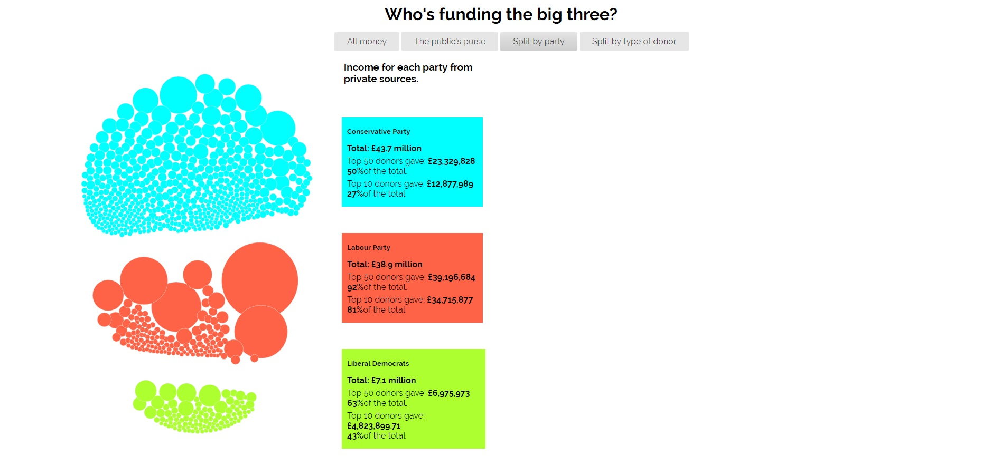
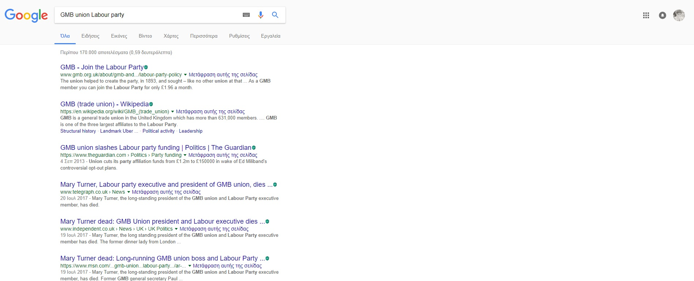
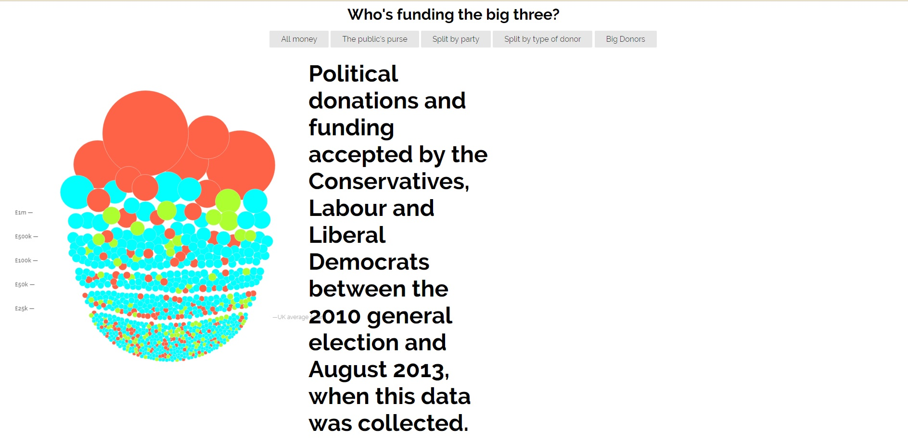
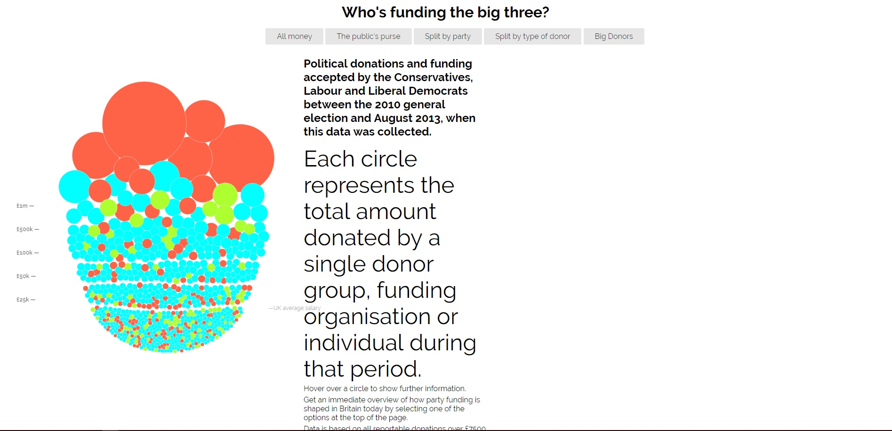
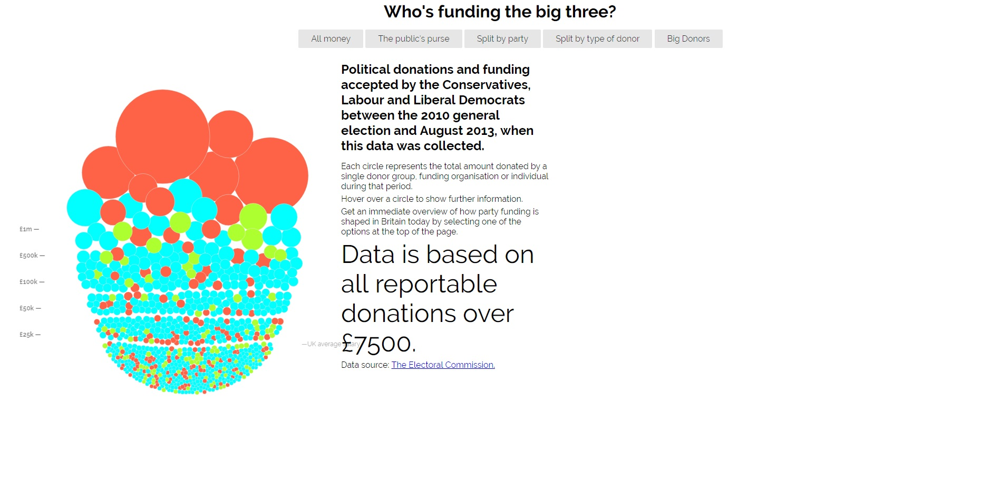
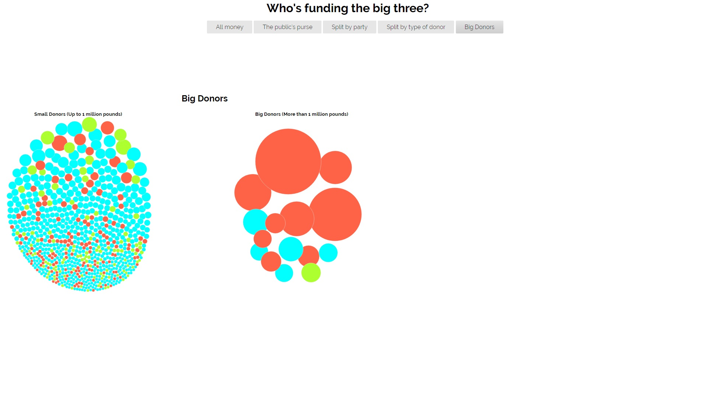
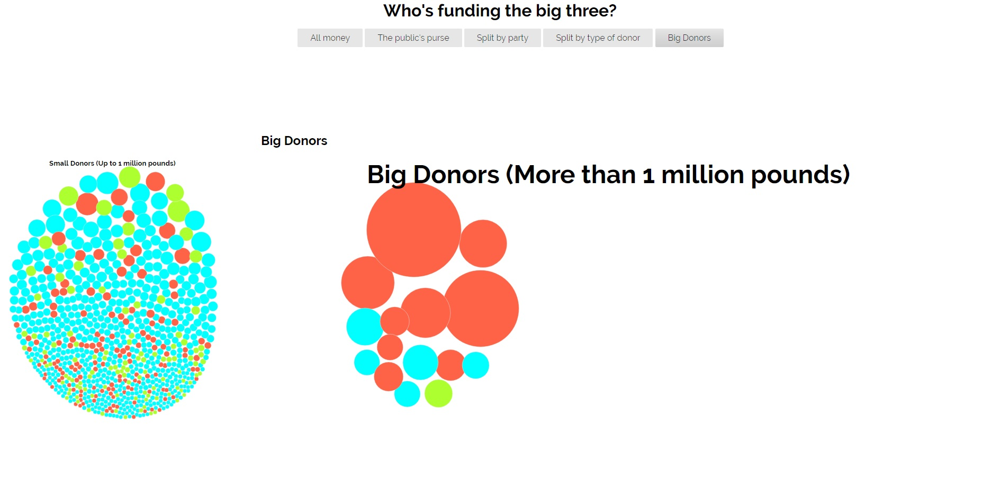

# Ιόνιο Πανεπιστημίο

# Τμήμα Πληροφορικής

# Μάθημα
## Τεχνολογία Λογισμικού
 
Επιβλέπων καθηγητής: Χωριανόπουλος Κωνσταντίνος 

# Επιλογή Εργασίας
## Οπτικοποίηση δεδομένων χορηγιών (UK)

Αχιλλέας Καπετάνιος
ΑΜ: Π2015201

## Παραδοτέο 1
### Σύνδεσμοι Αποθετηρίων

Μαθήματος: https://github.com/achkap/sw

Εφαρμογής: https://github.com/achkap/D3js-uk-political-donations

Σύνδεσμος Εφαρμογής: https://achkap.github.io/D3js-uk-political-donations/

## Παραδοτέο 1

Όλες οι αλλαγές που έγιναν στον κώδικα έχουν σημειωθεί στα αντίστοιχα αρχεία ως σχόλια στον κώδικα. 

Αλλαγή χρωμάτων στις μπάλες με τα δεδομένα:

https://github.com/achkap/D3js-uk-political-donations/blob/gh-pages/chart.js

Αλλαγή χρώματος στα στα 3 πεδία των κομμάτων της ομαδοποίησης Split by party:

https://github.com/achkap/D3js-uk-political-donations/blob/gh-pages/style.css

Προσθήκη ήχου κάθε φορά που ο χρήστης της εφαρμογής κάνει κλικ σε μία από τις επιλογές/κουμπιά ομαδοποίησης των δεδομένων:

https://github.com/achkap/D3js-uk-political-donations/blob/gh-pages/index.html

Ανέβασμα ήχου στο Github

https://github.com/achkap/D3js-uk-political-donations/blob/gh-pages/moneysound.mp3

Άνοιγμα νέου παραθύρου με τα αποτελέσματα της αναζήτησης στο Google για τον αντίστοιχο δωρητή, όταν ο χρήστης κάνει κλικ
σε μία από τις μπάλες. Για καλύτερα αποτελέσματα της αναζήτησης, προστέθηκαν η ιδιότητα (άτομο, εταιρεία, σωματείο κλπ) 
καθώς και το κόμμα στο οποίο έκαναν τη δωρεά.

https://github.com/achkap/D3js-uk-political-donations/blob/gh-pages/chart.js

Ο κώδικας τροποποιήθηκε προκειμένου τα γράμματα να μεγενθύνονται κατά 300% κάθε φορά που το ποντίκι περνάει από πάνω. Για να γίνει αυτό τροποποιήθηκε το αρχείο

https://github.com/achkap/D3js-uk-political-donations/blob/gh-pages/style.css

Δυστυχώς ενώ έγινε η προσπάθεια να λειτουργεί το ποντίκι ακριβώς σαν ένας μεγενθυντικός φακός και να μεγαλώνει κάθε γράμμα ξεχωριστά ή κάθε κομμάτι της σελίδας ξεχωριστά από όπου περνάει, αυτό δεν κατέστη δυνατό. Θα μπορούσε να γίνει για εικόνα αλλά όχι για κείμενο.

Επίσης προστέθηκε text2speech για τους κύκλους των δωρητών, έτσι ώστε μόλις το ποντίκι βρίσκεται μέσα σε έναν από τους κύκλους ακούγεται το όνομα του δωρητή, το κόμμα στο οποίο δώρισε τα χρήματα καθώς και το συνολικό ποσό.
Για να γίνει αυτό χρησιμοποιήθηκε το Web Speech API (https://developer.mozilla.org/en-US/docs/Web/API/Web_Speech_API). Στις ήδη υπάρχουσες συναρτήσεις mouseover και mouseout προστέθηκαν η μεταβλητή για το SpeechSynthesis, καθώς και το υψος και ταχύτητα της φωνής, όπως και η εντολή για έναρξη και σταμάτημα της ομιλίας στις συναρτήσεις mouseover και mouseout αντιστοιχα. Δηλαδή να αρχίζει η ομιλία όταν το ποντίκι μπαίνει στον κύκλο και να σταματάει μόλις βγει από αυτόν. Το αρχείο που τροποποιήθηκε είναι το 

https://github.com/achkap/D3js-uk-political-donations/blob/gh-pages/chart.js

Τέλος χρειάστηκε να τροποποιηθούν όλα τα βασικά αρχεία προκειμένου να δημιουργήσουμε μια καινούρια κατανομή. Η κατανομή που προτιμήθηκε είναι να δείχνει τους μεγάλους δωρητές (πάνω από 1 εκ λίρες) και να τους χωρίζει από τους μικρούς. Γι' αυτό έπρεπε στο αρχείο

https://github.com/achkap/D3js-uk-political-donations/blob/gh-pages/chart.js

να δημιουργηθούν οι κατάλληλες συναρτήσεις ώστε να δημιουργηθεί η καινούρια κατανομη, στο αρχείο

https://github.com/achkap/D3js-uk-political-donations/blob/gh-pages/index.html

να προστεθεί ένα έξτρα κουμπί προκειμένου ο χρήστης να διαλέγει την καινούρια κατανομή, αλλά και να μπουν οι επεξεγήσεις και στο αρχείο

https://github.com/achkap/D3js-uk-political-donations/blob/gh-pages/style.css

να οριστούν τα σημεία στα οποία θα μπουν. Έτσι:

## Αλλαγές στο κοινό αποθετήριο του κώδικα

Δημιουργήθηκε ένα .csv αρχείο στο φάκελο participants, στο οποίο αρχείο υπάρχουν τα στοιχεία του φοιτητή.

https://github.com/achkap/D3js-uk-political-donations/blob/participant2/participants/2015201.csv

Προστέθηκαν επίσης οι 5 εικόνες δωρητών οι οποίες εμφανίζονται κάθε φορά που πηγαίνει πάνω από κάθε κύκλο δωρητή το ποντίκι.
Οι δωρητές που επιλέχθηκαν είναι: 

https://github.com/achkap/D3js-uk-political-donations/tree/icos/photos

Leigh Day and Co Solicitors (59)

Scottish Parliament (75)

GovNet Communications (810)

KPMG (819)

C and C Alpha Group (830)

## Παραδοτέο 2

Δυστυχώς στο παραδοτέο 2 δεν υπήρξε καμία πρόοδος. Το μόνο που έγινε ήταν να δεσμευτεί μια περιοχή στο φάκελο participants και στο αρχείο index
με τα στοιχεία του χρήστη.

https://github.com/achkap/D3js-uk-political-donations/blob/stats/participants/index.html

## Τελική Αναφορά

Η τελική αναφορά για όλα τα ζητούμενα που πραγματοποιήθηκαν δημιουργήθηκε σε διαφορετική σελίδα.
Για το λόγο αυτό δημιουργήθηκε νέο αποθετήριο με το όνομα britishparties και η σελίδα της τελικής αναφοράς είναι:

https://achkap.github.io/britshparties/

