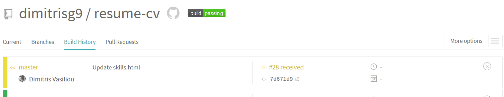

Αποθετήριο: https://github.com/dimitrisg9/resume-cv  
Βιογραφικό/CV: https://dimitrisg9.github.io/resume-cv/

### 1ο Παραδοτέο
- Για το πρώτο παραδοτέο επέλεξα το πρώτο θέμα απο τα παραδείγματα (https://github.com/sharu725/online-cv/) .
- Έγινε αλλαγή φόντου και προσθήκη φωτογραφίας του CV. 
- Στη συνέχεια πρόσθεσα το instagram μαζί με το εικονίδιο του μαζι με τα υπόλοιπα social media που ήδη υπήρχαν. 
- Ακολουθώντας το βοήθημα από την ιστοσελίδα (https://www.w3schools.com/howto/howto_js_mobile_navbar.asp) δημιουργήθηκε το Navigation bar για υπολογηστή και κινητό όπου βοήθαει στην ομαλή πλοήγηση του επισκέπτη.  

### 2ο Παραδοτέο
- Για το δεύτερο παραδοτέο δημιουργήθηκε το pdf από το αρχείο data.yml χρησιμοποιώντας το pandoc με ένα προσχέδιο που λήφθηκε από το παράδειγμα στην εκφώνηση της εργασίας το template.tex. Αυτό τροποποιήθηκε για να δουλεύει στα δεδομένα του yaml αρχείου που συμπεριλήφθηκε με το παράδειγμα που επέλεξα στο προηγούμενο παραδοτέο.
- Ακολουθώντας τους οδηγούς https://github.com/tompollard/markdown-cv και https://gist.github.com/willprice/e07efd73fb7f13f917ea , προσαρμόζωντας τα δεδομένα, επιτεύχθηκε η δημιουργία Continuous Integration συστήματος μετά από αλλαγές που έχουν συμβεί στο βιογραφικό. Για το λόγο αυτό δημιουργήθηκε το .travis.yml έτσι ώστε να έχει τα κατάλληλα εργαλεία και να τρέχει το αρχείο Makefile που μέσα σε αυτό τρέχει την εντολή pandoc και το αρχείο push.sh για να μπορέσει να ανεβάσει το αλλαγμένο αρχείο pdf
- Πιο κάτω η διαδικασία μετά από όποια δίποτε αλλαγή στο βιογραφικό

