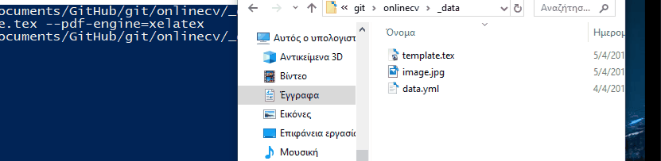

# Τεχνολογία Λογισμικού

#### Όνομα Φοιτητή: Διονύσιος Παύλος Κοντοζίδης 
####    ΑΜ Φοιτητή: Π2016178

## Εργασία Μπόνους
#####        Αποθετήριο: https://github.com/dionisiskon/onlinecv/
#####     Βιογραφικό/CV: https://dionisiskon.github.io/onlinecv/

### 1ο Παραδοτέο
Για το πρώτο παραδοτέο επιλέχθηκε το πρώτο από τα παραδείγματα(https://github.com/sharu725/online-cv/) ως θέμα 
για την δόμηση του ηλεκτρονικού βιογραφικού. Αρχικά, έγινε η απαραίτητη επεξεργασία στο αρχείο [data.yml](https://github.com/dionisiskon/onlinecv/blob/gh-pages/_data/data.yml).
που περιείχε τα στοιχεία του βιογραφικού και προσθήκη της φωτογραφίας του CV([profile](https://github.com/dionisiskon/onlinecv/blob/gh-pages/assets/images/profile.png)). Για την επίτευξη αυτού
έγινε προσθήκη των βεβαιώσεων παρακολούθησης που έχουν ληφθεί από το πανεπιστήμιο στο φάκελο [assets/certificates](https://github.com/dionisiskon/onlinecv/tree/gh-pages/assets/certificates) ώστε
να μπορούν να αναγνωστούν από τον χρήστη που επισκέπτεται την σελίδα κάτω από την επικεφαλίδα <b>Σεμινάρια</b>. Στη συνέχεια, 
τροποποιήθηκε το αρχείο [contact.html](https://github.com/dionisiskon/onlinecv/blob/gh-pages/_includes/contact.html) για να προστεθεί το κουμπί του 
Instagram στην πλαινή μπάρα κάτω από την εικόνα και τα υπόλοιπα Social Media.  
 

Ακόμα, ακολουθώντας τα βήματα στο βίντεο [Minimal Responsive Navigation](https://www.youtube.com/watch?v=BXArjoEmVa0&t=94s) και προσαρμόζοντας κατάλληλα τον κώδικα δημιουργήθηκε μια μπάρα πλοήγησης για την αύξηση της αισθητικής και της ευχρηστίας της ιστοσελίδας. Η μπάρα αυτή, κατασκευάστηκε με την δημιουργία ενός αρχείου [header.html](https://github.com/dionisiskon/onlinecv/blob/gh-pages/_includes/header.html) που περιέχει την HTML της μπάρας πλοήγησης και ενός αρχείου στον φάκελο css για την επιθυμητή μορφοποίησή του.Στο αρχείο HTML παρέχονται τα απαραίτητα λίνκ ώστε να γίνεται σωστή ανακατεύθυνση του χρήστη στις επιθυμητές επικεφαλίδες αλλα και να παρέχεται τρόπος επικοινωνίας. Η ανακατεύθυνση του χρήστη επιτεύχθηκε με την αλλαγή τριών αρχείων HTML όπου και προστέθηκε tag <section id='' > ώστε να αναγνωρίζεται με αυτό τον τρόπο το σωστό τμήμα για την προώθηση του χρήστη. 
  
<b>Desktop view</b>

  

<b>Mobile view</b>

<b>Mobile view(checked)</b>

Όπως μπορείτε να παρατηρήσετε η μπάρα πλοήγησης συρρικνώνεται μετά από ένα μέγεθος οθόνης σε ένα κουμπί και logo για να προσαρμοστεί κατάλληλα στις οθόνες κινητών συσκευών ενώ στις μεγαλύτερες οθόνες επεκτείνεται και γίνεται πλήρης μπάρα. Μετά την πίεση του πλήκτρου του μενού μέσω του αρχείου CSS περιστρέφεται το logο,φορτώνονται τα κουμπιά και γίνεται λευκό το background.
Μετέπειτα από την επιλογή του χρήστη, γίνεται προώθησή του και μετά την πίεση του πλήκτρου για 2η φορά το background ξαναγυρνάει στο φυσιολογικό του.

### 2o Παραδοτέο
Για το δεύτερο παραδοτέο δημιουργήθηκε το pdf από το αρχείο data.yml χρησιμοποιώντας το pandoc με ένα "προσχέδιο" που λήφθηκε από το παράδειγμα στην εκφώνηση της εργασίας, το template.tex. Αυτό τροποποιήθηκε για να δουλεύει στα δεδομένα του yaml αρχείου που συμπεριλήφθηκε με το παράδειγμα cv που επέλεξα στο προηγούμενο παραδοτέο.

Παρακάτω επισυνάπτεται η διαδικασία της εκτέλεσης της εντολής για την δημιουργία του pdf αρχείου.

Επιπλέον για το δεύτερο παραδοτέο ακολουθώντας τους οδηγούς απο τα github https://github.com/tompollard/markdown-cv και https://gist.github.com/willprice/e07efd73fb7f13f917ea και προσαρμόζωντας τα δεδομένα για να ταιριάζουν στο αποθετήριο αυτό επιτεύχθηκε η δημιουργία Continuous Integration(CI) συστήματος μετά από αλλαγές που τυχόν έχουν συμβεί στο βιογραφικό. Για αυτό δημιουργήθηκε το .travis.yml για την σωστή καθοδήγηση του Travis CI ώστε να κατεβάζει την γραμματοσειρά και τα κατάλληλα εργαλεία και να τρέχει το Makefile που εκτελεί την εντολή pandoc και το push.sh για να ανεβάσει το αλλαγμένο αρχείο pdf στο φάκελο _data του αποθετηρίου.

Παρακάτω μπορεί να φανεί η διαδικασία μετά από μια αλλαγή στο βιογραφικό

